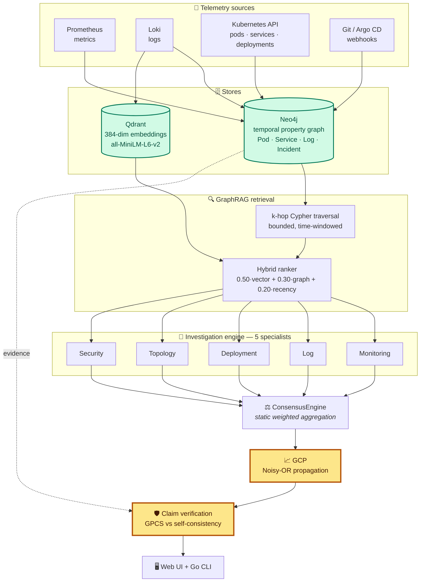
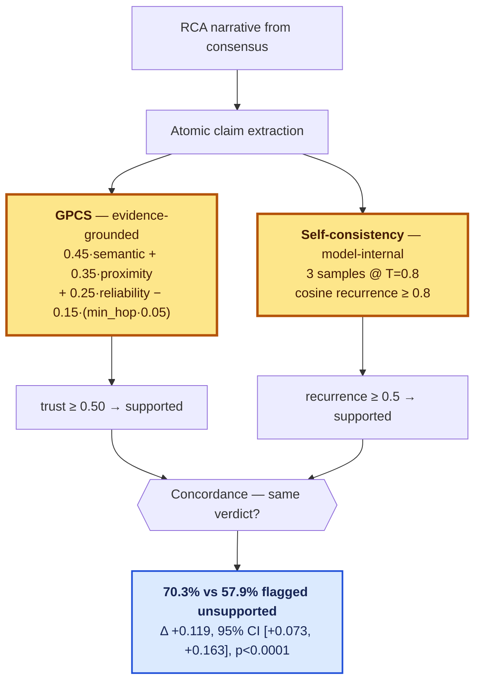

<div align="center">

# 🚀 CloudGraph

### Graph-Grounded Verification of LLM-Generated Root Cause Analysis for Kubernetes

CloudGraph builds a temporal knowledge graph from live cluster telemetry,
retrieves incident context over it, has five specialist LLM agents diagnose the
incident, and then — the part this project is actually about: **checks every
claim in the generated explanation against graph evidence.**

The research question is not *"can an LLM write a plausible root cause?"*
It is *"can we tell whether it made that up?"*

<br />

[](https://github.com/shivamshashank/CloudGraph/actions/workflows/ci.yml)
[](https://github.com/shivamshashank/CloudGraph/actions/workflows/release.yml)
[](https://codecov.io/gh/shivamshashank/CloudGraph)
[](https://github.com/shivamshashank/CloudGraph/releases)
[](https://github.com/shivamshashank/CloudGraph/stargazers)
[](https://github.com/shivamshashank/CloudGraph/network/members)
[](LICENSE)

<br />


<br />

**v1 complete** · 36 RCAEval RE2 scenarios · 3,685 claims · 0 exclusions · 129 tests

</div>

---

## 📌 Overview

Large language models write fluent incident explanations. They also invent
them. CloudGraph is a system and a study for telling the two apart.

It ingests Prometheus metrics, Loki logs, Kubernetes objects and Git/Argo CD
events into a **temporal property graph** (Neo4j), retrieves incident context
by **k-hop traversal fused with dense vectors** (Qdrant), runs **five
specialist agents** over that context, and then scores every atomic claim in
the resulting narrative two independent ways:

- **GPCS** (Graph-Provenance Claim Scoring): *evidence-grounded*: is this
  claim supported by the incident graph?
- **Self-consistency** — *model-internal*: does this claim recur when the model
  is sampled again?

Comparing those two verifiers, on real chaos-injected telemetry, is the
experiment.

| | |
|---|---|
| **Evaluation** | 36 RCAEval RE2 scenarios · 3,685 claims · 0 exclusions |
| **Build** | `9787fde`, image `sha256:81c4864130e8` |
| **Tests** | 129 |
| **Deployment** | Kubernetes via Helm — verified on kubeadm and OrbStack |

---

## 📊 Results

All three headline results come from one merged dataset
([`experiments/results/`](experiments/results/)), with scenario-clustered
paired bootstrap confidence intervals and Wilcoxon signed-rank tests.

| RQ | Question | Answer | Effect | 95% CI | p |
|---|---|---|---|---|---|
| **RQ1** | Does graph-grounded scoring differ from self-consistency? | **Yes** | +0.119 | [+0.073, +0.163] | <0.0001 |
| **RQ4** | Does neural/hybrid retrieval beat keyword? | **Yes** | +0.190 | [+0.116, +0.269] | 0.0003 |
| **RQ3** | Does structured context beat raw context? | **No** | +0.024 | [−0.028, +0.077] | 0.302 |

**RQ2**, *is this real end-to-end rather than a simulated scorer?*, is answered
**yes**: every baseline invokes the real pipeline. It was the prerequisite for
all of the above, and discharging it meant finding and fixing integrity defects
in this project's own pipeline first.

Two further findings, reported because they went against the design's own
predictions:

- **Vector ≡ hybrid on every measure.** The graph contributes nothing to
  *retrieval* on this benchmark. Its measurable contribution is to *claim
  scoring* — a different mechanism.
- **Neither verifier discriminates correct from incorrect claims.** On the
  4.2% of claims carrying automatic correctness labels, both gaps are −0.8 pp
  and both precision figures sit exactly on the base rate.

**→ [Full findings with figures](experiments/FINDINGS.html)** ·
[Methodology](experiments/README.md) ·
[Data provenance](experiments/DATA_PROVENANCE.md)

### ⚠️ What these results do not establish

Stated once, plainly, because each is easy to assume away:

1. **The primary measure is inter-method concordance, not accuracy.** It
   measures whether two verifiers reached the *same* verdict. Both can be wrong
   on the same claim and it counts as agreement.
2. **GPCS is stricter, not demonstrably better aimed.** Flagging more claims is
   not evidence of flagging the right ones.
3. **The task is fault-type diagnosis for a known affected service.** The
   benchmark supplies the faulted service, so the system is asked *why* it
   failed, never *which* service failed. Nothing here demonstrates root-cause
   service localisation.
4. **Scope is resource and network faults in microservice systems.** RCAEval
   RE2 contains no config errors, security events, deployment failures, DNS
   faults or certificate expiry.
5. **GPCS thresholds are fixed defaults**: 0.30 evidence floor, 0.50 trust cut
   — set by inspecting live score distributions. No held-out fitting was
   performed. They are **not calibrated**.

---

## ⚡ Quick Start

```bash
git clone https://github.com/shivamshashank/CloudGraph.git
cd CloudGraph
sudo cloudgraph deploy
```

Then open the UI, configure an LLM provider on the Settings page, and run a
diagnosis.

- 📖 **[Installation guide](docs/guides/INSTALLATION.md)** — prerequisites,
  kubeadm + Helm provisioning, configuration, troubleshooting
- 🏃 **[Quickstart](docs/guides/QUICKSTART.md)** — deploy in a few minutes
- 🖥️ **[UI walkthrough](docs/guides/UI_WALKTHROUGH.md)** — every screen, tab and
  button, with 14 screenshots from a live deployment against a real LLM

---

## 📚 Documentation

| | Document | Describes |
|---|---|---|
| 🏗️ | [Architecture index](docs/README.md) | Every design doc, marked built vs planned |
| 🗺️ | [System overview](docs/architecture/system-overview.md) | Lifecycle, install through investigation |
| 🖼️ | [Current architecture](docs/architecture/figures/current-architecture.svg) | Evaluated pipeline — solid built, dashed planned |
| 🔄 | [Design evolution](docs/architecture/design-evolution.md) | What changed from the original design, and why |
| 🧮 | [GPCS design](docs/design/GPCS_DESIGN.md) | Graph-Provenance Claim Scoring — the contribution |
| 📈 | [GCP design](docs/design/GCP_DESIGN.md) | Graph Confidence Propagation — Noisy-OR over the topology |
| 🧪 | [Experiments](experiments/README.md) | Benchmark, results, integrity guarantees, limitations |
| 📊 | [Findings](experiments/FINDINGS.html) | Eight findings with evidential status |
| 🔖 | [Data provenance](experiments/DATA_PROVENANCE.md) | Corpus source, licence, selection, checksums |
| 📚 | [Literature review](dissertation/LITERATURE_REVIEW.md) | RAG, GraphRAG, AIOps, multi-agent, hallucination detection |
| 🔗 | [References](dissertation/REFERENCES.md) | Numbered bibliography |
| ❓ | [Research questions](research/RESEARCH_QUESTIONS.md) | The seven RQs — four answered in v1, three deferred to v2 |
| 🕳️ | [Research gaps](research/RESEARCH_GAPS.md) | CloudGraph against the literature |
| 💡 | [Novel contributions](research/NOVEL_CONTRIBUTIONS.md) | Five candidates with pre-registered falsification criteria |
| ✅ | [Project status](docs/project/STATUS.md) | What is implemented and what is not |
| 🚧 | [Roadmap](docs/project/ROADMAP.md) | v2 work in priority order |
| 🎓 | [Dissertation pack](dissertation/README.md) | Chapter plan, progress log, submission checklist |

---

## 🏗️ Architecture



**The amber boxes are the research contribution.** Everything upstream is
infrastructure that exists to make verification possible.

### The verification step

This is what the study measures: the same claims scored two independent ways:



⚠️ **Concordance is not accuracy.** The comparison establishes that the two
verifiers *differ*, not that either is *right*: see
[what these results do not establish](#️-what-these-results-do-not-establish).

**Ingestion.** Metrics, logs, Kubernetes objects and webhook events become a
temporal property graph — `(:Pod)-[:RUNS_ON]->(:Node)`,
`(:Pod)-[:BELONGS_TO]->(:Service)`, `(:Commit)-[:TRIGGERED_BY]->(:Deployment)`.
Writes use `MERGE` on object UIDs, so repeated discovery is idempotent.

**Retrieval.** Bounded k-hop Cypher traversal from an incident seed, fused with
dense vectors (`all-MiniLM-L6-v2`, 384-dim) by a hybrid ranker:

```text
hybrid_score = 0.50·vector_similarity + 0.30·graph_proximity + 0.20·recency
```

Every result carries a `score_breakdown`, so any ranking can be explained term
by term in the UI.

**Verification.** The narrative is split into atomic claims, then scored by
GPCS —

```text
trust = 0.45·semantic + 0.35·proximity + 0.25·reliability − 0.15·(min_hop·0.05)
```

— and independently by self-consistency (3 samples at temperature 0.8; a claim
that fails to recur is flagged).

---

## 🤖 Agent Architecture

Five specialists, each an independent LLM call over its own evidence slice,
returning a finding and a confidence in `[0,1]`:

| Agent | Interprets |
|---|---|
| 🔍 **Monitoring** | Metrics, alerts, resource saturation |
| 📝 **Log** | Error signatures, repeated exceptions, warning bursts |
| 🚢 **Deployment** | Commits, releases, configuration drift |
| 🕸️ **Topology** | Service dependencies, blast radius, propagation paths |
| 🔐 **Security** | RBAC, secrets, policy changes, authentication failures |

A `ConsensusEngine` fuses them into one report. **The consensus step is a
static weighted aggregation, not a reasoning agent**: an accurate description
matters here, because "multi-agent" often implies debate or critique, and this
system has neither.

---

## 📂 Repository Structure

```text
cmd/cloudgraph/          Go CLI — deploy, ingest, report, health
services/
  api/                   FastAPI: ingestion, retrieval, GPCS, GCP, evaluation
  investigation-engine/  The five specialist agents
  agent-orchestrator/    ConsensusEngine
  ui/                    Static HTML/CSS/vanilla-JS (no framework, no build)
deployments/helm/        Helm chart — API, agents, UI, Neo4j, Qdrant, OTel, RBAC
graph/schema.cypher      Node labels, constraints, indexes
experiments/             Benchmark, merged results, findings, provenance
research/                Forward-looking research programme
dissertation/            Chapter plan, progress log, literature review, references
docs/                    Architecture, algorithm design, guides, project status
testing/                 End-to-end runbook and reproduction scripts
```

---

## 🔬 Reproducing the Evaluation

```bash
cd services/api && .venv/bin/python scripts/build_rcaeval_dataset.py --n-cases 36
```

Case selection is deterministic — the same 36 cases reproduce exactly. Run the
batches per [`testing/END_TO_END_RUNBOOK.md`](testing/END_TO_END_RUNBOOK.md),
then merge and regenerate:

```bash
cd services/api && .venv/bin/python scripts/paired_bootstrap.py && .venv/bin/python scripts/make_figures.py
```

**Expected divergence.** LLM sampling at temperature 0.8 is not seedable
through these APIs. Per-condition concordance moved across a 12-point range
over four isolated re-runs of identical scenarios, so a reproduction will land
*near*, not *on*, the published figures. This is a stated limitation, not
something worked around.

### 🛡️ Evaluation Integrity

Four defects each produced confident, invalid numbers before being caught. All
are fixed and pinned by regression tests in
`services/api/tests/test_evaluation_integrity.py`:

| Defect | Consequence |
|---|---|
| Ground-truth leakage | Every condition received the answer as its input |
| Index-based claim join | Scores attached to the wrong claims |
| Unearned graph proximity | A missing path scored as hop distance 0 |
| Cross-scenario contamination | Evidence from other scenarios stayed visible |

`merge_reports.py` enforces gates that **abort** on duplicate claims, broken
joins or ground-truth echo. Bootstrap is seeded (`seed=42`).

> Anything citing `64.0% agreement`, `44.2% vs 31.5%`, or `n=25` refers to an
> invalidated run and must not be reused.

---

## 🧪 Testing

```bash
cd services/api && .venv/bin/python -m pytest tests/ -q -n auto
```

```bash
go build ./... && go test ./...
```

129 Python tests plus the Go CLI suite. CI runs both, alongside pre-commit
(ruff, black, flake8, pylint, markdownlint, shellcheck, gitleaks).

---

## 🚧 v2 — What's Deferred

v1 is complete. Everything below is explicitly out of scope and tracked in
[`docs/project/ROADMAP.md`](docs/project/ROADMAP.md).

| Item | Why it matters |
|---|---|
| **Human-labelled claim correctness** (RQ7) | The most valuable outstanding work. Automatic labels cover 4.2%; without human labels we can say GPCS is *stricter*, not better *aimed*. Also the prerequisite for completing RQ1. |
| **Matched-compute control re-run** (RQ5) | Whether five agents beat one LLM at equal cost. The existing run predates the integrity fixes, so its numbers are invalid and unreported. One run, no new code. |
| **Benchmark screen** | The six-baseline ladder is built but **hidden from the UI** and not citable: point estimates with no CIs, compute confounded with architecture. |
| **Threshold calibration** (RQ6) | GPCS 0.30/0.50 and GCP edge weights are hand-set. Reliability diagrams and Brier score would make confidence outputs meaningful. **Nothing in v1 is calibrated.** |
| **API authentication** | `/api/v1/settings` is unauthenticated and returns the stored provider key in cleartext. Fine on localhost; a real risk otherwise. |
| **Qdrant collection bootstrap** | The `evidence` collection is not created on a fresh deploy, so the semantic store silently falls back to a local file. |
| **RCAEval RE3** | Code-level faults, to widen beyond resource and network. |
| **Trace ingestion** | The Tempo adapter is wired but Tempo was never deployed; `CALLS` edges fall back to naming heuristics. |

---

## 🤝 Contributing

```bash
git checkout -b feature/new-feature
git commit -m "feat: add new feature"
git push origin feature/new-feature
```

See [`CONTRIBUTING.md`](CONTRIBUTING.md) ·
[`SECURITY.md`](SECURITY.md) ·
[`CODE_OF_CONDUCT.md`](CODE_OF_CONDUCT.md)

---

## 📄 License & Citation

MIT — see [`LICENSE`](LICENSE).

The benchmark corpus is **RCAEval** (MIT), Zenodo DOI
[10.5281/zenodo.14590730](https://doi.org/10.5281/zenodo.14590730), arXiv
[2412.17015](https://arxiv.org/abs/2412.17015). Full attribution in
[`experiments/DATA_PROVENANCE.md`](experiments/DATA_PROVENANCE.md).

---

## 👤 Author

**Shivam Shashank**

- 🌐 Portfolio: [shivam-shashank.me](https://www.shivam-shashank.me/)
- 💼 LinkedIn:
  [shivam-shashank-2b5766217](https://www.linkedin.com/in/shivam-shashank-2b5766217/)
- 📧 Email: [shivamkumar872000@gmail.com](mailto:shivamkumar872000@gmail.com)
- 🐙 GitHub: [shivamshashank](https://github.com/shivamshashank)

---

<div align="center">

### ⭐ If CloudGraph helps you, please star the repository

</div>
