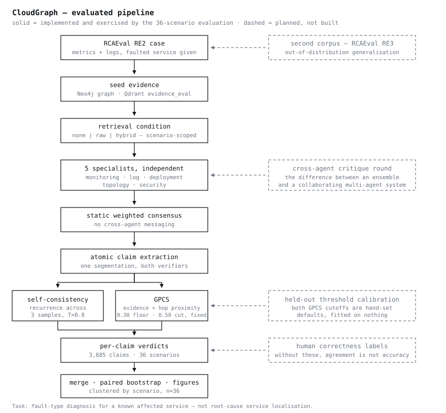

<div align="center">

# 🚀 CloudGraph

### GraphRAG-Powered Multi-Agent Root Cause Analysis for Cloud-Native Systems

CloudGraph is an AI-powered AIOps platform that combines Knowledge Graphs,
GraphRAG, Multi-Agent Systems, Kubernetes Observability, and Large Language
Models to automatically investigate incidents, identify root causes, and
generate remediation recommendations across cloud-native environments.

<br />

[](https://github.com/shivamshashank/CloudGraph/actions/workflows/ci.yml)
[](https://github.com/shivamshashank/CloudGraph/actions/workflows/release.yml)
[](https://codecov.io/gh/shivamshashank/CloudGraph)
[](https://goreportcard.com/report/github.com/shivamshashank/CloudGraph)
[](https://github.com/shivamshashank/CloudGraph/releases)
[](https://github.com/shivamshashank/CloudGraph/stargazers)
[](https://github.com/shivamshashank/CloudGraph/network/members)
[](LICENSE)

<br />


</div>

## 📌 Overview

CloudGraph transforms cloud observability data into explainable incident
intelligence.

It continuously ingests:

- Logs
- Metrics
- Kubernetes Events
- Kubernetes Object State
- Alerts
- Runtime Security Events
- Git Commits
- Pull Requests
- Deployment History

and constructs a real-time knowledge graph that powers GraphRAG retrieval and
multi-agent reasoning.

CloudGraph is designed to collect this data from open-source observability and
cloud-native tools such as OpenTelemetry, Prometheus, Grafana Loki,
kube-state-metrics, node_exporter, Alertmanager, Argo CD, Falco, and
GitHub/GitLab webhooks. What is actually wired versus planned is recorded in
[`docs/README.md`](docs/README.md) and [`docs/project/STATUS.md`](docs/project/STATUS.md).

---

# 🔬 Research Motivation

Modern cloud-native systems generate massive volumes of logs, metrics,
deployment events, and infrastructure changes.

Existing AIOps solutions typically rely on:

- Rule-based correlation
- Keyword search
- Traditional vector-based retrieval

These approaches often struggle to:

- Understand service dependencies
- Correlate infrastructure and application failures
- Explain reasoning paths
- Investigate multi-hop incident chains

CloudGraph explores whether GraphRAG-powered knowledge graph retrieval and
multi-agent reasoning can improve root cause analysis accuracy, explainability,
and incident resolution performance within Kubernetes environments.

---

# 🎯 Research Questions

### RQ1

Can GraphRAG improve root cause analysis accuracy compared to traditional RAG?

### RQ2

Does multi-agent reasoning improve investigation quality compared to
single-agent analysis?

### RQ3

Can knowledge graph retrieval reduce hallucinations during RCA generation?

### RQ4

Can GraphRAG-powered investigations reduce Mean Time To Resolution (MTTR)?

---

# 🧪 Research Hypotheses

### H1

GraphRAG achieves significantly higher RCA accuracy than traditional RAG.

### H2

GraphRAG combined with Multi-Agent Systems outperforms GraphRAG alone.

### H3

Knowledge graph retrieval reduces hallucination rates during incident analysis.

### H4

Confidence-aware agent voting improves recommendation quality and trust.

---

## 📐 What has actually been evaluated

The questions and hypotheses above are the research agenda. What has been
**measured** is narrower, and should not be conflated with them.

**The evaluated task is fault-type diagnosis for a known affected service,
not root-cause service localisation.** The benchmark supplies the faulted
service to the system, so it is asked *why* the service failed, never
*which* service failed. No result here shows that CloudGraph finds the
culprit service.

Completed: 36 chaos-injected RCAEval RE2 incidents across three systems and
six fault types, 3,685 claims, single build, zero exclusions.

| Question | Status |
|---|---|
| Does neural/hybrid retrieval beat keyword retrieval? | **Yes** — +0.190 tag recall, 95% CI [+0.116, +0.269], p=0.0003. Keyword never recovered a complete tag set in 36 scenarios. |
| Does the graph beat pure vector retrieval? | **No measurable difference** — identical on every retrieval metric. |
| Does retrieval context change how much output is graph-grounded? | **No** — 0.9 pp spread across none/raw/hybrid. |
| Are GPCS and self-consistency the same signal? | **No** — GPCS flags 11.9 pp more claims, CI [+0.073, +0.163]. |
| Does either verifier detect *incorrect* claims? | **Not established.** On the claims that can be labelled automatically, neither discriminates. |

H1–H4 as written are **not** tested by this evaluation. Full results:
[`experiments/FINDINGS.html`](experiments/FINDINGS.html) ·
[`experiments/README.md`](experiments/README.md).

---

## ✨ Core Features

- 🧠 GraphRAG-Powered Root Cause Analysis
- ☸️ Kubernetes-Native Architecture
- 🤖 Multi-Agent Investigation Workflow
- 🖥️ Unified AIOps Dashboard & Visualization
- 📊 Full Observability Integration
- 🔍 Explainable AI Decisions
- ⚡ Incident Correlation Engine
- 📈 MTTR Reduction Analytics
- 🔐 Security-Aware Investigations
- 🌐 Multi-Cloud Ready
- 📚 Incident Memory & Knowledge Base

---

# 🏆 Research Contributions

CloudGraph contributes the following research innovations:

## Contribution 1

### Temporal Incident Knowledge Graph

A dynamic knowledge graph that captures infrastructure relationships, deployment
history, service dependencies, and incident evolution over time.

## Contribution 2

### GraphRAG-Powered Incident Retrieval

Graph-based retrieval enables multi-hop reasoning across cloud resources,
services, deployments, alerts, and traces.

## Contribution 3

### Confidence-Aware Multi-Agent Investigation

Specialized agents independently investigate incidents and produce weighted
evidence scores used for consensus-driven RCA generation.

## Contribution 4

### Explainable Root Cause Analysis

Every recommendation can be traced back through graph relationships,
observability evidence, and agent reasoning.

## Contribution 5

### Reproducible Cloud Incident Benchmark

A benchmark dataset containing realistic Kubernetes incident scenarios for
GraphRAG evaluation.

---

# 🏗️ Architecture

## What is actually built

<p align="center">
  
</p>

Solid boxes are implemented and were exercised by the 36-scenario
evaluation. Dashed boxes are planned and do not exist — including the
cross-agent critique round, which is the difference between an ensemble
and a collaborating multi-agent system.

## Design history

The original design targeted AWS (EKS, RDS, S3), seven agents including
trace/RCA/recommendation roles, cross-agent collaboration, external alert
integrations and a continuous-learning loop. None of that was built. The
diagrams depicting it have been removed rather than captioned, because a
diagram that has to be explained away is worse than no diagram.

[`docs/architecture/design-evolution.md`](docs/architecture/design-evolution.md)
records what changed and why; git history retains the original visuals.

---

# 🧩 System Components

## Cloud Layer

> **Note:** CloudGraph is Kubernetes-native and runs on any Kubernetes distribution. **Current deployment uses Helm + kubeadm/Rancher** (not cloud-specific). Below is the full list of cloud-native services CloudGraph *can* integrate with, not all of which are actively deployed in the current implementation.

- AWS EKS *(optional; Helm charts support any Kubernetes)*
- EC2 *(not required; local nodes or any K8s worker)*
- IAM *(integrable via Argo CD external secrets or external-secrets operator)*
- S3 *(optional artifact storage)*
- CloudWatch *(optional; currently using open-source Prometheus/Loki/OTel)*

## Kubernetes Layer

- Kubernetes
- Helm
- ArgoCD
- Ingress NGINX

## Observability Layer

- Prometheus
- Grafana
- Loki
- OpenTelemetry
- Alertmanager
- kube-state-metrics
- node_exporter
- Falco
- Argo CD Notifications

## Open-Source Data Collection Layer

CloudGraph can collect both historical and live continuous data from
open-source systems:

| Data | Open-Source Source | Example Evidence |
| --- | --- | --- |
| Logs | OpenTelemetry Collector, Loki, Promtail / Alloy | Exceptions, warnings, retries, kubelet/container logs |
| Metrics | Prometheus, kube-state-metrics, node_exporter | CPU, memory, pod status, restart count, latency, error rate |
| Kubernetes Events | Kubernetes API/event stream | Scheduling failures, image pull errors, probe failures, restarts |
| Alerts | Alertmanager | Fired/resolved alerts, severity, labels, affected service |
| Deployments | Argo CD notifications/webhooks | Sync status, health state, degraded apps, rollbacks |
| Git Activity | GitHub/GitLab webhooks | Commits, pull requests, changed files, release timestamps |
| Security Events | Falco | Runtime anomalies, suspicious process/file/network activity |

Live continuous ingestion can be implemented using a mix of pull, push, stream,
and batch modes:

- Pull: query Prometheus, Loki, Kubernetes API, and Git APIs on a
  schedule.
- Push: receive webhooks from Alertmanager, Argo CD, GitHub/GitLab, Falco, and
  CI/CD systems.
- Stream: forward telemetry through OpenTelemetry Collector and log collectors.
- Batch: import historical incident datasets for repeatable dissertation
  experiments.

## Knowledge Graph Layer

- Neo4j

Nodes:

- Services
- Pods
- Deployments
- Databases
- Nodes
- Alerts
- Metrics
- Traces
- Commits

Relationships:

- CALLS
- DEPENDS_ON
- AFFECTS
- DEPLOYED_BY
- GENERATES

## Retrieval Layer

- GraphRAG
- Hybrid Search
- Vector Search
- Context Ranking

Vector Database:

- Qdrant

## AI Layer

- GPT-4 / Gemini / Claude
- Custom HTTP Orchestration Layer

## Frontend Layer

A web-based dashboard that serves as the central interface for CloudGraph. It
provides:

- **Live Observability**: Visualizes incoming logs and metrics.
- **Incident History**: Stores and displays past incidents and their
  resolutions.
- **Graph Visualization**: Shows the knowledge graph updating in real-time as
  investigations proceed.
- **Agent Monitoring**: Displays the status and findings of individual agents.

- Static HTML/CSS/vanilla JavaScript (`services/ui/static`), served directly — no framework or build step
- Topology graph rendered via hand-built SVG DOM manipulation (`topology.js`) — no charting/graph library

---

# 🤖 Agent Architecture

## Monitoring Agent

Analyzes:

- Metrics
- Alerts
- Resource Utilization

## Log Agent

Analyzes:

- Application Logs
- System Logs
- Error Patterns

## Investigation Agent

Analyzes:

- Latency Bottlenecks

## Deployment Agent

Analyzes:

- Git Commits
- CI/CD Events
- Deployment Changes

## Security Agent

Analyzes:

- RBAC
- Security Policies
- Cluster Events

## Root Cause Agent

Responsibilities:

- Evidence Fusion
- Root Cause Ranking
- Hypothesis Validation
- Confidence Estimation

## Consensus Engine

Aggregates findings from all agents using:

- Weighted Voting
- Confidence Scoring
- Temporal Correlation

---

# 🧪 Experimental Dataset

CloudGraph is evaluated using a reproducible incident benchmark dataset.

## Incident Categories

### Kubernetes

- CrashLoopBackOff
- ImagePullBackOff
- OOMKilled
- Node Failures

### Networking

- DNS Failures
- Service Discovery Issues
- Network Partitions

### Security

- RBAC Misconfigurations
- Secret Rotation Failures
- IAM Errors

### Deployments

- Faulty Releases
- Configuration Drift
- Rollout Errors

### Observability

- Missing Metrics
- Alert Storms
- Telemetry Gaps

Target Dataset Size:

- 100+ Incidents
- 500+ Services
- 10,000+ Events
- 100,000+ Graph Relationships
- Evidence Correlation

## Recommendation Agent

Generates:

- RCA Report
- Confidence Score
- Evidence Chain
- Remediation Plan
- Risk Assessment

---

# 🕸️ GraphRAG Investigation Pipeline

CloudGraph transforms raw observability telemetry into explainable root cause
analysis through a multi-stage GraphRAG and multi-agent reasoning pipeline.

<p align="center">
  
</p>

See [What is actually built](#what-is-actually-built) for the end-to-end
pipeline, and
[`docs/architecture/system-overview.md`](docs/architecture/system-overview.md)
for the step-by-step walkthrough.

---

## 🔄 Investigation Workflow

### Stage 1 — Data Collection

CloudGraph continuously ingests:

- 📜 Application Logs
- 📊 Metrics
- � Metrics
- 📜 Application Logs
- ☸️ Kubernetes Events
- 🚀 Deployment History
- 📂 Git Activity
- 🛠 Configuration Changes

---

### Stage 2 — Knowledge Graph Construction

Observability signals are transformed into graph entities.

#### Nodes

- Services
- Pods
- Deployments
- Nodes
- Databases
- Metrics
- Alerts
- Logs
- Commits
- Incidents

#### Relationships

- CALLS
- DEPENDS_ON
- DEPLOYED_BY
- GENERATES
- AFFECTS
- CONNECTS_TO
- TRIGGERED_BY

---

### Stage 3 — GraphRAG Retrieval

Unlike traditional vector retrieval, GraphRAG enables:

- 🔍 Multi-Hop Reasoning
- 🕸 Dependency Traversal
- 📚 Context Expansion
- ⚡ Incident Correlation
- 🔗 Relationship-Aware Retrieval

---

### Stage 4 — Multi-Agent Investigation

Specialized agents independently investigate incidents.

| Agent               | Responsibility         |
| ------------------- | ---------------------- |
| 📈 Monitoring Agent | Metrics & Alerts       |
| 📜 Log Agent        | Log Analysis           |
|  Deployment Agent | Release Analysis       |
| 🔐 Security Agent   | Security Investigation |

---

### Stage 5 — Evidence Fusion

Agent outputs are combined through a consensus engine.

Evidence scoring considers:

- Confidence
- Source Reliability
- Graph Evidence Strength
- Temporal Correlation
- Cross-Agent Agreement

---

### Stage 6 — Root Cause Analysis

The Root Cause Agent:

- Correlates evidence
- Ranks hypotheses
- Computes confidence scores
- Generates explainable RCA reports

---

### Stage 7 — Recommendation Generation

The Recommendation Agent produces:

- Root Cause Summary
- Confidence Score
- Evidence Chain
- Impact Assessment
- Remediation Plan
- Rollback Recommendations

---

## 🏆 Key Research Innovations

### 🧠 Temporal GraphRAG

Captures infrastructure evolution and incident progression over time.

### 🤖 Confidence-Aware Multi-Agent Reasoning

Combines agent findings using weighted evidence aggregation.

### 🔍 Explainable AI for AIOps

Every RCA decision can be traced back to graph relationships, telemetry
evidence, and agent reasoning.

### 📊 Incident Intelligence Layer

Transforms raw observability data into actionable operational knowledge.

---

# 📂 Repository Structure

```text
cloudgraph/

├── cmd/                       # cloudgraph CLI (Go)
├── deployments/
│   ├── kubernetes/
│   └── helm/
├── docs/
│   ├── guides/                # INSTALLATION.md, QUICKSTART.md
│   ├── architecture/          # System design docs + diagrams
│   ├── design/                # GPCS_DESIGN.md, GCP_DESIGN.md (algorithm design)
│   ├── images/                # Architecture diagrams (png/svg)
│   ├── STATUS.md              # Current implementation status
│   └── ROADMAP.md             # Forward-looking roadmap
├── research/                  # Research questions, contributions, methods
├── experiments/                # Reproducible evaluation: results, figures, scripts
├── testing/                    # Incident-injection + reproduction scripts
├── dissertation/                # Weekly progress log, literature review, references
├── services/
│   ├── api/                    # Python backend API
│   ├── ui/                     # Web frontend
│   ├── agent-orchestrator/     # Python Agent Orchestrator
│   └── investigation-engine/   # Python Investigation Engine
├── embedded.go                 # Embeds deployments/helm for the CLI binary
├── README.md
└── LICENSE
```

---

# 🚨 Example Investigation

## Incident

Checkout service unavailable.

### Collected Evidence

Logs:

```text
database connection timeout
```

Metrics:

```text
error_rate increased
```

Signal chain:

```text
checkout → payment → postgres
```

Deployment:

```text
payment-service deployed 10 minutes ago
```

### Knowledge Graph Correlation

```text
deployment-v14
    ↓
secret-change
    ↓
database-auth-failure
    ↓
payment-service-crash
    ↓
checkout-outage
```

### Generated RCA

```json
{
  "root_cause": "Invalid database credentials",
  "confidence": 0.94,
  "recommendation": "Rollback deployment v14"
}
```

---

# ⚡ Quick Start

## Clone

```bash
git clone https://github.com/your-org/cloudgraph.git
cd cloudgraph
```

## Docker

```bash
docker compose up -d
```

## Backend

```bash
cd services/api
uvicorn app.main:app --reload
```

## Start Investigation Engine

```bash
python run_agents.py
```

---

# ☸️ Kubernetes Deployment

```bash
kubectl apply -f deployments/kubernetes/
```

Verify:

```bash
kubectl get pods -A
kubectl get svc -n observability
kubectl get svc -n cloudgraph
```

# Week 2 End-to-End Verification

From the repository root, validate and verify the observability and deployment stack:

```bash
cd tests/observability
go test -v -timeout 5m ./...
```

For a local deployment, install the CLI and deploy:

```bash
curl -fsSL https://raw.githubusercontent.com/shivamshashank/CloudGraph/main/install.sh | sudo bash
sudo cloudgraph deploy
```

---

# 🗄️ Neo4j Setup

```bash
docker run -d \
  --name neo4j \
  -p 7474:7474 \
  -p 7687:7687 \
  neo4j
```

---

# 🔍 Qdrant Setup

```bash
docker run -d \
  -p 6333:6333 \
  qdrant/qdrant
```

---

# 🌐 API Endpoints

## Health

```http
GET /health
```

## Investigate Incident

```http
POST /api/v1/investigate
```

Request:

```json
{
  "incident_id": "INC-001"
}
```

## Graph Search

```http
POST /api/v1/graph/search
```

## Agent Status

```http
GET /api/v1/agents
```

---

# 📊 Evaluation Framework

Metrics:

- Root Cause Accuracy
- Precision
- Recall
- F1 Score
- MTTR Reduction
- Hallucination Rate
- Retrieval Quality

Comparison Modes:

1. Traditional RAG
2. GraphRAG
3. GraphRAG + Multi-Agent System

---

# 🧪 Experimental Dataset

CloudGraph is evaluated using a reproducible incident benchmark dataset.

## Incident Categories

### Kubernetes

- CrashLoopBackOff
- ImagePullBackOff
- OOMKilled
- Node Failures

### Networking

- DNS Failures
- Service Discovery Issues
- Network Partitions

### Security

- RBAC Misconfigurations
- Secret Rotation Failures
- IAM Errors

### Deployments

- Faulty Releases
- Configuration Drift
- Rollout Errors

### Observability

- Missing Metrics
- Alert Storms
- Telemetry Gaps

Target Dataset Size:

- 100+ Incidents
- 500+ Services
- 10,000+ Events
- 100,000+ Graph Relationships

---

# 🧪 Testing

```bash
pytest
```

Coverage:

```bash
pytest --cov
```

Lint:

```bash
ruff check .
```

Type Check:

```bash
mypy .
```

---

# 🤝 Contributing

```bash
git checkout -b feature/new-feature
git commit -m "feat: add new feature"
git push origin feature/new-feature
```

---

# 📄 License

MIT License

---

## 👤 Author

**Shivam Shashank**

- 🌐 Portfolio: [shivam-shashank.me](https://www.shivam-shashank.me/)
- 💼 LinkedIn:
  [shivam-shashank-2b5766217](https://www.linkedin.com/in/shivam-shashank-2b5766217/)
- 📧 Email: [shivamkumar872000@gmail.com](mailto:shivamkumar872000@gmail.com)
- 🐙 GitHub: [shivamshashank](https://github.com/shivamshashank)

---

<div align="center">

### ⭐ If CloudGraph helps you, please star the repository

</div>
