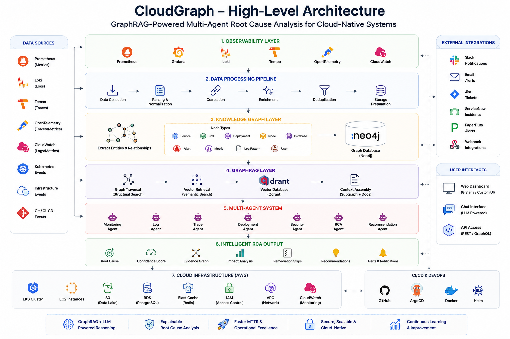
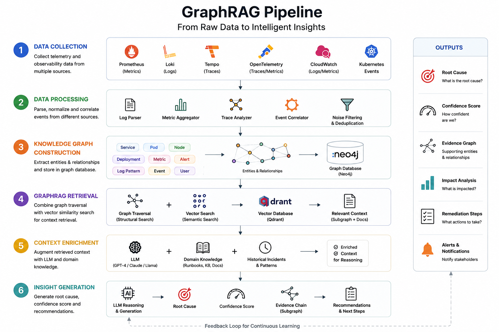
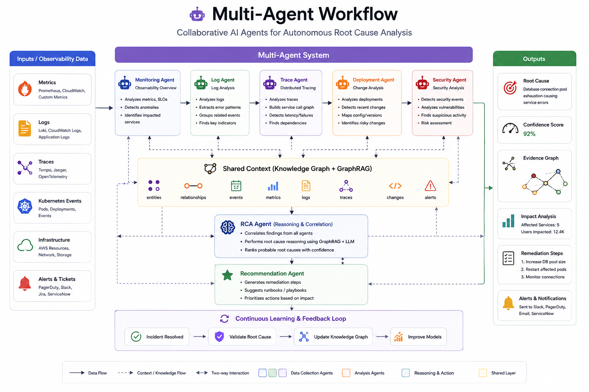
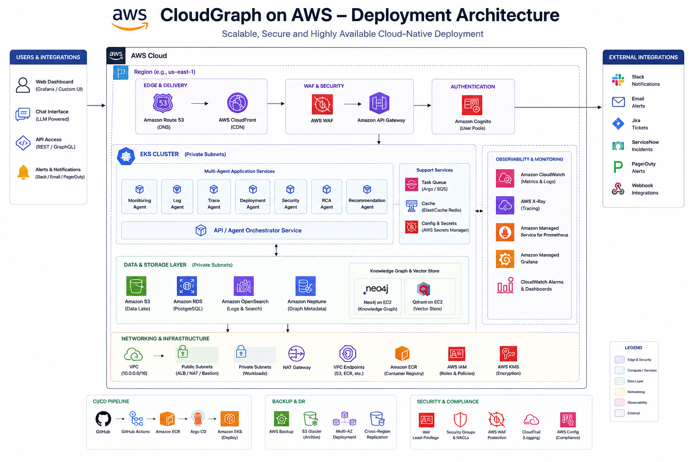
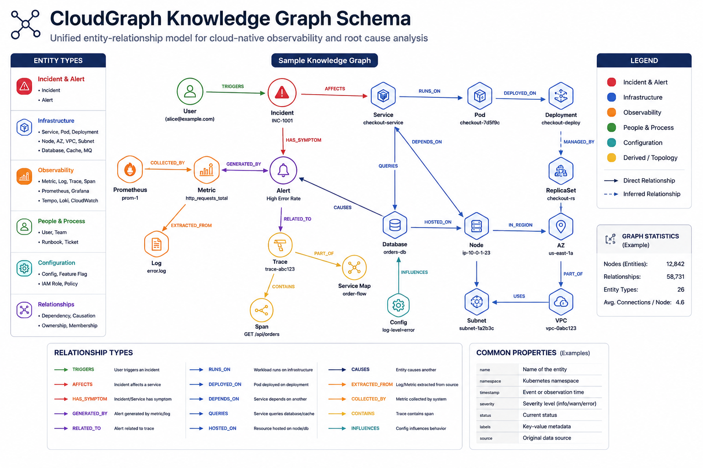

# 🚀 CloudGraph

### GraphRAG-Powered Multi-Agent Root Cause Analysis for Cloud-Native Systems

CloudGraph is an AI-powered AIOps platform that combines Knowledge Graphs,
GraphRAG, Multi-Agent Systems, Kubernetes Observability, and Large Language
Models to automatically investigate incidents, identify root causes, and
generate remediation recommendations across cloud-native environments.

---

## 🏷️ Technology Stack


---

## 📌 Overview

CloudGraph transforms cloud observability data into explainable incident
intelligence.

It continuously ingests:

- Logs
- Metrics
- Traces
- Kubernetes Events
- Git Commits
- Terraform Changes
- Deployment History

and constructs a real-time knowledge graph that powers GraphRAG retrieval and
multi-agent reasoning.

---

## ✨ Core Features

- 🧠 GraphRAG-Powered Root Cause Analysis
- ☸️ Kubernetes-Native Architecture
- 🤖 Multi-Agent Investigation Workflow
- 📊 Full Observability Integration
- 🔍 Explainable AI Decisions
- ⚡ Incident Correlation Engine
- 📈 MTTR Reduction Analytics
- 🔐 Security-Aware Investigations
- 🌐 Multi-Cloud Ready
- 📚 Incident Memory & Knowledge Base

---

# 🏗️ Architecture

<table>
  <tr>
    <td align="center" width="33%">
      <b>High-Level Architecture</b><br><br>
      
    </td>
    <td align="center" width="33%">
      <b>GraphRAG Pipeline</b><br><br>
      
    </td>
    <td align="center" width="33%">
      <b>Multi-Agent Workflow</b><br><br>
      
    </td>
  </tr>
  <tr>
    <td align="center">
      <b>AWS Deployment</b><br><br>
      
    </td>
    <td align="center">
      <b>Knowledge Graph Schema</b><br><br>
      
    </td>
    <td></td>
  </tr>
</table>

---

# 🧩 System Components

## Cloud Layer

- AWS EKS
- EC2
- IAM
- S3
- CloudWatch

## Kubernetes Layer

- Kubernetes
- Helm
- ArgoCD
- Ingress NGINX

## Observability Layer

- Prometheus
- Grafana
- Loki
- Tempo
- OpenTelemetry
- Alertmanager

## Knowledge Graph Layer

- Neo4j

Nodes:

- Services
- Pods
- Deployments
- Databases
- Nodes
- Alerts
- Metrics
- Traces
- Commits

Relationships:

- CALLS
- DEPENDS_ON
- AFFECTS
- DEPLOYED_BY
- GENERATES

## Retrieval Layer

- GraphRAG
- Hybrid Search
- Vector Search
- Context Ranking

Vector Database:

- Qdrant

## AI Layer

- GPT-5
- Claude
- Llama 3
- LangGraph
- LangChain

---

# 🤖 Agent Architecture

## Monitoring Agent

Analyzes:

- Metrics
- Alerts
- Resource Utilization

## Log Agent

Analyzes:

- Application Logs
- System Logs
- Error Patterns

## Trace Agent

Analyzes:

- Distributed Traces
- Latency Bottlenecks

## Deployment Agent

Analyzes:

- Git Commits
- CI/CD Events
- Terraform Changes

## Security Agent

Analyzes:

- RBAC
- Security Policies
- Cluster Events

## Root Cause Agent

Combines evidence from all agents.

## Recommendation Agent

Generates:

- RCA Report
- Confidence Score
- Fix Recommendation

---

# 📂 Repository Structure

```text
cloudgraph/

├── agents/
├── backend/
├── graph/
├── retrieval/
├── observability/
├── deployments/
│   ├── terraform/
│   ├── kubernetes/
│   └── helm/
├── datasets/
├── experiments/
├── docs/
│   └── images/
├── tests/
├── scripts/
├── docker-compose.yml
├── README.md
└── LICENSE
```

---

# 🚨 Example Investigation

## Incident

Checkout service unavailable.

### Collected Evidence

Logs:

```text
database connection timeout
```

Metrics:

```text
error_rate increased
```

Trace:

```text
checkout → payment → postgres
```

Deployment:

```text
payment-service deployed 10 minutes ago
```

### Knowledge Graph Correlation

```text
deployment-v14
    ↓
secret-change
    ↓
database-auth-failure
    ↓
payment-service-crash
    ↓
checkout-outage
```

### Generated RCA

```json
{
  "root_cause": "Invalid database credentials",
  "confidence": 0.94,
  "recommendation": "Rollback deployment v14"
}
```

---

# ⚡ Quick Start

## Clone

```bash
git clone https://github.com/your-org/cloudgraph.git
cd cloudgraph
```

## Docker

```bash
docker compose up -d
```

## Backend

```bash
uvicorn app.main:app --reload
```

## Start Investigation Engine

```bash
python run_agents.py
```

---

# ☸️ Kubernetes Deployment

```bash
kubectl apply -f deployments/kubernetes/
```

Verify:

```bash
kubectl get pods -A
```

---

# 🏗️ Terraform Deployment

```bash
cd deployments/terraform

terraform init
terraform plan
terraform apply
```

Resources:

- EKS Cluster
- VPC
- IAM
- Monitoring Stack

---

# 🗄️ Neo4j Setup

```bash
docker run -d \
  --name neo4j \
  -p 7474:7474 \
  -p 7687:7687 \
  neo4j
```

---

# 🔍 Qdrant Setup

```bash
docker run -d \
  -p 6333:6333 \
  qdrant/qdrant
```

---

# 🌐 API Endpoints

## Health

```http
GET /health
```

## Investigate Incident

```http
POST /api/v1/investigate
```

Request:

```json
{
  "incident_id": "INC-001"
}
```

## Graph Search

```http
POST /api/v1/graph/search
```

## Agent Status

```http
GET /api/v1/agents
```

---

# 📊 Evaluation Framework

Metrics:

- Root Cause Accuracy
- Precision
- Recall
- F1 Score
- MTTR Reduction
- Hallucination Rate
- Retrieval Quality

Comparison Modes:

1. Traditional RAG
2. GraphRAG
3. GraphRAG + Multi-Agent System

---

# 🛣️ Roadmap

## v1

- Knowledge Graph
- GraphRAG
- Incident Investigation

## v2

- Autonomous Remediation
- Security Analysis

## v3

- Multi-Cloud Support
- Graph Neural Networks

## v4

- Self-Learning Incident Memory
- Reinforcement Learning Agents

---

# 🧪 Testing

```bash
pytest
```

Coverage:

```bash
pytest --cov
```

Lint:

```bash
ruff check .
```

Type Check:

```bash
mypy .
```

---

# 🤝 Contributing

```bash
git checkout -b feature/new-feature
git commit -m "feat: add new feature"
git push origin feature/new-feature
```

---

# 📄 License

MIT License

---

## 👤 Author

**Shivam Shashank**

- 🌐 Portfolio: [shivam-shashank.me](https://www.shivam-shashank.me/)
- 💼 LinkedIn:
  [shivam-shashank-2b5766217](https://www.linkedin.com/in/shivam-shashank-2b5766217/)
- 📧 Email: [shivamkumar872000@gmail.com](mailto:shivamkumar872000@gmail.com)
- 🐙 GitHub: [shivamshashank](https://github.com/shivamshashank)

---

<div align="center">

### ⭐ If CloudGraph helps you, please star the repository.

</div>
