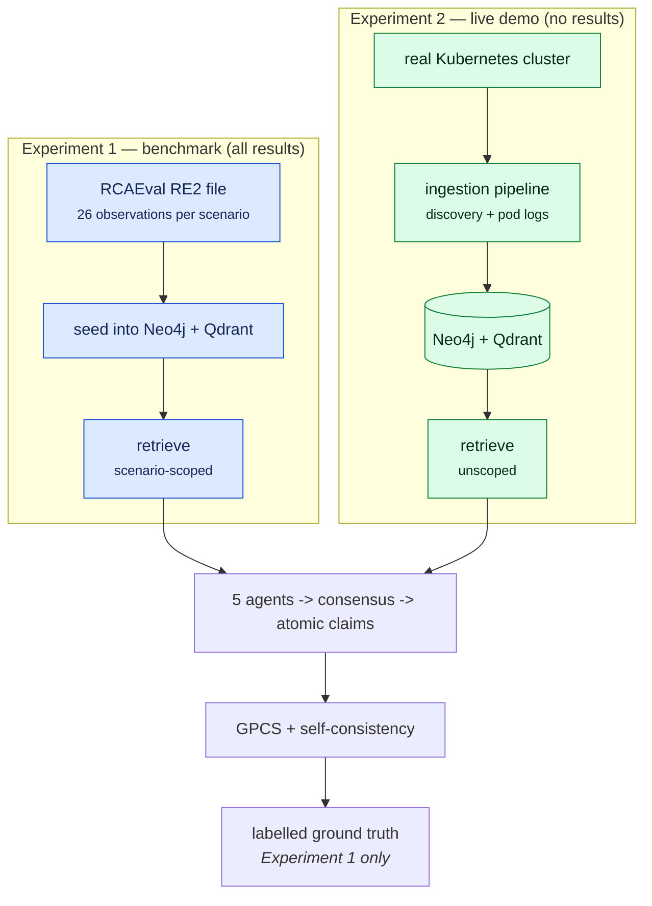
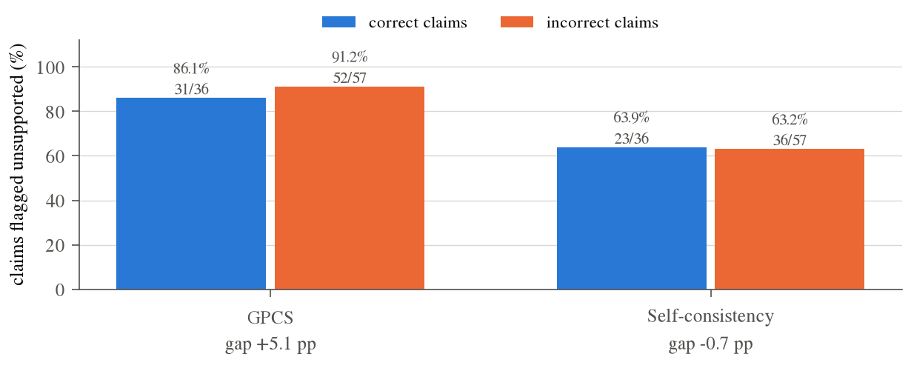
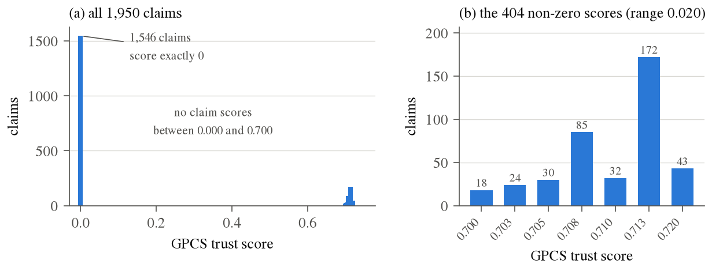
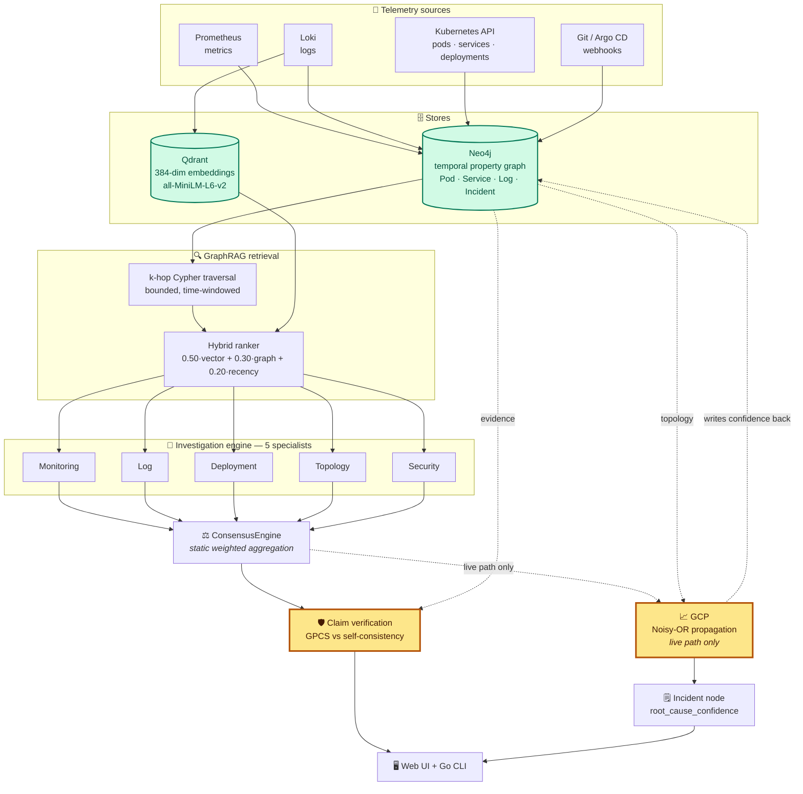
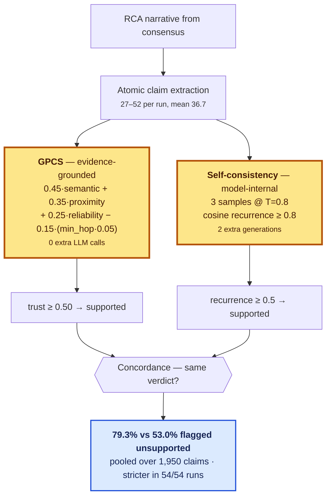

<div align="center">

# 🚀 CloudGraph

### Graph-Grounded Verification of LLM-Generated Root Cause Analysis for Kubernetes

CloudGraph builds a temporal knowledge graph from live cluster telemetry,
retrieves incident context over it, has five specialist LLM agents diagnose the
incident, and then — the part this project is actually about: **checks every
claim in the generated explanation against graph evidence.**

The research question is not *"can an LLM write a plausible root cause?"*
It is *"can we tell whether it made that up?"*

<br />

[](https://github.com/shivamshashank/CloudGraph/actions/workflows/ci.yml)
[](https://github.com/shivamshashank/CloudGraph/actions/workflows/release.yml)
[](https://codecov.io/gh/shivamshashank/CloudGraph)
[](https://github.com/shivamshashank/CloudGraph/releases)
[](https://github.com/shivamshashank/CloudGraph/stargazers)
[](https://github.com/shivamshashank/CloudGraph/network/members)
[](LICENSE)

<br />


<br />

**Experiment 1** · 18 RCAEval RE2 scenarios × 3 conditions · 54 runs · 1,950 claims · 129 tests

</div>

---

## 📌 Overview

Large language models write fluent incident explanations. They also invent
them. CloudGraph is a system and a study for telling the two apart.

It ingests Loki logs, Kubernetes objects and Git/Argo CD
events into a **temporal property graph** (Neo4j), retrieves incident context
by **k-hop traversal fused with dense vectors** (Qdrant), runs **five
specialist agents** over that context, and then scores every atomic claim in
the resulting narrative two independent ways:

- **GPCS** (Graph-Provenance Claim Scoring) — *evidence-grounded*: is this
  claim supported by the incident graph? Costs **no extra model calls.**
- **Self-consistency** — *model-internal*: does this claim recur when the model
  is sampled again? Costs **two extra full generations.**

Comparing those two verifiers, on real chaos-injected telemetry, is the
experiment.

> **Two properties of the implementation that bound how the results read.**
>
> **Metrics are synthetic on the live-cluster path.** Experiment 1 seeds real
> RCAEval telemetry into its `Metric` nodes
> (`services/api/app/demo/seeding.py`), so its metric evidence is measured data.
> Experiment 2 has no such source: every `Metric` node there is produced by
> `_simulate_pod_metrics()`
> (`services/api/app/adapters/k8s_discovery.py:236`), which generates values
> with `random.uniform()`. A Prometheus ingestion endpoint exists
> (`POST /api/v1/telemetry/metrics`) but nothing calls it and no metrics-server
> is deployed, so no metric figure in an Experiment 2 diagnosis reflects
> measured telemetry. Metric evidence is excluded from retrieval and from
> provenance scoring in Experiment 2 for that reason.
>
> **GPCS's semantic term is a constant in Experiment 1.** Its evidence comes
> from graph traversal, which assigns a fixed score (`0.75` within two hops,
> `0.6` beyond) rather than a measured similarity. The trust score is therefore
> determined by graph reachability:
> `0.45×0.75 + 0.35×0.50 + 0.25×0.81 − 0.15×0.05 = 0.7075 ≈ 0.708`, which is the
> value taken by 85 of the 1,950 claims. Read those results as measuring
> **reachability**, not semantic provenance.

**The headline result is a measurement, not a win.** Only **4.8%** of the claims
an LLM generates about an incident can be adjudicated at all using standard RCA
benchmark metadata. That ceiling — not the choice of verifier — is what binds
this whole line of work, and it applies to any claim-level verifier evaluated
this way.

| | |
|---|---|
| **Evaluation** | 18 RCAEval RE2 scenarios × 3 retrieval conditions · 54 runs · 1,950 claims |
| **Adjudicable** | 93 of 1,950 claims (4.8%) |
| **Tests** | 129 |
| **Deployment** | Kubernetes via Helm — verified on kubeadm and OrbStack |

---

## 🧪 Two experiments, two different jobs

| | `experiment-1-benchmark/` | `experiment-2-live-demo/` |
|---|---|---|
| **Purpose** | measure verification | demonstrate the pipeline |
| **Evidence comes from** | an RCAEval file, seeded into the stores | the real cluster, via the ingestion pipeline |
| **Exercises ingestion?** | **no** | **yes** |
| **Ground truth** | labelled, 1,950 claims | known but unlabelled |
| **Scale** | 18 faults x 3 conditions = 54 runs | 1 fault |
| **Produces results?** | **yes — every number in this README** | **no** |



**No data from the host cluster reaches any prompt in Experiment 1.** Its
telemetry is seeded from a file and torn down after each run. That is deliberate:
incidents on a live cluster have no labelled ground truth, so claim correctness
could not be scored; and holding the evidence pool constant is what lets a
difference in outcome be attributed to retrieval strategy rather than to which
data happened to exist.

The consequence is that Experiment 1 measures evidence **selection**, not
evidence **discovery**. Experiment 2 exists to exercise the ingestion pipeline
that Experiment 1 deliberately bypasses — it demonstrates, and measures nothing.

---

## 📊 Results & Key Findings

Every number below is derived from the 54 run logs across 18 benchmark scenarios. Full analysis is detailed in [`experiment-1-benchmark/results/EXPERIMENT_FINAL_RESULTS.md`](experiment-1-benchmark/results/EXPERIMENT_FINAL_RESULTS.md).

### 1. Retrieval Condition Breakdown (`NONE` vs `RAW` vs `HYBRID`)

| Metric | `NONE` (No Context) | `RAW` (Full Dump) | `HYBRID` (Ranked Graph) | Takeaway |
|---|---:|---:|---:|---|
| **Total Claims Extracted** | 628 | 703 | **619** | **HYBRID:** fewest claims (36.1/run pooled). |
| **GPCS Unsupported % (Pooled)** | 78.3% | 80.1% | 79.3% | Flat across conditions. |
| **Self-Consistency Unsupported %**| 57.0% | **49.2%** | 53.3% | **RAW:** highest recurrence. |
| **Mean Request Payload** | 1,651 ch | 27,406 ch | **13,196 ch** | **HYBRID: 51.9% smaller** than `RAW`. |
| **Evaluable Correctness Coverage**| 4.8% (30/628) | 3.6% (25/703) | **6.1% (38/619)** | **HYBRID:** most adjudicable claims. |
| **Consistent : Contradicted** | **14 : 16** | 10 : 15 | 12 : 26 | **NONE:** best ratio; HYBRID worst. |

---

### 2. Does either verifier track correctness?



**Figure 1 — Neither verifier separates correct claims from incorrect ones.**
A verifier that worked would show a tall orange bar beside a short blue one.
GPCS flags incorrect claims 5.1 pp more often than correct ones (about three
claims); self-consistency flags them 0.7 pp *less* often. Counts appear beneath
each percentage — the 93 adjudicable claims split 36 correct / 57 incorrect.



**Figure 2 — The trust score is a gate, not a graded confidence.** Across 1,950
claims it takes only eight distinct values. 1,546 sit at exactly `0.000`, and
**nothing at all falls between 0.000 and 0.700**; the 404 non-zero scores occupy
a band 0.020 wide. This is the mechanism behind Figure 1 — a threshold cannot be
tuned on a distribution with this shape.

---

### 3. Research Questions (RQ) Support Matrix

The project has **one** research-question register, RQ1-RQ7, defined in
[`docs/PROJECT_EXPLAINED.md`](docs/PROJECT_EXPLAINED.md). Every verdict below
comes from the 18-scenario evaluation, which computes **no inferential statistics**

- no verdict here rests on a *p*-value or a confidence interval.

| RQ | Question | Verdict |
|---|---|---|
| **RQ1** | Does GPCS behave differently from self-consistency, and does either flag track claim correctness? | **Partly against.** Distinct - 79.3% vs 53.0% unsupported, stricter in all 54 runs. But on 93 adjudicable claims neither tracks correctness (GPCS +5.1 pp at 0.627 precision, SC -0.7 pp at 0.610, base rate 0.613). |
| **RQ2** | Is the measured result real end-to-end, not an artefact of a simulated scorer? | **Yes.** 54/54 runs completed, zero fallbacks or timeouts, paired verdicts for all 1,950 claims, deterministic labeller, `claims.csv` regenerable by committed script. |
| **RQ3** | Does graph-structured retrieval beat dumping all evidence into context? | **Cost win only.** HYBRID cuts the request payload **51.9% vs RAW** and gives the best evaluable coverage (6.1%), but the worst consistent:contradicted ratio (12:26). No accuracy advantage. |
| **RQ4** | Is any retrieval benefit symbolic-structural or neural-semantic? | **Not measured.** No retrieval ablation was run. Highest-value experiment outstanding. |
| **RQ5** | Does the five-agent architecture beat a single model at matched compute? | Deferred to v2. |
| **RQ6** | Are the confidence scores calibrated, and would fitted weights beat hand-set ones? | Deferred to v2. |
| **RQ7** | Which claim types are each verifier's blind spot? | Deferred to v2 - 4.8% coverage is still too thin to stratify. |

**What the evaluation establishes operationally** - engineering results, not
research claims: the pipeline runs reliably end-to-end across 54 runs and 1,057
LLM calls with zero failures; GPCS supplies an evidence gate at **zero
additional LLM cost** against self-consistency's 2 extra generations per claim;
and requiring both verifiers to accept keeps just **308 of 1,950 claims — an
84.2% reduction** in volume.

---

### 4. The five hypotheses

The project rests on five claims. **Four are supported; one is refuted** — and
the refuted one is the claim the whole design was built on.

| # | Hypothesis | Verdict | Evidence |
|---|---|---|---|
| **H1** | An operational system already carries a real dependency graph, obtainable free rather than at extra cost. | ✅ **Supported** | All 54 runs built a typed property graph from RCAEval telemetry with no annotation step. |
| **H2** | The pipeline runs reliably end to end at scale. | ✅ **Supported** | 54/54 runs completed. **Zero** fallbacks or timeouts across 1,057 LLM calls and 5.20 h, producing paired verdicts for all 1,950 claims. |
| **H3** | A graph can verify generated claims at no additional model cost. | ✅ **Supported** | GPCS scores every claim by database query at **0 extra LLM calls**, against self-consistency's 2 extra generations. It also behaves distinctly: 79.3% unsupported vs 53.0%. |
| **H4** | Ranked graph retrieval reduces context cost against dumping all evidence. | ✅ **Supported** | HYBRID cuts the mean request payload **51.9%** (13,196 vs 27,406 chars), produces the fewest claims, and gives the best evaluable coverage (6.1%). |
| **H5** | A claim traceable to nearby graph evidence is more likely to be **true**. | ❌ **Refuted** | On 93 adjudicable claims GPCS's flag-rate gap is **+5.1 pp** at precision **0.627** against a **0.613** base rate — the score for flagging everything. Self-consistency is **−0.7 pp**. |

**H5 is the load-bearing one.** H1–H4 establish that the graph is free, the
system is reliable, verification is cheap and ranked retrieval is cheaper. None
of that matters much if traceable evidence does not indicate a true claim — and
it does not. **Provenance predicts reachability, not truth.** That is the
finding, and it is negative.

**→ [Full Pooled Results](experiment-1-benchmark/results/EXPERIMENT_FINAL_RESULTS.md)** ·
[Joint-Verifier Comparison](experiment-1-benchmark/results/EXPERIMENT_JOINT_VERIFIER_COMPARISON.md) ·
[Experiment 1 Methodology](experiment-1-benchmark/README.md)

---

### ⚠️ What These Results Do Not Establish (Scope & Limitations)

To keep evaluation findings honest and transparent, here is what the results do **not** claim:

1. **Strictness ≠ Superior Accuracy:** GPCS is stricter than Self-Consistency (rejection rate 79.3% vs 53.0%), but flagging more claims reflects a stricter database evidence gate—not higher accuracy. Across the 22 ground-truth claims, both verifiers differ by only 1 claim net.
2. **Single-Run Flag Rates Are Not Accuracy:** A single scenario run measures verifier strictness, not overall Precision/Recall. True verifier accuracy is evaluated over the combined 6-scenario dataset.
3. **Fault Diagnosis, Not Service Localization:** The benchmark identifies the affected target service (`ts-order-service`, `carts`, etc.) in advance. The system diagnoses *how/why* the service failed, not *which* service failed across the cluster.
4. **Coarse Evidence Gate (Binary Thresholding):** GPCS trust scores operate as a strict pass/fail evidence gate (79.3% of claims score `0.000` because no graph evidence cleared the vector similarity floor), rather than a calibrated continuous confidence score.

---

## ⚡ Quick Start

```bash
git clone https://github.com/shivamshashank/CloudGraph.git
cd CloudGraph
go build -o cloudgraph ./cmd/cloudgraph
sudo ./cloudgraph deploy
```

Then open the UI, configure an LLM provider on the Settings page, and run a
diagnosis.

- 📖 **[Installation guide](docs/guides/INSTALLATION.md)** — prerequisites,
  kubeadm + Helm provisioning, configuration, troubleshooting
- 🏃 **[Quickstart](docs/guides/QUICKSTART.md)** — deploy in a few minutes
- 🖥️ **[UI walkthrough](docs/guides/UI_WALKTHROUGH.md)** — every screen, tab and
  button, with 14 screenshots from a live deployment against a real LLM

---

## 📚 Documentation

### Start here

| | Document | Describes |
|---|---|---|
| 🧭 | [Project explained](docs/PROJECT_EXPLAINED.md) | What this is, in plain language |
| 🧮 | [Formulas & Framework](docs/FORMULAS.md) | Complete formulas, variables, code blocks & literature references |
| ⚙️ | [Mechanisms](docs/MECHANISMS.md) | Every algorithm, with its formula |
| 🔎 | [Verification flow](docs/VERIFICATION_FLOW.md) | How a claim becomes a verdict |

### The experiment

| | Document | Describes |
|---|---|---|
| 🧪 | [Experiment 1](experiment-1-benchmark/README.md) | Scenarios, layout, reproduction, pipeline state |
| 📈 | [Final results](experiment-1-benchmark/results/EXPERIMENT_FINAL_RESULTS.md) | Pooled and per-scenario |
| ⚖️ | [Joint verifier comparison](experiment-1-benchmark/results/EXPERIMENT_JOINT_VERIFIER_COMPARISON.md) | GPCS and self-consistency used together |
| 🧵 | [How the traces work](experiment-1-benchmark/traces/README.md) | The runner, the log format, the nine steps |
| 🏷️ | [Labelling policy](research/LABELLING_POLICY.md) | Pre-registration and the deviation log D-1…D-4 |

### Design and architecture

| | Document | Describes |
|---|---|---|
| 🏗️ | [Architecture index](docs/README.md) | Every design doc, marked built vs planned |
| 🗺️ | [System overview](docs/architecture/system-overview.md) | Lifecycle, install through investigation |
| 🖼️ | [Current architecture](docs/architecture/figures/current-architecture.svg) | Evaluated pipeline — solid built, dashed planned |
| 🧮 | [GPCS design](docs/design/GPCS_DESIGN.md) | Graph-Provenance Claim Scoring — the contribution |
| 📉 | [GCP design](docs/design/GCP_DESIGN.md) | Graph Confidence Propagation — Noisy-OR, live path only |

### Research and dissertation

| | Document | Describes |
|---|---|---|
| 🕳️ | [Research gaps](research/RESEARCH_GAPS.md) | CloudGraph against the literature |
| 💡 | [Novel contributions](research/NOVEL_CONTRIBUTIONS.md) | Candidates with falsification criteria |

---

## 🏗️ Architecture



**The amber boxes are the research contribution.** Everything upstream is
infrastructure that exists to make verification possible.

Two things the diagram makes explicit that are easy to get wrong:

**GCP does not feed verification.** They are computed independently.
`GraphProvenanceClaimScorer` never reads GCP's output — GCP's two scores go only
to the `Incident` node's `root_cause_confidence` and `recommendation_confidence`
properties. And GCP runs **only on the live investigation path**
(`/api/v1/investigations/trigger`); the evaluation that produced every number
above never calls it. So the reported results test **GPCS against
self-consistency**, and say nothing about GCP.

**GCP writes its output back onto the graph**, and reads that property in
preference to its content rules on the next run — so each run's output becomes
the next run's input. It is therefore not idempotent, and repeated investigation
of the same cluster inflates confidences toward saturation. This is documented
rather than repaired.

### The verification step

This is what the study measures: the same claims scored two independent ways.



⚠️ **Concordance is not accuracy.** The comparison establishes that the two
verifiers *differ*, not that either is *right*: see
[known limitations](#-known-limitations).

**Ingestion.** Metrics, logs, Kubernetes objects and webhook events become a
temporal property graph — `(:Pod)-[:RUNS_ON]->(:Node)`,
`(:Pod)-[:BELONGS_TO]->(:Service)`, `(:Commit)-[:TRIGGERED_BY]->(:Deployment)`.
Writes use `MERGE` on object UIDs, so repeated discovery is idempotent.

**Retrieval.** Bounded k-hop Cypher traversal from an incident seed, fused with
dense vectors (`all-MiniLM-L6-v2`, 384-dim) by a hybrid ranker:

```text
hybrid_score = 0.50·vector_similarity + 0.30·graph_proximity + 0.20·recency
```

Every result carries a `score_breakdown`, so any ranking can be explained term
by term in the UI.

**Verification.** The narrative is split into atomic claims, then scored by
GPCS —

```text
trust = 0.45·semantic + 0.35·proximity + 0.25·reliability − 0.15·(min_hop·0.05)
```

— and independently by self-consistency (3 samples at temperature 0.8; a claim
that fails to recur is flagged).

---

## 🤖 Agent Architecture

Five specialists, each an independent LLM call over its own evidence slice,
returning a finding and a confidence in `[0,1]`:

| Agent | Interprets |
|---|---|
| 🔍 **Monitoring** | Metrics, alerts, resource saturation |
| 📝 **Log** | Error signatures, repeated exceptions, warning bursts |
| 🚢 **Deployment** | Commits, releases, configuration drift |
| 🕸️ **Topology** | Service dependencies, blast radius, propagation paths |
| 🔐 **Security** | RBAC, secrets, policy changes, authentication failures |

A `ConsensusEngine` fuses them into one report. **The consensus step is a
static weighted aggregation, not a reasoning agent**: an accurate description
matters here, because "multi-agent" often implies debate or critique, and this
system has neither.

**Each specialist is gated on finding evidence first.** The monitoring agent's
model call sits behind `if metrics_log:`, the security agent's behind
`if threat_detected:`, and so on; without evidence the agent takes a rules path
and still returns a finding, but makes no LLM call.

This is measurable in the logs, and the measured cost is **not** five specialist
calls. On every RCAEval scenario the security specialist takes the rules path —
a chaos-injected resource fault is not a threat — so each generation is **4
specialist calls + 1 consensus call**:

| | calls |
|---|---:|
| in-cluster (4 specialists + 1 consensus) × 3 generations | 15 |
| in-process (claim extraction) × 3 generations | 3 |
| **total per scenario** | **18** |

Five specialists is therefore the *architecture*, not a guaranteed cost.

---

## 📂 Repository Structure

```text
cmd/cloudgraph/          Go CLI — deploy, ingest, report, health
services/
  api/                   FastAPI: ingestion, retrieval, GPCS, GCP, evaluation
  investigation-engine/  The five specialist agents
  agent-orchestrator/    ConsensusEngine
  ui/                    Static HTML/CSS/vanilla-JS (no framework, no build)
deployments/helm/        Helm chart — API, agents, UI, Neo4j, Qdrant, OTel, RBAC
graph/schema.cypher      Node labels, constraints, indexes
experiment-1-benchmark/  Experiment 1 — the evaluation. 54 run logs, 10 traces,
                         results, claims.csv. Seeded RCAEval data; no live cluster.
experiment-2-live-demo/  Experiment 2 — end-to-end demonstration on a real
                         Kubernetes cluster. No results, no statistics.
scripts/                 trace_scenario.py — the instrumented runner for Experiment 1
research/                Labelling policy, gaps against the literature, contributions
docs/                    Architecture, algorithm design, guides
testing/                 End-to-end runbook and reproduction scripts
```

---

## 🔬 Reproducing the Evaluation

The logs **cannot** be reproduced byte-for-byte: generation runs at temperature
0.8, and identical configurations were measured to vary by up to **25.7 pp** on
verifier rates — three runs of `rcaeval-03`/`hybrid` gave concordance of 68.6%,
42.9% and 68.4% with nothing changed between them. Treat any single
scenario-condition cell as uninformative on its own. What *is* reproducible is
the analysis.

```bash
gunzip -k experiment-1-benchmark/logs/*.gz
```

To re-run one scenario end to end (requires the cluster and port-forwards):

```bash
cd services/api
AUTH=$(kubectl get secret cloudgraph-neo4j-auth -n cloudgraph-system -o jsonpath='{.data.NEO4J_AUTH}' | base64 -d)
NEO4J_URI=bolt://127.0.0.1:7687 NEO4J_AUTH="$AUTH" QDRANT_HOST=127.0.0.1 QDRANT_PORT=6333 AGENT_ORCHESTRATOR_URL=http://localhost:8082 .venv/bin/python ../../scripts/trace_scenario.py rcaeval-03 hybrid out.log
```

**Scenarios must run sequentially.** `teardown_benchmark_data()` deletes every
`is_benchmark` node without scenario scoping, and `assert_semantic_store_isolated()`
fails if the vector store holds any foreign scenario. Parallel runs break both.

### 🛡️ Evaluation controls

The pipeline enforces the following, and every run records enough to check them:

| Control | Enforced by |
|---|---|
| Ground truth never enters a prompt | `test_no_ground_truth_leakage_into_observations` — rejects both the claim text and the bare fault phrase |
| Observations span all services, not just the faulted one | `test_observations_span_multiple_services` — showing only the anomalous service would be leakage by selection |
| Retrieval sees one scenario only | `scenario_id` filter on the Neo4j query and the Qdrant filter, plus the file-fallback path |
| Scenarios do not overlap | `teardown_benchmark_data()` between runs; store census printed before and after seeding |
| Claims join to their own scores | scores and claim text carried together, verified per run |
| Prompts are what the services actually sent | in-cluster request and response bodies captured from pod stdout, not reconstructed |

Two limits of these controls are worth stating:

- **Isolation is enforced at query time, not by assertion.** The
  `assert_semantic_store_isolated()` check inspects a collection the evaluation
  does not write to, so it passes unconditionally. What actually prevents
  cross-scenario evidence is the `scenario_id` filter, and the run logs record
  the store census that demonstrates it.
- **Claim text in `results/claims.csv` is truncated to 52 characters.** Full text
  is in the run logs and the traces.

Labelling follows a pre-registered policy with its deviations recorded in
[`research/LABELLING_POLICY.md`](research/LABELLING_POLICY.md).

---

## 🧪 Testing

```bash
cd services/api && .venv/bin/python -m pytest tests/ -q -n auto
```

```bash
go build ./... && go test ./...
```

129 Python tests plus the Go CLI suite. CI runs both, alongside pre-commit
(ruff, black, flake8, pylint, markdownlint, shellcheck, gitleaks).

---

## 🚧 Known limitations

| Limitation | Consequence |
|---|---|
| **Eighteen scenarios, one sample per cell** | Results are counts and rates. No inferential statistics are reported, and the N1 null is underpowered. |
| **4.8% adjudicable coverage** | Verifier comparisons rest on 93 labelled claims. GPCS can be shown *stricter*, not better *aimed*. |
| **GPCS resolution** | Trust takes eight distinct values, 79.3% of them exactly `0.000`. It is a gate, not a continuous confidence. |
| **Nothing is calibrated** | GPCS thresholds (0.30 floor, 0.50 cut) and GCP edge weights are hand-set defaults. No reliability diagrams or Brier scores. |
| **Metrics are synthetic** | No metric-based diagnosis is grounded in measured telemetry. |
| **Scope is resource and network faults** | RCAEval RE2 has no config errors, security events, deployment failures, DNS faults or certificate expiry. |
| **Task is fault-type diagnosis** | The faulted service is given. Nothing here demonstrates root-cause service localisation. |
| **`/api/v1/settings` is unauthenticated** | It returns the stored provider key in cleartext. Acceptable on localhost, not otherwise. |
| **Qdrant `evidence` collection is not created on a fresh deploy** | The semantic store falls back to a local file until it is created. |
| **Traces are not ingested** | The Tempo adapter is wired but unused; `CALLS` edges fall back to naming heuristics. |

---

## 🤝 Contributing

```bash
git checkout -b feature/new-feature
git commit -m "feat: add new feature"
git push origin feature/new-feature
```

See [`CONTRIBUTING.md`](CONTRIBUTING.md) ·
[`SECURITY.md`](SECURITY.md) ·
[`CODE_OF_CONDUCT.md`](CODE_OF_CONDUCT.md)

---

## 📄 License & Citation

MIT — see [`LICENSE`](LICENSE).

### Citing this work

The evaluation dataset — all 54 run logs, `claims.csv`, the 18 scenario
definitions and the analysis scripts — is archived on Zenodo:

> Shashank, S. (2026). *CloudGraph: Evaluation Dataset for Graph-Grounded
> Verification of LLM-Generated Root Cause Analysis in Kubernetes* (v1)
> [Data set]. Zenodo. [10.5281/zenodo.22142635](https://zenodo.org/records/22142635)

```bibtex
@misc{cloudgraphdata,
  author    = {Shashank, Shivam},
  title     = {CloudGraph: Evaluation Dataset for Graph-Grounded Verification
               of LLM-Generated Root Cause Analysis in Kubernetes},
  year      = {2026},
  publisher = {Zenodo},
  version   = {v1},
  doi       = {10.5281/zenodo.22142635}
}
```

The archived `claims.csv` is byte-identical to
[`experiment-1-benchmark/results/claims.csv`](experiment-1-benchmark/results/claims.csv)
in this repository, so every figure below can be reproduced from either.

### Upstream corpus

The benchmark corpus is **RCAEval** (MIT), Zenodo DOI
[10.5281/zenodo.14590730](https://doi.org/10.5281/zenodo.14590730), arXiv
[2412.17015](https://arxiv.org/abs/2412.17015). This dataset is a derivative of
it and inherits its MIT terms.

## 👤 Author

**Shivam Shashank** — MSc dissertation, University of Birmingham.
Supervisor: Dr Vincent Rahli.

- 🌐 Portfolio: [shivam-shashank.me](https://www.shivam-shashank.me/)
- 💼 LinkedIn:
  [shivam-shashank-2b5766217](https://www.linkedin.com/in/shivam-shashank-2b5766217/)
- 📧 Email: [shivamkumar872000@gmail.com](mailto:shivamkumar872000@gmail.com)
- 🐙 GitHub: [shivamshashank](https://github.com/shivamshashank)

---

<div align="center">

### ⭐ If CloudGraph helps you, please star the repository

</div>
