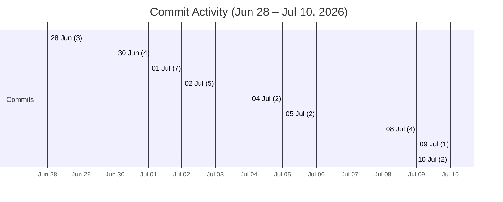

# Executive Summary

CloudGraph is an open-source **AI-driven AIOps platform** for multi-cloud Kubernetes environments, designed to autonomously investigate incidents and perform root-cause analysis (RCA). It continuously ingests cloud-native telemetry (logs, metrics, Kubernetes events, alerts, deployments, Git commits/PRs, etc.) from common tools (Prometheus, Grafana Loki, OpenTelemetry, Alertmanager, Falco, GitHub/GitLab webhooks, etc.). The data is normalized into a **real-time knowledge graph** (in Neo4j) that powers a **GraphRAG** retrieval process (combining graph-structural search with vector embeddings via Qdrant). A set of collaborative AI agents then explore this context using large language models (e.g. GPT-5, Claude) to generate explainable RCA reports and remediation suggestions. CloudGraph is primarily a research prototype (2026) for cloud-native observability; it bundles deployment tooling (Go-based CLI with Helm/Kubernetes manifests) and end-to-end tests. Its scope covers **Kubernetes-based systems** (notably AWS EKS but extensible to any Kubernetes cluster) and integrates common open-source observability services. The repository is actively developed (latest commit Jul 10, 2026) with no open issues or PRs.

## Purpose & Scope

As described in the README, CloudGraph’s goal is to “transform cloud observability data into explainable incident intelligence” by fusing knowledge graphs, GraphRAG retrieval, multi-agent systems, and LLMs. It focuses on **autonomous root-cause analysis across cloud-native environments**, answering research questions about whether graph-based retrieval and multi-agent reasoning improve RCA accuracy, explainability, and time-to-resolution. The platform ingests a wide variety of telemetry (logs, metrics, alerts, events, security violations, deployment history, Git activities, etc.) from standard tools (OpenTelemetry, Prometheus, Grafana Loki, Falco, ArgoCD, etc.). This data populates a time-indexed knowledge graph that explicitly models entities (services, hosts, containers, errors, etc.) and relationships (deployment, communication, hierarchy), enabling structured graph queries. In scope are Kubernetes and underlying cloud infrastructure (especially AWS-related resources), observability stacks, and external context (Git events). CloudGraph does **not** target legacy systems or on-premise non-Kubernetes environments, nor does it natively cover every cloud provider (see *Supported Services* below). Its emphasis is on **Kubernetes-based microservices** and modern observability pipelines.

## Architecture & Core Components

 *Figure: High-level architecture of CloudGraph (from README)*. At a high level, CloudGraph ingests telemetry from **observability and cloud sources** into a processing pipeline that builds a unified *knowledge graph* (e.g. in Neo4j). This pipeline performs data collection, parsing/normalization, correlation and enrichment. The knowledge graph captures entities and relationships (deployments, metrics, logs, events).

A **GraphRAG retrieval** layer combines structural graph traversals with semantic vector search. Graph queries on the knowledge graph (Neo4j) identify related context, while an embeddings index in Qdrant enables similarity search on textual data. The retrieved context chunks (evidence chains) are passed to LLMs (e.g. GPT-4o-mini, Claude, Gemini) via custom HTTP API wrappers for reasoning.

A **Multi-Agent system** then orchestrates specialized agents (Monitoring, Log, Trace, Deployment, Security, RCA, Recommendation agents) that collaboratively analyze the assembled context and generate a comprehensive RCA report. The final results (root cause, confidence scores, impacted services, remediation steps) are exposed via a web UI and API.

```mermaid
flowchart TB
    subgraph Sources
      logs[Logs]
      metrics[Metrics]
      events[Kubernetes Events]
      security[Runtime Security Events]
      git[Git Commits/PRs]
    end
    subgraph Pipeline
      parse[Parse / Normalize]
      enrich[Enrich / Deduplicate]
      store[(Knowledge Graph – Neo4j)]
    end
    subgraph Retrieval
      graphrag[GraphRAG retrieval]
      qdrant[Vector DB (Qdrant)]
    end
    subgraph Agents
      agents[Multi-Agent RCA Engine]
    end
    subgraph UI
      dashboard[Dashboard / API]
    end
    logs --> parse
    metrics --> parse
    events --> parse
    security --> parse
    git --> parse
    parse --> enrich --> store
    store --> graphrag
    graphrag --> qdrant
    qdrant --> agents
    agents --> dashboard
```

*Data-flow diagram: Observability sources feed a parse/enrich pipeline to build a Neo4j graph. GraphRAG (Neo4j+Qdrant) retrieves context for LLM-based agents, whose findings surface in the UI.*

### Core Code Components

The repository’s structure reflects its architecture:

- **`cmd/cloudgraph/`** – A Go-based CLI (`cloudgraph`) for installation and management. It uses an embedded Helm chart (`embedded.go`) to deploy the components.
- **`deployments/`** – Kubernetes and Helm manifests for the backend and agents.
- **`services/api/`** – Python backend (FastAPI/uvicorn) providing the investigation API endpoints.
- **`services/agent-orchestrator/` & `investigation-engine/`** – Python services running the multi-agent orchestration and LLM-driven investigation logic.
- **`services/ui/`** – Web frontend: static HTML/CSS/vanilla JavaScript (no framework, no build step) for visualizing RCA results.
- **`graph/`** – (Likely) code for graph ingestion and ontology (not detailed in README).
- **`tests/`** – End-to-end tests, including observability endpoint checks (e.g. Prometheus/Loki health) and CLI tests.
- **`docs/`** – Documentation and design notes (Week-1 strategy, etc.).
- Various helper scripts (e.g. `install.sh` for CLI install).

Each Python service likely has its own dependencies (not explicitly listed in a `requirements.txt` but implied by code). The languages breakdown is ~53% Python, 14% Go, 14% HTML, 10% JavaScript, reflecting a Pythonic AI core and Go-based CLI.

## Supported Cloud Providers & Services

| **Domain**           | **Supported Components / Integrations**                                                                                        |
|----------------------|-------------------------------------------------------------------------------------------------------------------------------|
| **AWS**              | Kubernetes/EKS (via Helm charts; EKS is optional); EC2 (K8s workers), S3 (artifact storage), IAM roles, CloudWatch (optional use with Prometheus). Focus is on AWS infrastructure (icons and docs explicitly mention EKS, EC2, S3). |
| **Kubernetes (generic)** | Any K8s cluster (Rancher/kubeadm compatible). Supports container orchestrators (ArgoCD for deployments, Helm) and common K8s tools (NGINX ingress). Kubernetes events and state are ingested (kube-state-metrics, etc.). |
| **Observability/Monitoring** | Prometheus (metrics), Grafana (dashboards), Loki (logs), OpenTelemetry collectors (logs/traces), Alertmanager (alerts), kube-state-metrics/node-exporter (cluster metrics), Falco (security events). These open-source tools are all supported data sources for CloudGraph. |
| **CI/CD & GitOps**   | Argo CD notifications; GitHub/GitLab webhooks for deployment history, commits and PRs. For example, container image tags and Git events are ingested. |
| **Graph & Vector DB** | Neo4j (knowledge graph DB for structural context); Qdrant (vector DB for embedding-based retrieval). Sentence-transformers (for embedding generation) and LLM backends (GPT-4o-mini, Claude, Gemini) are integrated in the multi-agent consensus inference layer. |
| **Other Clouds**     | *Not explicitly integrated.* Azure/GCP are not mentioned. In principle, any Kubernetes (AKS, GKE) could host CloudGraph, but no Azure/GCP-specific services are configured by default. (Multi-cloud readiness is claimed, but actual integrations beyond AWS are unspecified.) |

## Installation, Setup, and Usage

CloudGraph can be run locally (Docker Compose) or deployed on Kubernetes. The **Quickstart** outlines the key steps. A typical local setup is:

```bash
# Clone and start backend containers
git clone https://github.com/shivamshashank/CloudGraph.git
cd CloudGraph
docker compose up -d                        # Launch Neo4j, Qdrant, etc.

# Start the Python API server
cd services/api
uvicorn app.main:app --reload              # FastAPI backend

# Run the multi-agent orchestrator and investigation engine
cd ../../services
python run_agents.py                       # Launches agent loop

# (Alternatively) deploy on Kubernetes with kubectl/Helm
kubectl apply -f deployments/kubernetes/   # Deploy all K8s components

# Run automated observability tests (go test)
cd ../../tests/observability && go test -v -timeout 5m ./               # Verify Prometheus/Loki endpoints

# Using the CloudGraph CLI (Linux only):
curl -fsSL https://raw.githubusercontent.com/shivamshashank/CloudGraph/main/install.sh | sudo bash   # Install CLI
sudo cloudgraph deploy                                                                    # Deploy via Helm using the CLI
```

Important notes from the README:

- The **Docker Compose** mode starts all components (including Neo4j, Qdrant) for local testing.
- The **Kubernetes/Helm** path uses `cloudgraph deploy` (CLI) or manual `kubectl apply`, and requires a K8s cluster (tested on AWS EKS).
- The CLI installer supports only Linux (amd64/arm64).
- Example API usage: The service exposes endpoints like `/api/v1/health`, `/api/v1/investigate?incident_id=...`, and agents can be queried via `/api/v1/agents`.
- A developer can run linter/tests: e.g. `go test ./tests/observability` for Go tests, and Python style checks (via RUFF, MyPy) as shown in `README`.

See the **INSTALLATION.md** and **QUICKSTART.md** in the repo for detailed setup instructions.

## Dependencies & Compatibility

- **Languages/Frameworks**: CloudGraph is implemented in **Python** (backend, agents) and **Go** (CLI). The UI uses static **JavaScript/HTML** for the workbench.
- **Go**: The CLI uses Go 1.23 (as per `go.mod`).
- **Python**: Requires a modern Python 3 environment (the specific version is unspecified, but a recent 3.x is implied). It depends on FastAPI (uvicorn), Neo4j and Qdrant Python clients, and HTTP request libraries (for OpenAI, Claude, and Gemini API calls).
- **Operating System**: The CLI installer only supports Linux (amd64/arm64). The system as a whole can run on any OS hosting Docker or a K8s cluster; the code has been tested primarily on Linux-based clusters.
- **Containers & Orchestration**: Docker (for local mode), Kubernetes (tested on AWS EKS). Helm is used for packaging.
- **Databases**: Neo4j (graph DB) and Qdrant (vector DB) must be running (the provided Docker Compose starts these). Neo4j is v4.x or v5.x (installed via Docker image), and Qdrant 1.x (specified in `docker-compose.yml`).
- **Browser/UI**: A modern web browser is needed for the frontend; the UI is built with common web frameworks.
- **Hardware**: No explicit specs, but running LLM-based agents and graph queries suggests a need for reasonable CPU/RAM. GPUs are not specifically mentioned (likely the LLM calls are cloud-based or not GPU-accelerated).

Compatibility notes: CloudGraph integrates with AWS-specific services (EKS, EC2, S3) but does not include Azure/GCP clients by default. It relies on open-source tools and should run on any K8s cluster (AKS/GKE/PVCs) if appropriately adapted. The Helm charts do not explicitly limit to AWS.

## Security Considerations

CloudGraph includes a `SECURITY.md` encouraging responsible disclosure, but **no known vulnerabilities** or CVEs are reported in the repo. However, several points merit caution:

- **Authentication**: The README and code suggest *no default authentication* on the API or UI. For example, the UI/auth workbench was recently added, but the default scripts and tests bypass auth. In its current form, CloudGraph would likely expose internal APIs if not placed behind a firewall or API gateway. Deploying to production would require adding network policies, OAuth integration, or similar.
- **Network Exposure**: The observability tests assume in-cluster access (they skip if endpoints are unreachable). This implies the services are listening on internal K8s DNS names (`*.svc.cluster.local`) and not exposed externally by default. Still, a misconfigured load balancer or port could expose them.
- **Third-party Components**: CloudGraph uses common OSS tools (Prometheus, Grafana, Neo4j, Qdrant). Each of these has its own security model. For example, Neo4j should be secured (authentication, encryption) in a real deployment. Qdrant endpoints may also need securing. These are not specifically addressed by CloudGraph’s setup.
- **LLM & Data Privacy**: Using LLMs (potentially cloud services like OpenAI) means sensitive data (e.g. application logs or code) might be sent out. No mention is made of on-premise models. Users should ensure compliance with data governance policies when enabling LLM queries.
- **Supply Chain**: The CLI downloads a release binary from GitHub. Users should verify release tags/signatures if using in production. The Go CLI version is fixed to the latest tag (v1.0.3 as a fallback).
- **Security Policy**: According to `SECURITY.md`, any discovered vulnerability should be reported privately (via email) and not as a public issue. This is good practice but indicates the project is small and self-governed.

In summary, **no critical issues are flagged**, but CloudGraph should be considered a research prototype: it needs hardening (auth, TLS, RBAC) before production use. Running it in an isolated or test environment first is advisable.

## Limitations, Issues & Maintenance Status

- **Project Maturity**: CloudGraph is largely a *research project (2026)*. Its documentation is detailed, but the code is new (39 commits, 15 releases as of Jul 10, 2026). It has few external adopters (0 stars, 0 forks) and is maintained by a single author (Shivam Shashank). No official support or SLA is provided.
- **Activity**: Development is active – the latest commit is on Jul 10, 2026, adding UI workbench features. The commit history shows frequent merges and feature work in the week of July 2026. There are **no open issues or pull requests** at this time, which suggests either a lack of community contributions or that all known tasks have been addressed or documented. The repository issues section is empty (0 issues).
- **Open Issues**: With 0 open issues/PRs, none are officially tracked. Users may need to rely on direct issue creation if they find bugs. The absence of issues might also mean not many users have tried it yet.
- **Known Gaps**: The `PROJECT_COMPLETION_CHECKLIST.md` and audit docs hint at some unfinished items (e.g. UI authentication not fully implemented). The test suite covers only observability endpoints and CLI basics; there are no automated tests of the RCA logic itself.
- **Performance**: No benchmark data is provided. Scalability limits (graph size, LLM usage, etc.) are unspecified. Neo4j and Qdrant will need appropriate resources for larger datasets.
- **Compatibility**: As noted, the CLI only supports Linux. The system has been demonstrated on AWS/EKS; compatibility with other clouds is untested.
- **Known Vulnerabilities**: None have been disclosed or documented. A basic security review of included dependencies would be prudent before production use (e.g. checking Neo4j/Qdrant versions for CVEs).

Mermaid Gantt chart – daily commit activity (June–July 2026):



*Chart: Number of commits per day from the Git history (week of integration) – peaks on July 1 and continues steady development.*

## Licensing & Contribution Guidelines

- **License**: The project is released under the **MIT License**, permitting free use, modification, and distribution. All copies of the software must include the copyright and permission notice.
- **Contributing**: A `CONTRIBUTING.md` and `CODE_OF_CONDUCT.md` are provided. The README suggests a standard Git workflow: fork, create feature branch, commit, and open a PR. The project uses a pre-commit config (linting), so code style checks (Ruff for Python, ESLint/HTMLLint for UI) should pass before PRs. Contributors should follow the noted guidelines. No dedicated developer community is apparent, so contributions may be reviewed by the author.
- **Release Process**: Releases are tagged (v1.0.x) on GitHub, and the CLI installer fetches the latest tag via GitHub API. It appears CI actions (GitHub Actions) may automate releases (the latest release was published by `@github-actions`).

## Integration Scenarios & Alternatives

CloudGraph is essentially an **RCA-as-a-service** platform that could be integrated into a Kubernetes-centric monitoring pipeline. Possible usage scenarios include: deploying CloudGraph alongside Prometheus/Grafana to automatically analyze alerts; hooking CloudGraph into a CI/CD pipeline to capture deployment events; or embedding it into an incident management system to generate draft RCA reports. It could also serve as a plug-in for observability dashboards, offering AI-driven insights on incidents.

As an **architecture**, it is highly modular: one could reuse just the GraphRAG engine for other graphs, or swap out the LLM backend. The REST API allows other systems to query investigation results programmatically.

**Alternatives/Competitors**: CloudGraph is a novel combination of techniques, so direct open-source equivalents are rare. Some roughly related tools include:

- **Moogsoft** or **BigPanda**: commercial AIOps/RCA platforms (closed-source).
- **LlamaIndex** or **Haystack**: tools for retrieval-augmented generation (RAG) pipelines, but not graph-based.
- **Kiali**: provides service-mesh/RCA for K8s (focused on Istio, not LLM).
- **OpenAI/RAG prototypes**: custom RAG implementations for logs (e.g. vector search + GPT), but they lack the explicit knowledge graph structure.
- **CloudGraph (cloudgraphdev)**: a different open-source project with the same name focusing on GraphQL API and CSPM (not to be confused with this).
- **ELK Stack**: can do log analytics with machine learning (like Elastic Security); however, it doesn’t incorporate a knowledge graph or multi-agent LLM reasoning.

No single OSS project currently matches CloudGraph’s GraphRAG+multi-agent design. Adopting CloudGraph means betting on its novel approach; alternatives for RCA generally involve custom data pipelines or commercial AIOps suites.

## Feature Comparison & Support Matrix

| **Feature / Component**      | **CloudGraph**           | **Observability Tools**         | **Competitor/Notes**                    |
|------------------------------|-------------------------|---------------------------------|-----------------------------------------|
| **Data Sources**             | Metrics (Prometheus), Logs (Loki), Traces (OpenTelemetry), K8s events, alerts, security (Falco), Git (webhooks). | Standard open-source (Prom/Grafana, etc.) | Most AIOps/RCA tools ingest similar data. |
| **Knowledge Graph**          | Yes (Neo4j for entity graph). | No (ELK/Prom use indices, not graphs). | Unique in open-source RCA context. |
| **Vector DB (Semantic Search)** | Yes (Qdrant). | Rare in RCA tools; typically newer AI-centric frameworks. | Similar to RAG pipelines. |
| **LLM Integration**          | Yes (OpenAI, Claude, Gemini via custom API wrappers). | Not built-in (most RCA are rule or ML-based). | Requires careful API key management. |
| **Multi-Agent Reasoning**    | Yes (specialized agents collaborate). | No. | Innovative architecture – no direct counterpart. |
| **Deployment**               | Helm/K8s, Docker Compose for local. CLI provided (Linux-only). | Standard (K8s, Docker); CLI is bespoke. | Competitors often SaaS or enterprise setups. |
| **UI Workbench**             | Yes (Static vanilla HTML/CSS/JS dashboard). | Common (Grafana, Kibana). | Pending maturity. |
| **Licensing**                | MIT (permissive). | Varies (Grafana/GPL, etc.). | MIT allows commercial use. |
| **Extensibility**            | Modular (graph + RAG + agents). | Extensible (e.g. Elasticsearch plugins). | Hybrid of methods is novel. |

| **Cloud Provider** | **Supported Services/Integrations**                                    |
|--------------------|------------------------------------------------------------------------|
| AWS (primary)      | EKS (K8s), EC2 (compute), S3 (storage), CloudWatch (via Prometheus). |
| Azure, GCP         | *None specific*. (K8s on AKS/GKE should run CloudGraph code, but no provider-specific hooks.) |
| Kubernetes (all)   | K8s API, kube-state-metrics, Helm, ArgoCD (GitOps).                    |

## Adoption Checklist

- [ ] **Platform Requirements**: Ensure a **Linux** host for the CLI (amd64/arm64), and a running **Kubernetes cluster** (AWS EKS recommended) or Docker environment.
- [ ] **Observability Stack**: Deploy or connect Prometheus, Grafana Loki, OpenTelemetry collector, Falco, etc., as data sources (CloudGraph expects these endpoints to be available).
- [ ] **Database Setup**: Have Neo4j (for the knowledge graph) and Qdrant (for vector store) available. The Quickstart uses Docker images, or you can deploy these in-cluster.
- [ ] **Networking**: The services assume internal DNS names (`*.svc.cluster.local`). Configure network policies to allow service-to-service communication.
- [ ] **LLM Credentials**: Obtain API keys for LLMs (OpenAI, Anthropic, etc.) and configure them for the agents. (Check code settings or environment variables.)
- [ ] **Cloud Credentials**: For AWS integration, configure IAM roles or AWS keys if collecting CloudWatch/S3 data. (Currently optional.)
- [ ] **CLI Install (optional)**: Run the install script to get `cloudgraph` CLI on Linux. Use `cloudgraph deploy` to install via Helm.
- [ ] **Run Tests**: Execute `go test ./tests/observability` to verify data endpoints (prometheus, loki) are reachable.
- [ ] **Development Tools**: To contribute or customize, install Go (v1.23) and Python 3.x. Linters (ruff, mypy) and Node.js (for UI) may also be needed.
Each checklist item corresponds to components or steps documented in the repository (e.g. cloud services from the README, CLI requirements). Where details are not specified (e.g. Windows support is explicitly unsupported), note as limitations.

**Sources:** All information is drawn from the CloudGraph repository files and docs: README and architecture descriptions; project structure and deployment instructions; code samples and scripts (install.sh, tests); and metadata (license, project stats). Unspecified details (e.g. Python version) are noted as such. Visuals (architecture diagram, timeline) are either taken from the repo or generated to summarize the activity.
