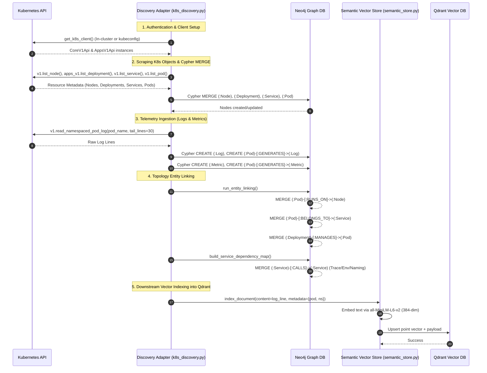

# Kubernetes Cluster Discovery & Dual-Database Architecture (Neo4j vs. Qdrant)

## 📌 Executive Overview

In **CloudGraph**, cluster discovery is the foundational process responsible for mapping Kubernetes infrastructure, extracting runtime telemetry (logs and metrics), and seeding downstream AI incident investigation engines.

The discovery process is orchestrated by `discover_cluster_topology()` in [`k8s_discovery.py`](../services/api/app/adapters/k8s_discovery.py). CloudGraph utilizes a **dual-database architecture** pairing **Neo4j** (Graph Database) and **Qdrant** (Vector Search Engine).

---

## 🏗️ Architectural Flow & Database Interactions

```mermaid
flowchart TD
    subgraph K8s["Kubernetes Cluster / API"]
        Nodes["v1.list_node()"]
        Deploys["apps_v1.list_deployment()"]
        Svcs["v1.list_service()"]
        Pods["v1.list_pod()"]
        Logs["v1.read_pod_log()"]
    end

    subgraph DiscoveryEngine["CloudGraph Discovery Adapter (k8s_discovery.py)"]
        Scraper["discover_cluster_topology()"]
        StatusRes["_resolve_pod_status()"]
        Linker["run_entity_linking()"]
        DepMap["build_service_dependency_map()"]
    end

    subgraph Neo4jDB["Neo4j (Graph Database) - Physical Topology"]
        N_Node[":Node"]
        N_Deploy[":Deployment"]
        N_Svc[":Service"]
        N_Pod[":Pod"]
        N_Log[":Log"]
        N_Metric[":Metric"]

        Rel_Runs["(:Pod)-[:RUNS_ON]->(:Node)"]
        Rel_Belongs["(:Pod)-[:BELONGS_TO]->(:Service)"]
        Rel_Manages["(:Deployment)-[:MANAGES]->(:Pod)"]
        Rel_Calls["(:Service)-[:CALLS]->(:Service)"]
    end

    subgraph QdrantDB["Qdrant (Vector Database) - Semantic Index"]
        Embedder["384-dim Embedding (all-MiniLM-L6-v2)"]
        Vec_Logs["Log Vector Payloads"]
        Vec_Metrics["Metric Vector Payloads"]
        Vec_Entity["Entity Description Embeddings"]
    end

    %% Flow Connections
    K8s --> Scraper
    Scraper --> StatusRes

    StatusRes -->|Cypher MERGE| N_Node & N_Deploy & N_Svc & N_Pod
    Scraper -->|Cypher CREATE| N_Log & N_Metric

    Scraper --> Linker --> Rel_Runs & Rel_Belongs & Rel_Manages
    Scraper --> DepMap --> Rel_Calls

    %% Ingestion to Qdrant
    Scraper -->|semantic_store.index_document()| Embedder
    Embedder --> Vec_Logs & Vec_Metrics & Vec_Entity

    classDef k8s fill:#326ce5,stroke:#fff,color:#fff;
    classDef neo fill:#008cc1,stroke:#fff,color:#fff;
    classDef qdrant fill:#dc2626,stroke:#fff,color:#fff;
    class K8s k8s;
    class Neo4jDB neo;
    class QdrantDB qdrant;
```

---

## ⚡ Role Comparison: Neo4j vs. Qdrant

| Feature / Dimension | **Neo4j** (Graph Database) | **Qdrant** (Vector Database) |
|---|---|---|
| **Primary Responsibility** | Structural topology, physical relationships, and multi-hop graph traversal. | Dense vector embeddings, semantic search, and prompt context retrieval. |
| **In-Memory Representation** | Nodes (`:Node`, `:Pod`, `:Service`), Labels, and Directed Edges (`:CALLS`, `:RUNS_ON`). | 384-dimensional dense vectors (`all-MiniLM-L6-v2`) with JSON metadata payloads. |
| **Cluster Discovery Role** | **Direct Scraping Target** — Cypher `MERGE` queries create resource graph nodes and edges. | **Secondary Indexing Target** — Scraped text logs, metric names, and pod metadata are embedded and stored in collections. |
| **Query Engine** | Neo4j Cypher (`MATCH`, `MERGE`, APOC procedures). | Cosine Similarity / HNSW Vector Index queries. |
| **GraphRAG Usage (`HYBRID` Mode)** | Provides 2-hop structural neighborhood expansion (e.g. downstream service dependencies). | Retrieves top-k semantically relevant log lines, metric anomalies, and code commit vectors. |
| **GPCS Claim Scoring Role** | Validates structural existence of services, pod states, and trace links. | Calculates vector similarity floor (`TRUST >= 0.3`) between claims and log evidence. |

---

## 🔄 Step-by-Step Execution Sequence



---

## 🛠️ Deep-Dive into Code Implementations

### 1. Neo4j Scraper Execution (`_discover_pods`)

Located in [`k8s_discovery.py:L355-L402`](../services/api/app/adapters/k8s_discovery.py):

```python
query = """
MERGE (p:Pod {id: $pod_uid})
SET p.name = $name,
    p.namespace = $namespace,
    p.nodeName = $node_name,
    p.status = $status,
    p.ip = $ip,
    p.env = $env
RETURN p.name as name
"""
neo4j_client.execute_query(query, params)
```

### 2. Structural Entity Linking (`run_entity_linking`)

Located in [`graph_constructor.py`](../services/api/app/adapters/graph_constructor.py):

```cypher
MATCH (p:Pod), (n:Node) WHERE p.nodeName = n.name MERGE (p)-[:RUNS_ON]->(n);
MATCH (p:Pod), (s:Service) WHERE p.name STARTS WITH s.name MERGE (p)-[:BELONGS_TO]->(s);
MATCH (d:Deployment), (p:Pod) WHERE p.name STARTS WITH d.name MERGE (d)-[:MANAGES]->(p);
```

### 3. Qdrant Vector Indexing (`semantic_store.index_document`)

Located in [`semantic_store.py`](../services/api/app/services/semantic_store.py):

* Converts log strings and metric descriptions into **384-dimensional dense vectors** using `all-MiniLM-L6-v2`.
* Upserts vectors into Qdrant collections with filtering metadata (`scenario_id`, `service_name`, `pod_id`).

---

## 💡 Summary

* **Neo4j** is the **direct target** during discovery. It holds the physical graph topology, telemetry linkages, and structural service call maps.
* **Qdrant** is the **semantic vector engine**. It indexes text embeddings of logs, metrics, and pod events discovered from Neo4j to enable downstream hybrid vector search during AI incident investigations.
