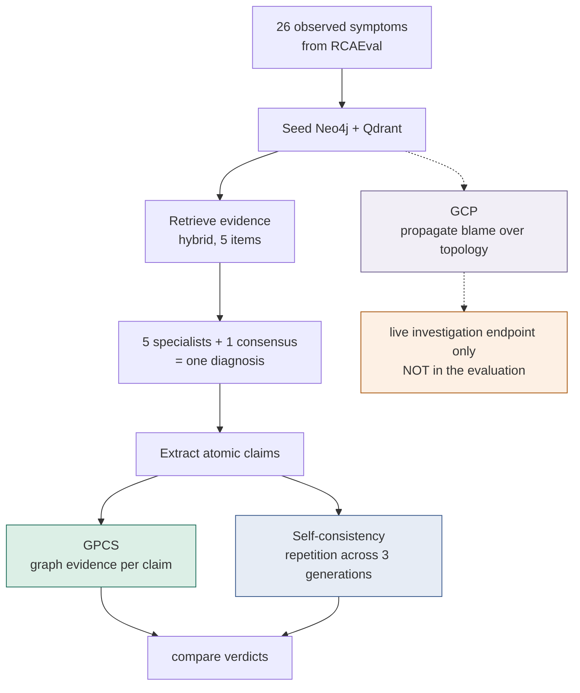
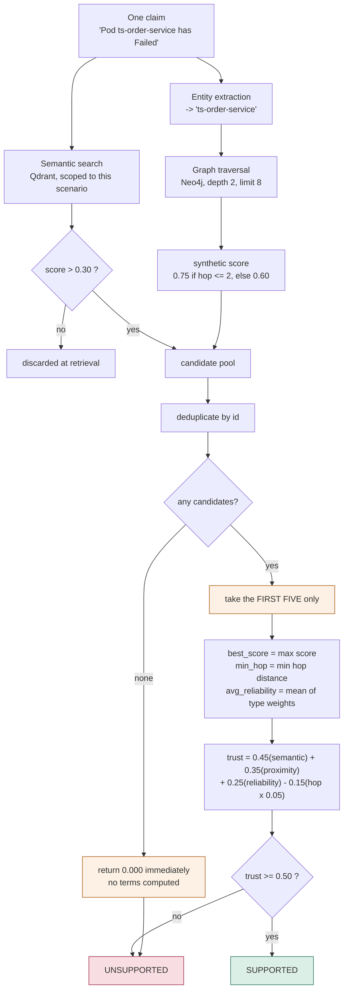
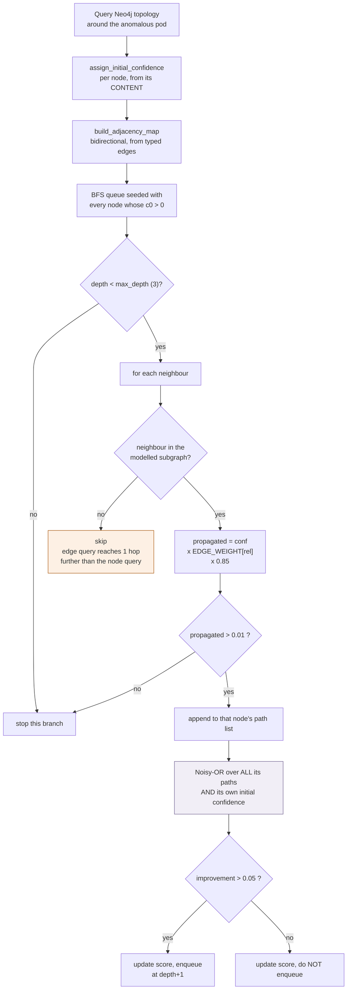
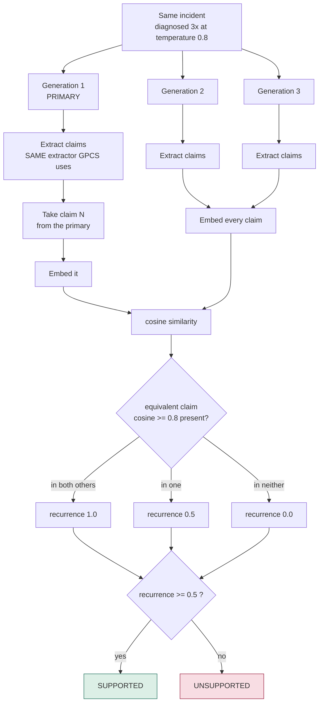
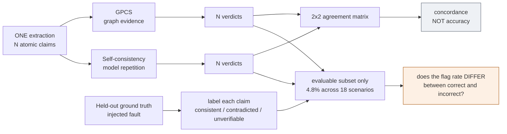

# The three mechanisms, end to end

GPCS, GCP and self-consistency — what each one does, step by step, with the
constants and control flow read from the source rather than from the design
notes.

Source files:

| Mechanism | File |
|---|---|
| GPCS | `services/api/app/research/gpcs.py` |
| GCP | `services/api/app/research/gcp.py` |
| Self-consistency | `services/api/app/research/self_consistency.py` |

> **Two corrections to Chapter 3 are recorded in §2.5.** The dissertation's
> description of GCP does not match the implementation. GCP is not part of the
> evaluation path, so no reported result changes — but the write-up is wrong and
> needs fixing.

---

## Where each one sits



**GPCS and self-consistency are what the 18-scenario evaluation measures.**
GCP runs in the product path (`app/main.py`) and is not tested by any reported
number.

---

## 1. GPCS — Graph-Provenance Claim Scoring

**The question it asks:** *is this particular sentence supported by anything in
the evidence store?*

### 1.1 The flow



### 1.2 Step by step

**Step 1 — two independent retrievals.**

*Semantic* (`_retrieve_supporting_evidence`): the claim text is embedded and
matched against Qdrant, scoped by `scenario_id` so no other incident's evidence
can leak in. The **0.30 floor is applied here, at retrieval** — weaker matches
never enter the pool at all.

*Graph traversal*: entities named in the claim seed a Neo4j walk, depth 2,
limit 8 per entity, first 3 entities only. These get a **synthetic** score:

```python
"score": 0.6 if item.get("hop_distance", 0) > 2 else 0.75
```

So a `semantic` term of exactly `0.7500` usually means *"graph evidence within
two hops"*, **not** a 75% textual match. This is easy to misread.

**Step 2 — deduplicate** by `id` or `name`.

**Step 3 — aggregate, but only the top five.**

```python
for result in evidence[:5]:      # ← a hard slice
```

If eight candidates were retrieved, three are silently ignored. Nothing
downstream records that this happened.

Three numbers come out:

| Output | How |
|---|---|
| `best_score` | max score among the five |
| `min_hop_distance` | min hop distance among those that have one; `None` if none do |
| `avg_reliability` | mean of `SOURCE_RELIABILITY[type]` over the five |

```python
SOURCE_RELIABILITY = {
  "pod": 0.90, "service": 0.90, "deployment": 0.90, "incident": 0.90,
  "metric": 0.85, "log": 0.80, "node": 0.75,
}   # anything else: 0.60
```

The reasoning: a Kubernetes object's state is a *fact about the cluster*; a
free-text log line is an *assertion an application makes about itself*.

**Step 4 — score.**

```python
if min_hop_distance is None:
    proximity = 0.0
    penalty   = 0.0
else:
    proximity = 1.0 / (1.0 + min_hop_distance)
    penalty   = 0.15 * (min_hop_distance * 0.05)

trust = 0.45*best_score + 0.35*proximity + 0.25*avg_reliability - penalty
trust = max(0.0, min(1.0, trust))
```

`min_hop = None` means the evidence arrived from semantic search with no path
back into the graph. **That is absent provenance, not adjacency**, so proximity
is set to 0 rather than treated as zero hops. Conflating the two once gave full
graph credit to 29.5% of claims and floored every score near 0.485.

**Step 5 — threshold.** `trust < 0.50` → unsupported.

### 1.3 A real calculation

Claim 1 of `rcaeval-03`, generation 1 — **8 candidates retrieved, 5 scored**:

| Term | Measured | × weight | Contribution |
|---|---|---|---|
| semantic | 0.7500 | 0.45 | 0.3375 |
| proximity = 1/(1+1) | 0.5000 | 0.35 | 0.1750 |
| reliability | 0.8300 | 0.25 | 0.2075 |
| penalty = 0.15 × (1 × 0.05) | | | −0.0075 |
| | | **trust** | **0.7125** |

`0.7125 ≥ 0.50` → **supported**.

Claim 2, *"Failure is due to an isolated CPU-bound performance bottleneck"*:

```text
evidence_items = 0
no evidence survived the 0.30 floor -> returned 0.0 immediately
TRUST = 0.000 -> UNSUPPORTED
```

Not a low score — an **early return** before any term exists. The graph holds
metrics and logs; it holds no node asserting *"the cause was CPU exhaustion."*

### 1.4 What this means in practice

Across 1,950 claims the **median trust is 0.000**, and no claim exceeds 0.720
even though the positive terms sum to 1.05. GPCS is not grading finely — for
most claims it finds nothing at all, and the 0.50 threshold sits far higher
relative to the real distribution than its nominal position suggests.

---

## 2. GCP — Graph Confidence Propagation

**The question it asks:** *given these symptoms, which entity is most likely to
blame?*

Note this is a **different question from GPCS**. GPCS scores sentences; GCP
scores entities.

### 2.1 The flow



### 2.2 Initial confidence is content-dependent

This is the part most often described wrongly. It is **not** a flat lookup by
node type — the value depends on what the node *says*:

```python
def _eval_log_conf(message):
    if any(w in msg for w in ["oom", "out of memory", "killed"]):     return 0.95
    if any(w in msg for w in ["error", "fail", "refused", "timeout"]): return 0.85
    return 0.50

def _eval_metric_conf(name, val):
    if "cpu" in name and val > 80.0:                    return 0.85
    if ("memory" in name or "mem" in name) and val > 90.0: return 0.90
    return 0.40

def _eval_deployment_conf(status):
    if status in ["failed", "progressing", "degraded"]: return 0.80
    return 0.60
```

Plus: `Commit` → `0.70`; anything else → `0.0`; and if the node already carries
a `confidence` property, that is used directly and overrides everything.

| Node | Condition | c₀ |
|---|---|---|
| Log | mentions OOM / killed | **0.95** |
| Log | mentions error / fail / refused / timeout | 0.85 |
| Log | otherwise | 0.50 |
| Metric | memory > 90 | **0.90** |
| Metric | cpu > 80 | 0.85 |
| Metric | otherwise | 0.40 |
| Deployment | failed / progressing / degraded | 0.80 |
| Deployment | otherwise | 0.60 |
| Commit | always | 0.70 |
| Structural nodes | — | 0.0 |

### 2.3 Edge weights and decay

```python
EDGE_WEIGHTS = {
  "GENERATES": 0.95, "UPDATED_BY": 0.90, "TRIGGERED_BY": 0.90,
  "MANAGES": 0.85, "BELONGS_TO": 0.80, "CALLS": 0.75, "RUNS_ON": 0.60,
}   # unknown relationship: 0.50
```

One step of propagation:

```python
propagated = curr_conf * EDGE_WEIGHTS.get(rel_type, 0.50) * self.decay_factor
```

Decay (`0.85`) is applied **once per hop**, so after *k* hops the accumulated
factor is `γᵏ × Π w` — matching the closed form in the design notes.

### 2.4 Noisy-OR, as implemented

```python
term = (1.0 - init_scores[neighbor]) * math.prod(
           1.0 - c for c in path_scores[neighbor])
new_c = 1.0 - term
```

That is:

```text
C(u) = 1 − (1 − c₀(u)) · Π (1 − c(Pⱼ))
```

The node's **own initial confidence is part of the product.** Several weak
independent indicators accumulate into a stronger belief — the reasoning an
operator applies when three unrelated symptoms all point at one service.

Two guards keep it terminating:

- a path contributes only if `propagated > 0.01`
- a node is re-enqueued only if its score improved by more than `0.05`

### 2.5 ⚠ Two errors in Chapter 3

**(a) Initial confidences.** The dissertation says:

> security threats $0.90$, error logs $0.85$, metric anomalies $0.80$,
> deployment rollouts $0.75$, commit regressions $0.70$

Against the code:

| Claimed | Actual |
|---|---|
| security threats 0.90 | **no security branch exists** |
| error logs 0.85 | 0.85 ✓ — but OOM logs are 0.95, unmentioned |
| metric anomalies 0.80 | 0.85 (cpu) / 0.90 (mem) / 0.40 otherwise |
| deployment rollouts 0.75 | 0.80 / 0.60 |
| commit regressions 0.70 | 0.70 ✓ |

It is also presented as a fixed table by node type, when the implementation is
**content-dependent** — the same node type gets different values depending on
what it contains.

**(b) The Noisy-OR formula.** The dissertation prints:

```text
C(u) = 1 − Π (1 − c(Pⱼ))
```

The code includes the node's own prior:

```text
C(u) = 1 − (1 − c₀(u)) · Π (1 − c(Pⱼ))
```

Neither error affects any reported result, because **GCP is not in the
evaluation path**. But both are factual errors in a document whose argument is
about measuring honestly, and both should be corrected before submission.

---

## 3. Self-consistency — the baseline

**The question it asks:** *did the model say this again?*

### 3.1 The flow



### 3.2 Constants

```text
DEFAULT_N_SAMPLES              = 3
DEFAULT_TEMPERATURE            = 0.8
RECURRENCE_SIMILARITY_THRESHOLD = 0.8
unsupported when recurrence     < 0.5
```

With two other generations, recurrence can only ever be `0.0`, `0.5` or `1.0`.

### 3.3 Why it uses the same extractor

From the source docstring:

> Uses `GraphProvenanceClaimScorer.extract_claims` for claim segmentation — the
> identical extractor GPCS uses — so the comparison is fair: the same text is
> split into the same claims by both methods, only the verification mechanism
> differs.

If each verifier extracted its own claims, `claim-7` would mean different
sentences to each, and an id-based join would pair unrelated things.

### 3.4 What it actually measures

**Stability, not truth.** A model that is confidently wrong is wrong in all
three samples, and self-consistency marks that claim *supported*. It never looks
at any evidence.

---

## 4. The comparison



Both verifiers score **the same claims, from the same extraction, from the same
generation.** Only the mechanism differs — which is what makes the comparison
fair.

### The result

```text
GPCS            79.3% unsupported  (1546/1950)
self-consistency 53.0% unsupported  (1034/1950)
```

GPCS is decisively **stricter**. Then on the 93 claims that can be adjudicated
(36 correct, 57 incorrect):

| Verifier | Flags incorrect | Flags correct | Gap | Precision |
|---|---|---|---|---|
| GPCS | 91.2% (52/57) | 86.1% (31/36) | **+5.1 pp** | 0.627 |
| Self-consistency | 63.2% (36/57) | 63.9% (23/36) | **−0.7 pp** | 0.610 |

Self-consistency flags true and false claims at essentially the same rate — its
gap is negative. GPCS leans the right way by 5.1 pp, roughly three claims, and
its precision of 0.627 is within noise of the **0.613** a verifier scores by
flagging everything.

**GPCS is stricter, not sharper.** Rejection by it carries no measurable
information about whether a claim is true. No inferential test is reported: one
sample per cell does not support one, and run-to-run variance on an identical
configuration reached 25.7 pp.

---

## Summary table

| | GPCS | GCP | Self-consistency |
|---|---|---|---|
| **Asks** | Is this sentence supported? | Which entity is to blame? | Did the model repeat this? |
| **Scores** | claims | entities | claims |
| **Uses evidence?** | yes — Neo4j + Qdrant | yes — Neo4j topology | **no** |
| **Uses the LLM?** | no (extraction only) | no | no (sampling only) |
| **Key constants** | 0.45/0.35/0.25/0.15, threshold 0.50, floor 0.30 | γ=0.85, depth 3, typed edge weights | 3 samples, T=0.8, cosine 0.8 |
| **In the evaluation?** | **yes** | **no** | **yes** |
| **Calibrated?** | no — all weights hand-set | no | n/a |
