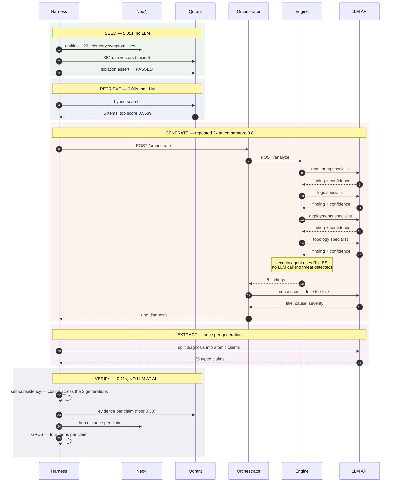
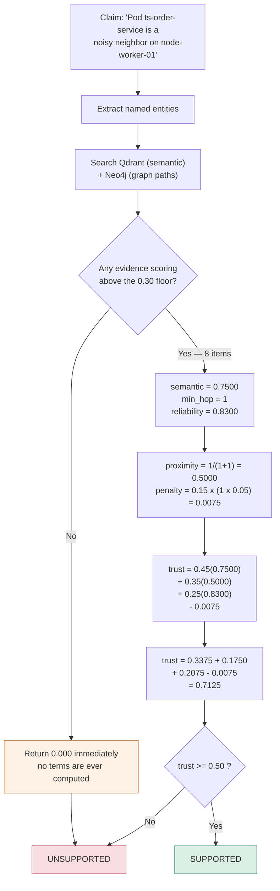
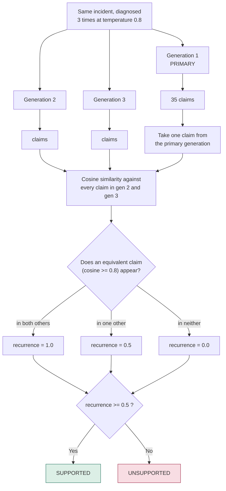
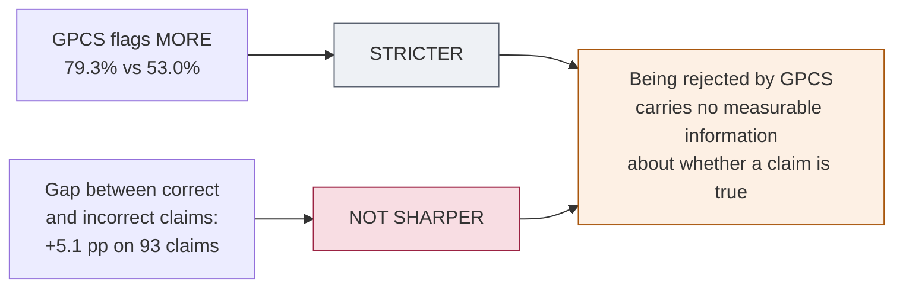

# CloudGraph verification flow

One scenario — `rcaeval-03`, CPU exhaustion on `ts-order-service`, condition
`hybrid` — drawn end to end. All values are from the checked-in trace
[`experiment-1-benchmark/traces/rcaeval-03-TRACE_HYBRID.md`](../experiment-1-benchmark/traces/rcaeval-03-TRACE_HYBRID.md)
and [`results/claims.csv`](../experiment-1-benchmark/results/claims.csv).

---

## 1. The whole pipeline, with every API call

18 LLM calls: 15 inside the cluster, 3 in the harness process.

**Call tally**

| Where | Calls |
|---|---|
| 4 specialists × 3 generations | 12 |
| consensus × 3 generations | 3 |
| claim extraction × 3 generations | 3 |
| **Total** | **18** |

Note that **verification costs zero LLM calls**. Generation takes ~270 s;
scoring all 35 claims takes 0.11 s.

---

## 2. GPCS — "can I find proof?"

> **The worked example below is illustrative, not observed.** In Experiment 1 the
> `semantic` term never varies: evidence reaches GPCS through graph traversal,
> which assigns a fixed `0.75` within two hops (`0.6` beyond) rather than a
> measured cosine similarity. Only eight distinct trust scores occur across all 1,950
> claims — `0.000`, `0.700`, `0.703`, `0.705`, `0.708`, `0.710`, `0.713`,
> `0.720` — and `0.000` accounts for 1,546 of them. Read the formula as scoring **graph reachability**,
> not semantic provenance. See the root [README](../README.md#results).

For each claim, independently:

**The floor exists** because nearest-neighbour search never returns empty — it
always yields its top-*k* regardless of relevance. Without a floor you cannot
tell "closest available match" from "no real match".

**`min_hop = None` is set to proximity 0, not treated as 0 hops.** Absent
provenance is not adjacency. Conflating them once gave full graph credit to
29.5% of claims and floored every score near 0.485.

**Result for this scenario: 25 of 35 unsupported (71.4%).** Only three distinct
trust scores occurred across all 35 claims — `0.000`, `0.708`, `0.710`.
A claim either matches evidence a hop away, or finds nothing at all.

---

## 3. Self-consistency — "did you say it again?"

With only two other generations, recurrence can only ever be `0.0`, `0.5` or
`1.0`.

**It never looks at evidence.** It only asks whether the model repeated itself.
So it measures **stability**, not truth — a confidently wrong model is wrong all
three times and gets marked *supported*.

**Result for this scenario: 20 of 35 unsupported (57.1%).**

---

## 4. The two verdicts side by side

Both verifiers score **the same claims**, from **the same extraction**, from
**the same generation**. Only the mechanism differs — which is what makes the
comparison fair.

The **8 claims GPCS alone rejects** are the strictness gap made visible.

> Agreement here is **concordance**, never accuracy. Both verifiers can be wrong
> about the same claim and it still counts on the diagonal.

---

## 5. Does either one track truth?

**33 of 35 claims cannot be judged.** The benchmark metadata settles causal
claims that name a mechanism, and nothing else. *"CPU mean jumped from 5.289 to
37.52"* is descriptive — true about the telemetry, silent about the cause.

Across all 18 scenarios this comes to **93 of 1,950 claims — 4.8%**.

### And on that 4.8%

That subset splits **36 correct, 57 incorrect**.

| Verifier | Flags **incorrect** | Flags **correct** | Gap | Precision |
|---|---|---|---|---|
| GPCS | 91.2% (52/57) | 86.1% (31/36) | **+5.1 pp** | 0.627 |
| Self-consistency | 63.2% (36/57) | 63.9% (23/36) | **−0.7 pp** | 0.610 |

Self-consistency's gap is **negative** — it flags correct claims marginally more
often than incorrect ones. GPCS leans the right way by 5.1 pp, roughly three
claims out of 93.

A verifier that flagged *everything* would score **0.613** precision on this
set. GPCS's 0.627 and self-consistency's 0.610 are both at that floor: what
looks like precision here is class balance, not discrimination.

---

## The one-line summary

