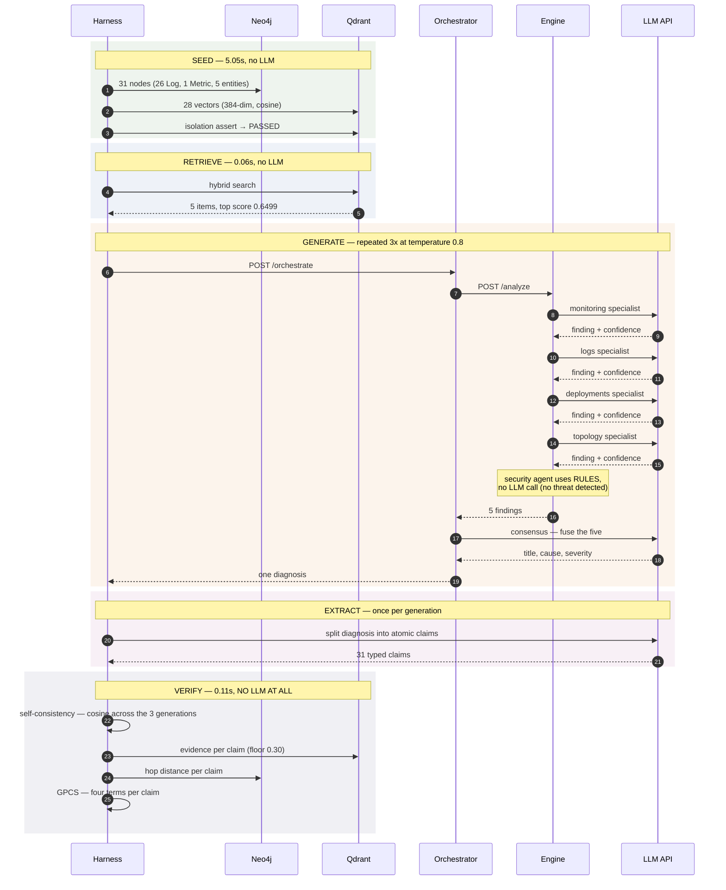
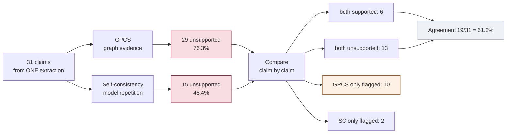
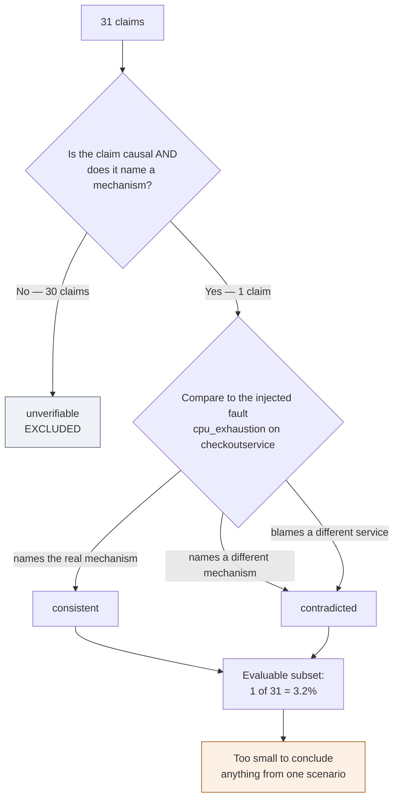
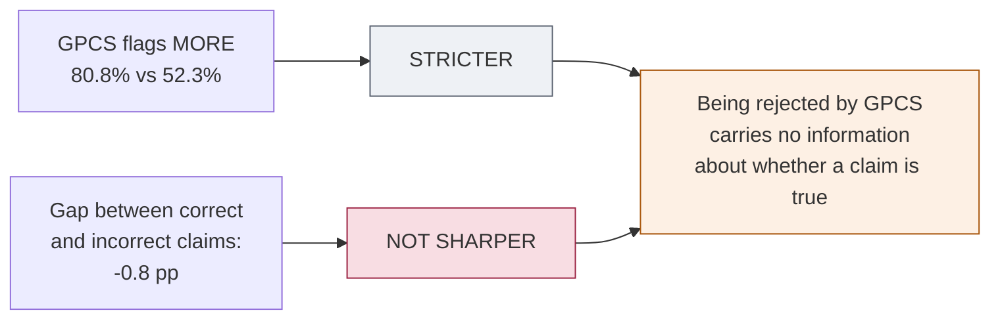

# CloudGraph verification flow

One scenario — `rcaeval-01`, CPU exhaustion on `checkoutservice`, condition
`hybrid` — drawn end to end. All values are from the live trace in
`/tmp/cloudgraph-trace-v2.log`.

---

## 1. The whole pipeline, with every API call

18 LLM calls: 15 inside the cluster, 3 in the harness process.

**Call tally**

| Where | Calls |
|---|---|
| 4 specialists × 3 generations | 12 |
| consensus × 3 generations | 3 |
| claim extraction × 3 generations | 3 |
| **Total** | **18** |

Note that **verification costs zero LLM calls**. Generation takes ~270 s;
scoring all 31 claims takes 0.11 s.

---

## 2. GPCS — "can I find proof?"

For each claim, independently:

**The floor exists** because nearest-neighbour search never returns empty — it
always yields its top-*k* regardless of relevance. Without a floor you cannot
tell "closest available match" from "no real match".

**`min_hop = None` is set to proximity 0, not treated as 0 hops.** Absent
provenance is not adjacency. Conflating them once gave full graph credit to
29.5% of claims and floored every score near 0.485.

**Result for this scenario: 29 of 38 unsupported (76.3%).** Only six distinct
trust scores occurred across all 31 claims — `0.000`, `0.703`, `0.713`, `0.720`.
A claim either matches evidence a hop away, or finds nothing at all.

---

## 3. Self-consistency — "did you say it again?"

With only two other generations, recurrence can only ever be `0.0`, `0.5` or
`1.0`.

**It never looks at evidence.** It only asks whether the model repeated itself.
So it measures **stability**, not truth — a confidently wrong model is wrong all
three times and gets marked *supported*.

**Result for this scenario: 15 of 31 unsupported (48.4%).**

---

## 4. The two verdicts side by side

Both verifiers score **the same claims**, from **the same extraction**, from
**the same generation**. Only the mechanism differs — which is what makes the
comparison fair.

The **10 claims GPCS alone rejects** are the strictness gap made visible.

> Agreement here is **concordance**, never accuracy. Both verifiers can be wrong
> about the same claim and it still counts on the diagonal.

---

## 5. Does either one track truth?

**30 of 31 claims cannot be judged.** The benchmark metadata settles causal
claims that name a mechanism, and nothing else. *"CPU rose from 0.4289 to
18.29"* is descriptive — true about the telemetry, silent about the cause.

Across all 6 scenarios this comes to **22 of 661 claims — 3.3%**.

### And on that 3.3%

| Verifier | Flags **incorrect** | Flags **correct** | Gap |
|---|---|---|---|
| GPCS | 60.4% | 61.2% | **−0.8 pp** |
| Self-consistency | 72.6% | 73.5% | **−0.8 pp** |

Both flag true and false claims at **the same rate**. Being rejected by either
verifier tells you essentially nothing about whether the claim is correct.

Both also post a precision of exactly **0.681** on a set that is **68.4%
incorrect** — which is precisely the score a verifier that flagged *everything*
would achieve. The precision is class balance, not discrimination.

---

## The one-line summary

