# 🚀 How CloudGraph Works

This document explains the complete end-to-end lifecycle of CloudGraph, from installation to AI-powered Root Cause Analysis (RCA).

CloudGraph is **not another observability platform**.

Instead, it acts as an **AI investigation layer** that sits on top of your existing Kubernetes environment and continuously transforms telemetry into explainable operational intelligence.

---

# High-Level Architecture

<p align="center">

</p>

---

# Step 1 — Installation

CloudGraph can be installed on any Kubernetes environment.

Examples include:

- Bare-metal Kubernetes
- On-premise clusters
- AWS EKS
- Azure AKS
- Google GKE
- k3s
- OpenShift
- Rancher

Users simply execute one command.

```bash
curl -fsSL https://get.cloudgraph.dev | bash
```

or

```bash
helm install cloudgraph cloudgraph/cloudgraph
```

---

# Step 2 — Bootstrap

The installer deploys CloudGraph into its own namespace.

```text
cloudgraph-system
```

CloudGraph installs:

- CloudGraph API
- Investigation Engine
- Agent Orchestrator
- OpenTelemetry Collector
- Neo4j
- Qdrant
- Redis
- UI
- RBAC
- CRDs

If the customer already has:

- Prometheus
- Grafana
- Loki

CloudGraph simply connects to them.

Otherwise, it can install its own observability stack.

---

# Step 3 — Cluster Discovery

CloudGraph automatically discovers infrastructure using the Kubernetes API.

It continuously inventories:

- Nodes
- Namespaces
- Pods
- Deployments
- StatefulSets
- DaemonSets
- Jobs
- Services
- Ingress
- PVCs
- ConfigMaps
- Secrets
- Network Policies

Example:

```text
frontend
checkout
payment
postgres
redis
rabbitmq
```

No manual configuration is required.

---

# Step 4 — Dependency Mapping

CloudGraph builds a real-time dependency graph.

Instead of seeing isolated resources...

```text
Pod A
Pod B
Pod C
```

CloudGraph understands relationships.

<p align="center">

</p>

Neo4j stores relationships such as:

```text
(Service)-[:CALLS]->(Service)

(Service)-[:USES]->(Database)

(Pod)-[:RUNS_ON]->(Node)

(Node)-[:HOSTS]->(Pod)

(Deployment)-[:CREATED]->(Pod)

(Service)-[:DEPENDS_ON]->(Service)
```

This forms the CloudGraph Knowledge Graph.

---

# Step 5 — Continuous Telemetry Collection

CloudGraph continuously ingests telemetry.

## Metrics

- CPU
- Memory
- Network
- Latency
- Error Rate

via Prometheus.

---

## Logs

Application logs

Container logs

System logs

via Loki.

---

## Kubernetes Events

Examples:

- CrashLoopBackOff
- OOMKilled
- ImagePullBackOff
- NodeNotReady
- FailedMount

---

## Deployment Metadata

CloudGraph collects:

- Git commits
- Pull Requests
- Helm Releases
- ArgoCD Syncs
- CI/CD pipelines
- Deployment history

---

# Step 6 — Knowledge Graph Construction

Telemetry is transformed into graph entities.

Example:

<p align="center">

</p>

The graph continuously evolves as the cluster changes.

Instead of storing raw logs, CloudGraph stores operational knowledge.

---

# Step 7 — Incident Detection

Suppose the following occurs:

- Error rate increases
- Checkout latency spikes
- Payment pods restart
- Database timeouts appear

Prometheus Alertmanager raises:

```text
Checkout Service Down
```

CloudGraph automatically starts an investigation.

No human intervention is required.

---

# Step 8 — Multi-Agent Investigation

Several AI agents investigate the incident simultaneously.

<p align="center">

</p>

Each agent has a specialized responsibility.

## Monitoring Agent

Investigates:

- CPU
- Memory
- Alerts
- Resource utilization

---

## Log Agent

Investigates:

- Error logs
- Stack traces
- Exception patterns

---

## Investigation Agent

Investigates:

- Service latency
- Dependency chains
- Deployment impact

---

## Deployment Agent

Investigates:

- Git commits
- Helm releases
- CI/CD
- Rollouts

---

## Security Agent

Investigates:

- RBAC
- Secrets
- IAM
- Security events

---

# Step 9 — GraphRAG Retrieval

Instead of sending thousands of logs into the LLM...

CloudGraph first queries Neo4j.

Example query:

```text
What resources are related to the Payment Service?
```

GraphRAG retrieves:

- Deployment
- Secret
- Database
- Services
- Alerts
- Logs
- Metrics

using multi-hop graph traversal.

<p align="center">

</p>

Only highly relevant evidence is retrieved.

This dramatically reduces token usage while improving reasoning quality.

---

# Step 10 — LLM Reasoning

The LLM receives structured context.

Example:

```text
Deployment:
6 minutes ago

Secret modified

Pods restarted

Authentication failures

Database unreachable

Checkout unavailable
```

Instead of processing gigabytes of logs, the model receives a concise evidence package.

---

# Step 11 — Consensus Engine

Every AI agent produces:

- Findings
- Confidence
- Evidence

Example:

| Agent | Confidence |
|---------|-----------|
| Monitoring | 92% |
| Logs | 97% |
| Traces | 94% |
| Deployment | 95% |
| Security | 89% |

The Consensus Engine combines these results into a unified explanation.

---

# Step 12 — Root Cause Analysis

CloudGraph generates an explainable RCA.

Example:

```text
Root Cause

Invalid PostgreSQL credentials

Confidence

94%

Evidence

✓ Secret modified

✓ Deployment occurred

✓ Pods restarted

✓ Authentication failures

✓ Database unreachable

✓ Checkout depends on Payment

✓ Payment depends on PostgreSQL
```

Every conclusion is traceable back to telemetry and graph relationships.

---

# Step 13 — Recommendations

CloudGraph generates actionable recommendations.

Example:

- Rollback deployment
- Restore previous Secret
- Restart Payment pods
- Verify PostgreSQL credentials
- Validate connectivity

Future versions may optionally perform automated remediation after user approval.

---

# Step 14 — Incident Learning

Every investigation is stored.

CloudGraph builds an organizational incident knowledge base.

Future incidents retrieve previous investigations using GraphRAG.

This enables:

- Faster investigations
- Better recommendations
- Reduced Mean Time To Resolution (MTTR)
- Continuous operational learning

---

# Multi-Cluster Deployment

CloudGraph supports enterprise-scale environments.

<p align="center">

</p>

Each cluster runs a lightweight CloudGraph Agent.

The Control Plane aggregates telemetry and investigations across all clusters.

---

# CloudGraph Architecture Summary

<p align="center">

</p>

---

# Why CloudGraph?

CloudGraph does **not replace**:

- Prometheus
- Grafana
- Loki

Instead, it sits **above** the observability stack and converts raw telemetry into explainable operational intelligence.

Traditional observability tells you **what happened**.

CloudGraph tells you:

- Why it happened
- What caused it
- Which services are affected
- What changed
- How confident the analysis is
- What should be done next

This transforms observability into autonomous, AI-driven incident investigation.
