# CloudGraph UI — visual walkthrough

A screen-by-screen tour of the running system: every tab, every button, what
each one does, and the technical machinery behind it.

Every screenshot was captured from a **live deployment against a real LLM**, in
order, by a scripted browser session — not mocked, not composited. The images
are committed under `docs/guides/images/`.

| | |
|---|---|
| Captured | 2026-08-12, 14 screenshots at 1440×900 |
| Cluster | OrbStack built-in Kubernetes, node `orbstack`, v1.35.6+orb1 |
| Namespace | `cloudgraph-system`, 7/7 pods `1/1 Running` |
| LLM | provider `meta`, model `muse-spark-1.2-contributor` |
| Driver | Playwright 1.62.1 (Chromium headless) |
| Access | `kubectl port-forward svc/cloudgraph-ui 3000:3000` |

**Empty states are not shown.** The walkthrough documents the system doing its
job. Where a screen has a placeholder, it is described in prose instead.

**The Benchmark screen is hidden in this release** and deferred to the next
version — see [§8](#8-benchmark--hidden-in-this-release).

Each screen below lists the endpoint it calls. Known limitations are called out
inline, next to the screen they affect.

---

## Contents

| § | Screen | Shots |
|---|---|---|
| 1 | Topology Map | 01–02 |
| 2 | AI Diagnosis — Investigation | 03 |
| 3 | AI Diagnosis — Context Explorer | hidden |
| 4 | Log Stream | 08 |
| 5 | Evidence & Search | 09–10 |
| 6 | LLM Settings | 11 |
| 7 | Data stores — Neo4j & Qdrant | 12–14 |
| 8 | Benchmark | hidden |
| 9 | The global shell | all |

---

## 1. Topology Map — `index.html`

The landing page. Renders the Kubernetes cluster as a property graph.

Two controls sit top-right: **🔍 Discover Cluster** and **🗑️ Reset Topology**.
On load the page issues `GET /api/v1/graph/data`, which reads whatever is
already in **Neo4j** — it does *not* query the Kubernetes API, so a fresh
install shows an empty canvas until a discovery has run.

Clicking **Discover Cluster** issues `POST /api/v1/graph/discover`. Server-side
the API uses its **ServiceAccount** token and the `cloudgraph-discovery`
**ClusterRole** to call `list_node`, `list_pod_for_all_namespaces`, deployments
and services. Each object is written with `MERGE` on the object **UID**, so
repeated discoveries are **idempotent**. Entity linking then creates
`(:Pod)-[:RUNS_ON]->(:Node)`, `(:Pod)-[:BELONGS_TO]->(:Service)` and
`(:Deployment)-[:MANAGES]->(:Pod)`. Measured: **6–19 s**, returning
`{nodes:1, deployments:5, services:10, pods:7}` plus link counts.

### 1.1 The rendered graph

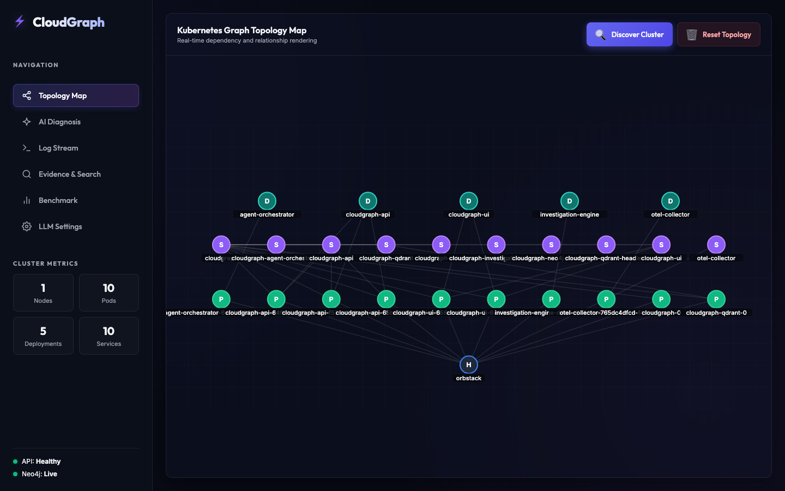

- **Four node classes**, drawn as lettered circles in tiers:
  - **D** — Deployment (teal), top row
  - **S** — Service (purple), middle row
  - **P** — Pod (green), third row
  - **H** — Node/host (blue), bottom — here the single `orbstack` node
- **Edges** are the Neo4j relationships above; the dense fan into `H` is every
  pod's `RUNS_ON` edge to the one worker node.
- **Interaction** — drag the background to pan, scroll to zoom
  (`topology.js`), click any node for its detail panel.
- **Colour encodes health, and every pod is green** — the visible result of the
  **pod-status fix**. `_resolve_pod_status()` used to return a
  successfully-completed *init container's* `Completed` reason instead of the
  pod's `Running` phase, so pods with init containers (`cloudgraph-qdrant-0`
  among them) rendered red while perfectly healthy. It now ignores container
  states that exited 0 and surfaces only genuine faults — `ImagePullBackOff`,
  `CrashLoopBackOff`, non-zero exits.
- **Sidebar tiles read `1 / 10 / 5 / 10`**, counted from node labels in the
  graph payload and matching `kubectl` exactly.
- **"Real-time" in the subtitle is a misnomer** — nothing polls or streams. The
  graph updates on Discover or reload only.

### 1.2 Node detail panel

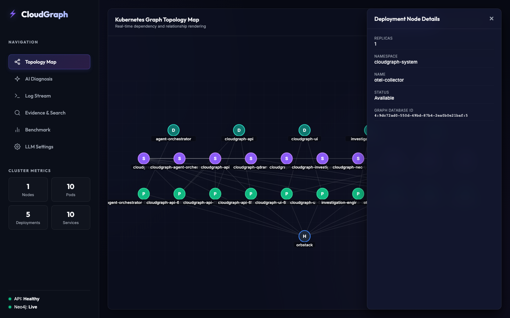

- Clicking a node slides in a detail panel; `×` closes it.
- **The panel adapts to node type.** A **Deployment** was clicked here, so the
  header reads *"Deployment Node Details"* with `REPLICAS`, `NAMESPACE`,
  `NAME`, `STATUS`, `GRAPH DATABASE ID`. A **Pod** yields *"Pod Node Details"*
  with `NODENAME`, `IP` and `ENV` (its `KEY=value` pairs) instead.
- **`GRAPH DATABASE ID`** is Neo4j's internal `elementId()`, e.g.
  `4:9dc72ad0-550d-49bd-87b4-2ea0b0e21baf:5` — the handle used to join this
  node back to evidence during retrieval, which is why it is surfaced.
- All fields come from **Neo4j node properties**, so this is a snapshot as of
  the last discovery, not a live read.

---

## 2. AI Diagnosis — Investigation tab

`diagnosis.html`, first of two tabs. Panel: *"Investigation Engine Output — AI
root cause analysis and recommendations"*, with one `🧠 Run AI Diagnosis`
button.

**Before a provider is configured**, the click first calls
`GET /api/v1/settings`, finds nothing, and shows the toast *"No LLM provider
connected. Configure one on the Settings page to set one up."* — no redirect,
so you keep your place.

### 2.1 A real multi-agent investigation

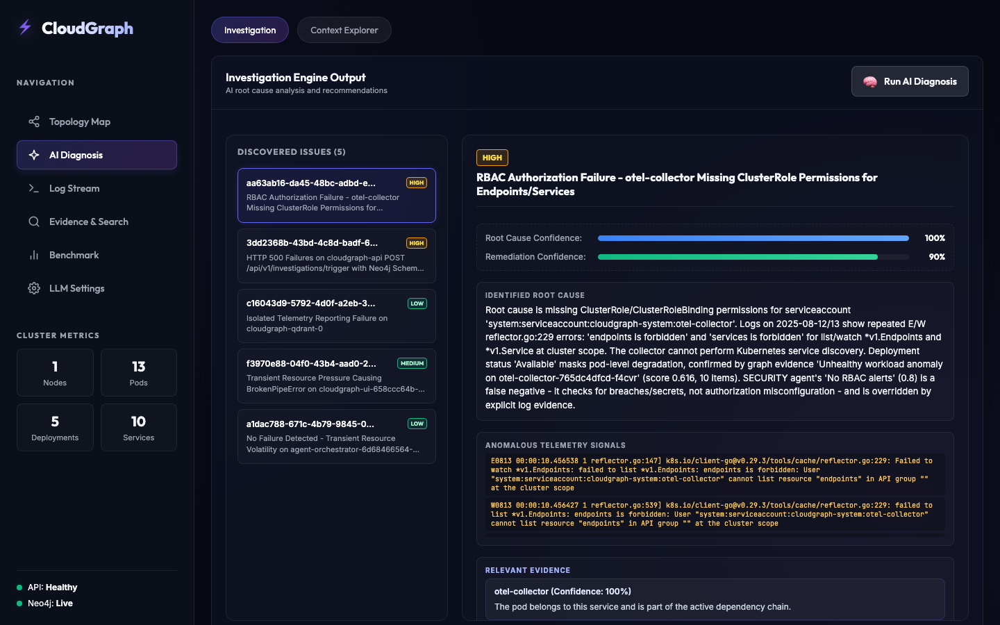

This is genuine LLM output against the live cluster. **Measured end-to-end:
394 s (6.5 min).**

- **`POST /api/v1/investigations/trigger`** with `{namespace}`. The server picks
  up every pod with ERROR logs (capped at 5) and runs the full pipeline on each:
  1. **Five specialist agents** — monitoring, log, deployment, topology,
     security — each an independent LLM call over its own evidence slice,
     returning a finding plus a `confidence` in `[0,1]`.
  2. **ConsensusEngine** — a *static weighted aggregation*, not a reasoning
     agent, fusing the five findings into one report.
  3. **GCP** — Graph Confidence Propagation, Noisy-OR belief propagation over
     the topology with hop-decay.
  4. **GPCS** — Graph-Provenance Claim Scoring splits the narrative into atomic
     claims and scores each against graph evidence.
- **Left rail — `DISCOVERED ISSUES (5)`** with severity chips (HIGH / MEDIUM /
  LOW). Each is a separate investigation, keyed by incident UUID.
- **Right pane** shows the selected issue: **Root Cause Confidence 100%**,
  **Remediation Confidence 90%**, the identified root cause, the anomalous
  telemetry that supports it, and the ranked evidence.
- **The diagnosis is correct and non-trivial.** It identified a real RBAC
  misconfiguration in this cluster — `system:serviceaccount:cloudgraph-system:otel-collector`
  forbidden to list/watch `*v1.Endpoints` and `*v1.Service` at cluster scope —
  and cited the actual `reflector.go:229` log lines as evidence.
- **It also caught a disagreement between its own agents:** *"SECURITY agent's
  'No RBAC alerts' (0.8) is a false negative — it checks for breaches/secrets,
  not authorization misconfiguration — and is overridden by explicit log
  evidence."* That is the consensus step doing real work rather than averaging.
- **Namespace is hardcoded** to `cloudgraph-system` in the request body, so the
  UI cannot investigate workloads in other namespaces.

**Three defects had to be fixed before this screen worked at all:**

| Defect | Effect | Fix |
|---|---|---|
| `GCP KeyError` | Every investigation returned HTTP 500 | `gcp.py` skips neighbours outside the scored subgraph |
| LLM settings not threaded to consensus | Agents used the configured provider; consensus 401'd against OpenAI and silently degraded to rule-based | API falls back to stored settings |
| 15 s UI proxy timeout | A 6.5-minute investigation always 500'd mid-flight | Long-running endpoints get 900 s; server made threaded |

---

<!-- Context Explorer section - commented out in UI release
## 3. AI Diagnosis — Context Explorer tab

The instrument panel behind the research: it shows exactly what each retrieval
configuration fed the model. One text input, a `Compare Context` button, and
four result sub-tabs.

### 3.1 Payload — four configurations side by side

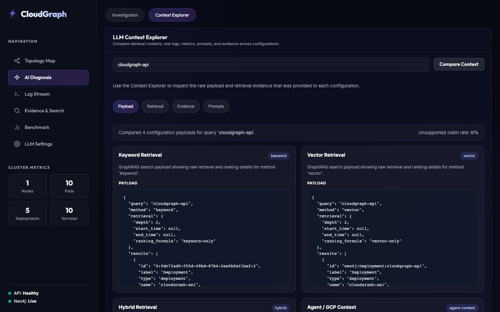

- **`POST /api/v1/investigations/context-comparison`** with `{query, namespace}`.
  **This works without an LLM** — it is pure retrieval inspection.
- Header: *"Compared 4 configuration payloads for query 'cloudgraph-api'"* with
  an **Unsupported claim rate: 0%**.
- **Four cards** — Keyword Retrieval, Vector Retrieval, Hybrid Retrieval, and
  Agent / GCP Context — each showing the literal JSON request:

  ```json
  { "query": "cloudgraph-api", "method": "keyword",
    "retrieval": { "depth": 2, "start_time": null, "end_time": null,
                   "ranking_formula": "keyword-only" },
    "results": [ { "id": "4:9dc72ad0-…:2", "label": "Deployment", … } ] }
  ```

- **`depth: 2`** is the k-hop traversal bound. **`ranking_formula`** names the
  scoring mode. **`start_time`/`end_time`** are the temporal window — `null`
  here because no incident seed constrained it.
- This is the UI counterpart of the `none` / `raw` / `hybrid` context ablation
  in `experiment-1-benchmark/`, but it is an **inspection tool only**. No published number
  comes from it.

### 3.2 Retrieval, Evidence and Prompts

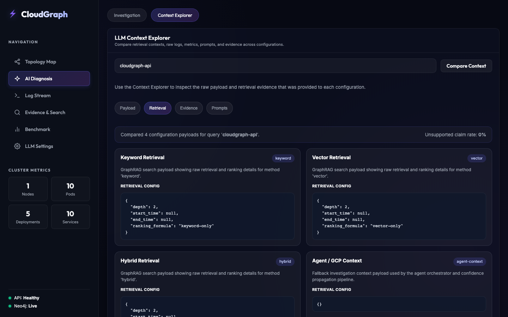

- **Retrieval** — the ranked items each configuration actually returned, so you
  can see where keyword and hybrid diverge on identical input.

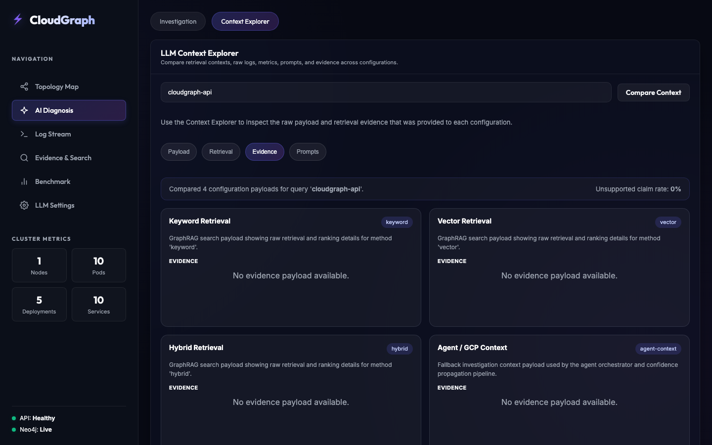

- **Evidence** — the evidence objects with their scores; the raw material GPCS
  scores claims against.

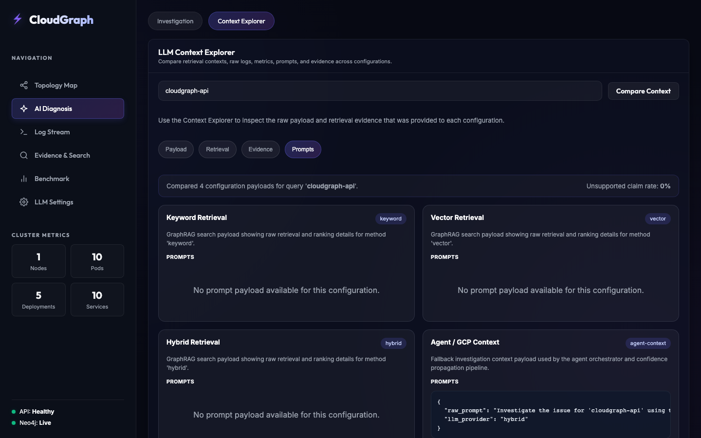

- **Prompts** — the fully assembled prompt text per configuration. This is what
  makes prompt construction auditable by eye, and it is the screen that makes
  the **ground-truth leakage** class of bug visible.
- All four sub-tabs are **client-side switches over a single response** — no
  refetch when you change tab.
-->

---

## 4. Log Stream — `logs.html`

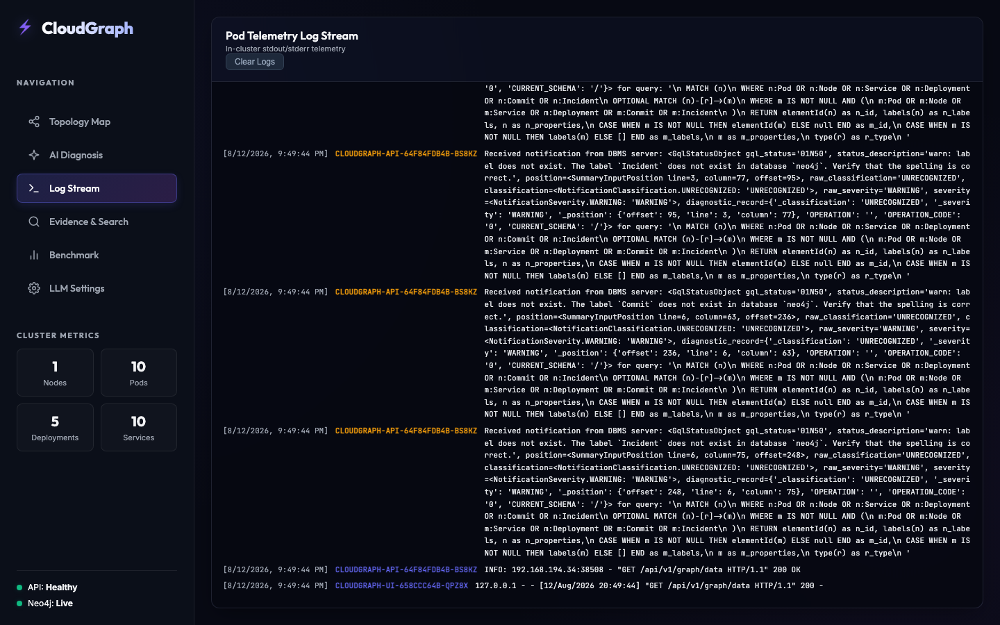

- **Heading** — *"Pod Telemetry Log Stream — In-cluster stdout/stderr
  telemetry"*. That claim is now accurate; it was not before.
- **This screen used to fabricate its content.** `streamLogs()` picked a random
  string from a hardcoded array based on each pod's status. Nothing was read
  from a container. Combined with the pod-status bug it invented *"Failed to
  pull image"* and *"Terminated due to OutOfMemory"* lines for healthy pods.
- **Now** it polls `GET /api/v1/logs/pods?tail=20`, which calls the Kubernetes
  **`pods/log` subresource** (`read_namespaced_pod_log`) for every Running pod.
  The output above is genuine — Neo4j `GqlStatusObject` DBMS notifications from
  `CLOUDGRAPH-API-…` and nginx access lines from `CLOUDGRAPH-UI-…`,
  byte-identical to `kubectl logs`.
- **This needed an RBAC fix too.** `pods/log` is a *separate subresource* from
  `pods`; the ClusterRole never granted it, so every read returned **403** —
  swallowed at `logger.debug`. Log ingestion had silently produced nothing for
  the life of the project. The grant is now in `values.yaml`, 1,825 `Log` nodes
  are ingested, and a 403 is logged as a **warning**.
- **Rendering is XSS-safe** — lines are inserted with `textContent` via
  individual elements, never `innerHTML`, now that arbitrary container output
  reaches the DOM.
- `Clear Logs` → `DELETE /api/v1/logs`. Polled pod logs are deliberately **not**
  persisted; they already live in the cluster.

---

## 5. Evidence & Search — `evidence.html`

Two independent panels: a retrieval comparison, and an evidence fetch.

### 5.1 Keyword vs Hybrid GraphRAG — the most research-relevant screen

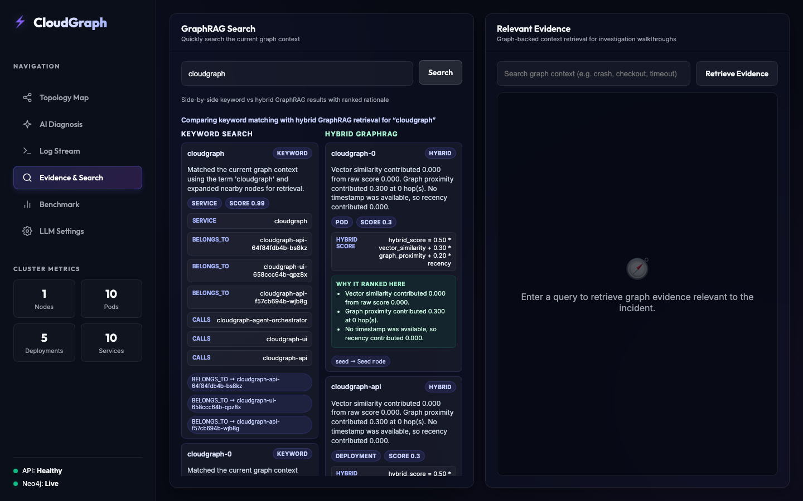

- **One click fires two calls.** `Search` issues `POST /api/v1/graphrag/search`
  **twice** in parallel — once `method: "keyword"`, once `method: "hybrid"` —
  and renders them side by side.
- **Keyword column** — lexical matching. `cloudgraph` matched a `SERVICE` at
  **SCORE 0.99**, then expanded to neighbours, showing the graph edges walked
  as chips: `BELONGS_TO → cloudgraph-api-…`, `CALLS → cloudgraph-agent-orchestrator`.
- **Hybrid column** — the three-signal ranker, printed in the card itself:

  ```text
  hybrid_score = 0.50 * vector_similarity
               + 0.30 * graph_proximity
               + 0.20 * recency
  ```

- **"WHY IT RANKED HERE"** decomposes the score per term — the
  `score_breakdown` the API returns for every hit:
  - *Vector similarity contributed 0.000 from raw score 0.000*
  - *Graph proximity contributed 0.300 at 0 hop(s)*
  - *No timestamp was available, so recency contributed 0.000*
- **Read that vector term carefully.** `0.000` is not "no match" — the Qdrant
  collection `evidence` does not exist on a fresh deploy, so the semantic store
  silently falls back to its local JSON file and the **neural half of hybrid
  retrieval is switched off**. Nothing in the UI announces this — there is no
  Qdrant indicator anywhere. It is the most misleading thing on screen.
- **`seed → Seed node`** marks the traversal origin; `0 hop(s)` means this hit
  *is* the seed.
- Type chips (`POD`, `DEPLOYMENT`, `SERVICE`) come from the Neo4j label.

### 5.2 Retrieved evidence

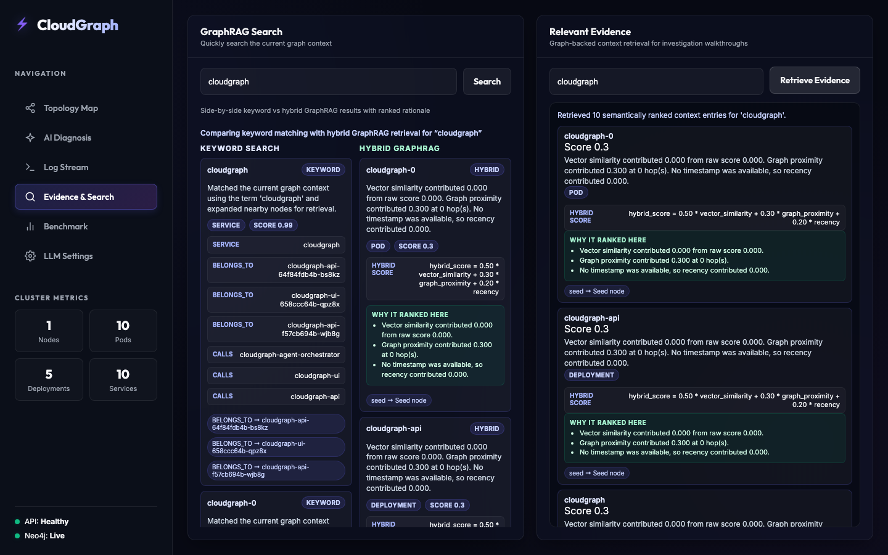

- `Retrieve Evidence` → `POST /api/v1/graphrag/retrieve` with
  `{query, namespace}`.
- Returns the graph-grounded evidence set an investigation would be given — the
  same material GPCS later scores claims against.

---

## 6. LLM Settings — `settings.html`

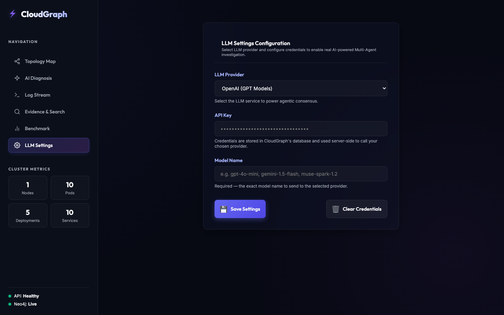

- **LLM Provider** — three options: `openai` (OpenAI GPT models), `gemini`
  (Google Gemini via its v1beta OpenAI-compatible endpoint), `meta` (Meta Llama
  API).
- **API Key** — a password field. Helper text: *"Credentials are stored in
  CloudGraph's database and used server-side to call your provider."*
- **Model Name** — free text and **required**; the exact model string passed to
  the provider (here `muse-spark-1.2-contributor`).
- **`Save Settings`** → `POST /api/v1/settings`. **`🗑️ Clear Credentials`** →
  `DELETE /api/v1/settings`.
- ⚠ **Provider and model must match.** `provider` selects the endpoint —
  `openai` → `api.openai.com`, `meta` → `api.meta.ai`. A mismatched pair fails
  with a **401** at call time, visible only in the API logs. This was hit
  during capture: `muse-spark-1.2-contributor` with provider `openai` returned
  `invalid_api_key` on every call.
- ⚠ **The key is returned in cleartext.** `GET /api/v1/settings` echoes the
  stored `api_key` verbatim, and that endpoint is **unauthenticated**. Anyone
  who can reach the API can read the live provider key with one curl. The
  password field masks it in the form only — not in transit, not at rest.

---

## 7. The data stores — Neo4j and Qdrant

The two databases behind every screen above. Neither is part of the CloudGraph
UI; both ship their own admin console, and both are reachable once you
port-forward them:

```bash
kubectl port-forward -n cloudgraph-system svc/cloudgraph 7474:7474 7687:7687
kubectl port-forward -n cloudgraph-system svc/cloudgraph-qdrant 6333:6333
```

Neo4j Browser is at `http://localhost:7474`, credentials from the release
secret:

```bash
kubectl get secret -n cloudgraph-system cloudgraph-neo4j-auth -o jsonpath='{.data.NEO4J_AUTH}' | base64 -d
```

### 7.1 The incident subgraph

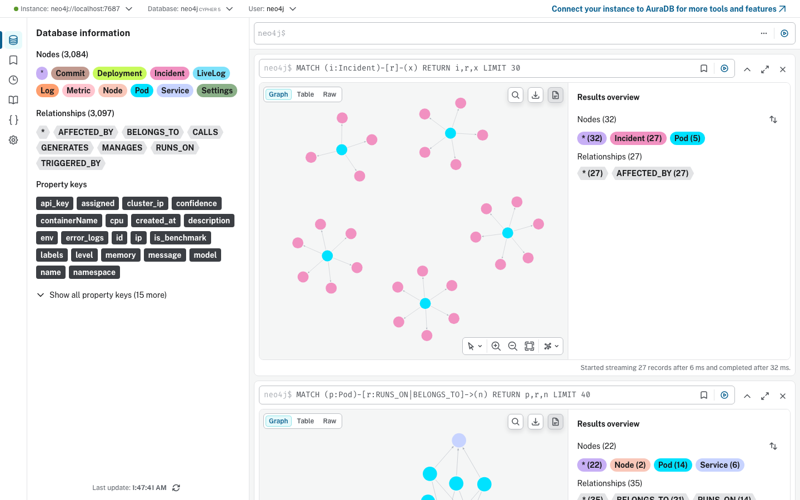

- **Left rail — Database information** is the schema as it actually exists:
  **3,084 nodes**, **3,097 relationships**.
- **Node labels**: `Commit`, `Deployment`, `Incident`, `LiveLog`, `Log`,
  `Metric`, `Node`, `Pod`, `Service`, `Settings`.
- **Relationship types**: `AFFECTED_BY`, `BELONGS_TO`, `CALLS`, `GENERATES`,
  `MANAGES`, `RUNS_ON`, `TRIGGERED_BY` — the edges the k-hop retriever
  traverses.
- **Property keys** include `confidence`, written back by **GCP** after
  Noisy-OR propagation, and `is_benchmark`, which marks seeded evaluation data
  so it can be torn down without touching live telemetry.
- The query `MATCH (i:Incident)-[r]-(x) RETURN i,r,x LIMIT 30` returns
  **32 nodes / 27 relationships in 32 ms**: 27 `Incident` nodes linked to
  5 `Pod` nodes by 27 `AFFECTED_BY` edges.
- The star pattern is one pod accumulating many incidents across repeated
  investigation runs — each `Run AI Diagnosis` (§2.1) writes a new `Incident`
  and attaches it to the affected pod.
- **This is the subgraph GPCS scores claims against.** When a claim is checked
  for support, traversal starts from the incident seed and walks these edges;
  `min_hop` in the trust formula is the shortest path found here.

### 7.2 What is actually stored

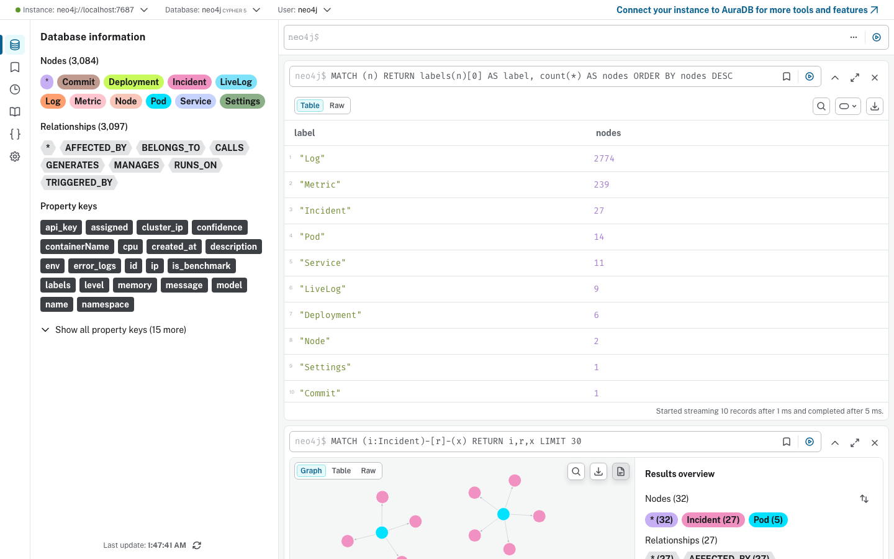

- `MATCH (n) RETURN labels(n)[0] AS label, count(*) AS nodes ORDER BY nodes DESC`

| Label | Nodes | What it is |
|---|---|---|
| `Log` | 2,774 | Real container stdout/stderr, ingested via the `pods/log` subresource |
| `Metric` | 239 | Prometheus samples attached to pods |
| `Incident` | 27 | One per investigation run |
| `Pod` | 14 | Live cluster pods |
| `Service` | 11 | Live cluster services |
| `LiveLog` | 9 | UI-persisted agent/investigation events |
| `Deployment` | 6 | Live cluster deployments |
| `Node` | 2 | Cluster nodes |
| `Settings`, `Commit` | 1 each | LLM configuration; a single ingested commit |

- **`Log` dominates the graph at 90% of all nodes.** That is the RBAC fix
  working — before `pods/log` was granted, log ingestion silently produced
  nothing (§4).

### 7.3 The vector store

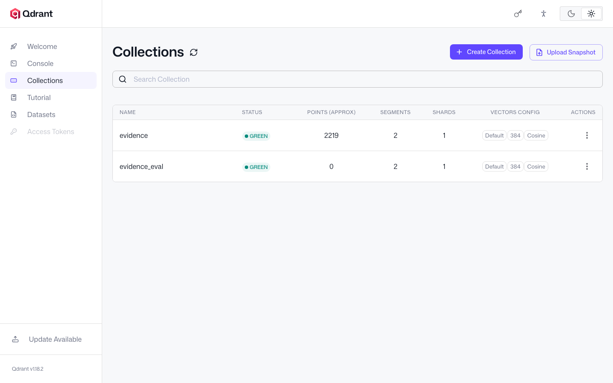

- Qdrant's own dashboard at `http://localhost:6333/dashboard`. **Two
  collections, both `GREEN`:**

| Collection | Points | Vectors | Purpose |
|---|---|---|---|
| `evidence` | 2,219 | 384-dim, Cosine | Live evidence embeddings for hybrid retrieval |
| `evidence_eval` | 0 | 384-dim, Cosine | Dedicated evaluation namespace, purged between scenarios |

- **384 dimensions** matches `all-MiniLM-L6-v2`; **Cosine** matches the
  similarity used by the hybrid ranker's `vector_similarity` term.
- **`evidence_eval` is the isolation fix.** Cross-scenario contamination was
  one of the four integrity defects: seeded evidence from other scenarios
  stayed visible during evaluation. Runs now use this dedicated collection,
  purged and asserted-empty between scenarios — which is why it reads 0 here.
- **Note the contrast with §5.1**, where the hybrid card reported
  `Vector similarity contributed 0.000`. On a *fresh* deploy the `evidence`
  collection does not exist and the store falls back to a local JSON file. It
  is populated here because ingestion has since run — so the vector term is
  degraded on first use, not permanently broken. Nothing in the UI signals
  which state you are in.

---

## 8. Benchmark — hidden in this release

The Benchmark screen is **commented out of the sidebar** on every page and
deferred to the next version. The code is retained in full —
`benchmark.html`, `benchmark.js`, `routers/benchmark.py` and its 204-line test
suite — and the page is still reachable directly at `/benchmark.html` for
development. Re-enable by restoring the commented anchor in the five pages that
render the sidebar.

**Why it is hidden.** It implements a six-baseline ladder — Keyword → Vector →
GraphRAG → +Agents → +GCP → +GPCS — measuring `tp`/`fp`/`fn` per rung. That
asks a genuinely different research question from the published work
(*"does each architecture layer earn its place?"* rather than *"does
graph-grounded verification behave differently from self-consistency?"*), and
it is **not citable as it stands**:

- **No statistical treatment** — bare point estimates, no confidence intervals,
  no significance tests, while every published result uses scenario-clustered
  bootstrap CIs.
- **Compute is confounded with architecture** — each rung adds LLM calls, so a
  gain cannot be attributed to the layer rather than the extra tokens. The
  **matched-compute control** is the correct instrument.
- **Single pass per rung** — well inside the measured run-to-run variance at
  temperature 0.8, which reached a 25.7-point spread across three runs of an
  identical configuration (see `experiment-1-benchmark/README.md`).
- **A different correctness construct** — `tp/fp/fn` against expected tags, not
  the claim-level verdicts the paper reports.

Making it citable is a separate study, tracked as Contribution 5 in
[`research/NOVEL_CONTRIBUTIONS.md`](../../research/NOVEL_CONTRIBUTIONS.md).
**No result in `experiment-1-benchmark/` came from this screen.**

---

## 9. The global shell

Present on every page, rendered by `app.js`.

- **Navigation** — five visible links: Topology Map, AI Diagnosis, Log Stream,
  Evidence & Search, LLM Settings. (Benchmark is commented out — §8.)
- **Cluster Metrics** — four counters (Nodes, Pods, Deployments, Services)
  computed by counting labels in `GET /api/v1/graph/data`. They reflect the
  **graph**, not the cluster; before a discovery they read zero even on a
  healthy cluster.
- **Status dots** — `API:` from `GET /health`, `Neo4j:` from the `neo4j` field
  of that same payload, both polled on an interval.
- **API base is same-origin** (`API_BASE = ""`). The UI container proxies
  `/api/v1/*` and `/health` to the API service, so the browser never talks to
  port 8080 directly. That proxy is a small Python server (`services/ui/main.py`),
  now threaded, with a 900 s timeout on LLM-backed endpoints and 15 s elsewhere.
- **No charting or graph library** — no D3, no Chart.js, nothing from a CDN.
  The topology is raw `document.createElementNS` SVG.

---

## What the published research used

The evaluation in `experiment-1-benchmark/` was produced by `cloudgraph report` and the
analysis scripts driving the same API this UI calls — **not** by clicking
through these screens. Setup: provider `meta`, model
`muse-spark-1.2-contributor`, temperature 0.8, 6 RCAEval RE2 scenarios,
1,057 LLM calls across 54 runs.

The screens worth showing in a demo are the **Topology Map** (§1), the
**AI Diagnosis** result (§2.1), and **GraphRAG Search** (§5.1) — the last
making retrieval and prompt construction auditable, which is what the
dissertation actually argues.
