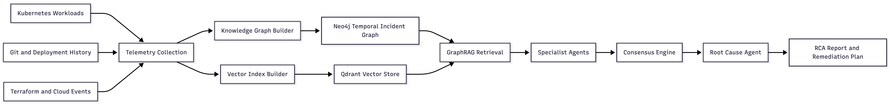

# Architecture Design

## Design Goal

CloudGraph is designed to convert cloud-native observability data into an
explainable incident knowledge graph, retrieve relevant evidence using GraphRAG,
and generate root cause analysis through specialized investigation agents.

## Diagram Inventory

| Diagram                         | Repository Path                                   | Dissertation Section    |
| ------------------------------- | ------------------------------------------------- | ----------------------- |
| High-Level Architecture         | `docs/images/high-level-architecture.png`         | System overview         |
| GraphRAG Pipeline               | `docs/images/graphrag-pipeline.png`               | Retrieval design        |
| GraphRAG Investigation Pipeline | `docs/images/graphrag-investigation-pipeline.png` | End-to-end RCA workflow |
| Multi-Agent Workflow            | `docs/images/multi-agent-workflow.png`            | Agent orchestration     |
| Knowledge Graph Schema          | `docs/images/knowledge-graph-schema.png`          | Data model              |
| AWS Deployment                  | `docs/images/aws-deployment.png`                  | Deployment architecture |

## Logical Architecture

## Data Sources

| Source                        | Example Evidence                                         | Graph Representation                                                     |
| ----------------------------- | -------------------------------------------------------- | ------------------------------------------------------------------------ |
| Logs                          | Error lines, exceptions, warnings                        | `LogEvent` nodes linked to service, pod, and incident                    |
| Metrics                       | CPU, memory, latency, error rate                         | `MetricSignal` nodes linked to service/resource/time window              |
| Traces                        | Spans, request paths, latency hotspots                   | `TraceSpan` nodes linked by parent-child and service calls               |
| Kubernetes Events             | Scheduling failures, restarts, image pulls               | `K8sEvent` nodes linked to pod/deployment/node                           |
| Kubernetes Object State       | Pod phase, deployment replicas, node readiness           | `K8sObjectState` nodes linked to cluster resources                       |
| Alerts                        | Fired/resolved alerts, severity, labels                  | `Alert` nodes linked to services, metrics, and incidents                 |
| Runtime Security Events       | Suspicious process, file, network, or privilege activity | `SecurityEvent` nodes linked to pod, node, service account, and incident |
| Git Commits and Pull Requests | Code changes, config updates, changed files              | `Commit` and `PullRequest` nodes linked to deployment and service        |
| Deployment Events             | Argo CD sync, health, degraded, rollback events          | `DeploymentEvent` nodes linked to service, commit, and incident          |
| Terraform/OpenTofu Changes    | Infrastructure drift, IAM/network changes                | `InfraChange` nodes linked to cloud resource                             |

For the full live ingestion plan, see `docs/week-1/data-collection-strategy.md`.

## Knowledge Graph Model

### Core Nodes

- `Service`
- `Pod`
- `Deployment`
- `Node`
- `Database`
- `Alert`
- `MetricSignal`
- `LogEvent`
- `TraceSpan`
- `Commit`
- `PullRequest`
- `InfraChange`
- `K8sEvent`
- `K8sObjectState`
- `DeploymentEvent`
- `SecurityEvent`
- `ChaosExperiment`
- `Incident`
- `Hypothesis`
- `Recommendation`

### Core Relationships

- `CALLS`
- `DEPENDS_ON`
- `DEPLOYED_BY`
- `GENERATES`
- `AFFECTS`
- `CONNECTS_TO`
- `TRIGGERED_BY`
- `OBSERVED_DURING`
- `SUPPORTS_HYPOTHESIS`
- `RECOMMENDS_ACTION`

### Required Properties

Most evidence nodes should include:

- `id`
- `source`
- `timestamp`
- `incident_id`
- `service_name`
- `severity`
- `confidence`
- `raw_reference`

## GraphRAG Retrieval Design

CloudGraph should use hybrid retrieval:

1. Vector retrieval finds semantically relevant logs, alerts, traces, and notes.
2. Graph traversal expands from the incident to related services, deployments,
   commits, pods, and downstream dependencies.
3. Temporal filtering keeps evidence inside the incident window.
4. Ranking combines semantic similarity, graph distance, source reliability,
   recency, and cross-source agreement.

## Agent Design

| Agent                | Inputs                               | Output                          |
| -------------------- | ------------------------------------ | ------------------------------- |
| Monitoring Agent     | Metrics, alerts, resource signals    | Metric anomaly findings         |
| Log Agent            | Application/system logs              | Error-pattern findings          |
| Trace Agent          | Distributed traces                   | Latency and dependency findings |
| Deployment Agent     | Commits, releases, Terraform changes | Change-correlation findings     |
| Security Agent       | RBAC, IAM, policy, secret evidence   | Security/configuration findings |
| Root Cause Agent     | All evidence and hypotheses          | Ranked RCA report               |
| Recommendation Agent | RCA plus operational context         | Remediation and rollback plan   |

## Confidence-Aware Consensus

Each agent output should include:

- Hypothesis.
- Evidence references.
- Confidence score from `0.0` to `1.0`.
- Evidence type.
- Explanation path.
- Suggested remediation.

The consensus engine should weight findings using:

- Agent confidence.
- Source reliability.
- Graph evidence strength.
- Temporal proximity to incident start.
- Agreement across independent agents.

## Dissertation Discussion Points

- Why graph traversal is better than isolated vector retrieval for dependency
  failures.
- How evidence chains improve RCA explainability.
- Why specialist agents map naturally to observability domains.
- How confidence scoring supports trust and reduces unsupported claims.
- How the architecture can be evaluated through baseline comparisons.
