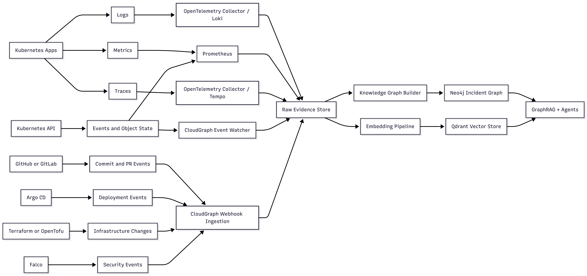

# Open-Source Data Collection Strategy

This document explains how CloudGraph can collect enough live and historical
data to demonstrate GraphRAG-powered root cause analysis in a dissertation
prototype.

## Goal

CloudGraph should collect continuously changing operational evidence from
open-source tools and convert it into graph nodes, vector documents, and
agent-readable investigation context.

The project should not rely on only static sample logs. Static data is useful
for repeatable experiments, but the final demonstration should show live
ingestion from a running Kubernetes environment.

## Open-Source Data Sources

| Data Type                 | Open-Source Source                                               | Source URL                                                                                                                                         | Collection Method                                                                  | CloudGraph Use                                                             |
| ------------------------- | ---------------------------------------------------------------- | -------------------------------------------------------------------------------------------------------------------------------------------------- | ---------------------------------------------------------------------------------- | -------------------------------------------------------------------------- |
| Application logs          | OpenTelemetry Collector, Grafana Loki, Promtail or Grafana Alloy | <https://opentelemetry.io/docs/collector/> and <https://grafana.com/docs/loki/latest/>                                                                 | Stream container stdout/stderr and application log files                           | Detect error messages, exceptions, retries, and failure windows            |
| System logs               | Grafana Loki and node log collectors                             | <https://grafana.com/docs/loki/latest/send-data/>                                                                                                    | Collect node, kubelet, and container runtime logs                                  | Identify host, kubelet, runtime, and system-level failures                 |
| Metrics                   | Prometheus                                                       | <https://prometheus.io/docs/introduction/overview/>                                                                                                  | Scrape service and infrastructure metrics at fixed intervals                       | Detect latency, saturation, error-rate, CPU, memory, and restart anomalies |
| Kubernetes object metrics | kube-state-metrics                                               | <https://github.com/kubernetes/kube-state-metrics>                                                                                                   | Export Kubernetes API object state as Prometheus metrics                           | Track pod phases, deployments, replica counts, jobs, and node readiness    |
| Host metrics              | Prometheus node_exporter                                         | <https://github.com/prometheus/node_exporter>                                                                                                        | Export machine-level CPU, memory, disk, network, and filesystem metrics            | Correlate service failures with node-level resource pressure               |
| Traces                    | OpenTelemetry SDK/Collector and Grafana Tempo                    | <https://opentelemetry.io/docs/concepts/signals/> and <https://grafana.com/docs/tempo/latest/>                                                         | Export distributed spans using OTLP                                                | Follow request paths and identify latency or dependency bottlenecks        |
| Kubernetes events         | Kubernetes API and event collectors                              | <https://kubernetes.io/docs/reference/using-api/>                                                                                                    | Watch event stream for pod scheduling, image pulls, restarts, probes, and warnings | Link cluster events to service, pod, deployment, and incident nodes        |
| Alerts                    | Prometheus Alertmanager                                          | <https://prometheus.io/docs/alerting/latest/alertmanager/>                                                                                           | Webhook alerts into CloudGraph ingestion API                                       | Create incident seeds and alert evidence nodes                             |
| Deployment state          | Argo CD notifications and webhooks                               | <https://argo-cd.readthedocs.io/en/stable/operator-manual/notifications/> and <https://argo-cd.readthedocs.io/en/release-2.9/operator-manual/webhook/> | Send sync, health, degraded, rollback, and deployment events                       | Correlate incidents with releases and GitOps state changes                 |
| Git changes               | GitHub/GitLab webhooks and commit APIs                           | <https://docs.github.com/en/webhooks> and <https://docs.gitlab.com/user/project/integrations/webhooks/>                                                | Ingest commits, pull requests, changed files, authors, and timestamps              | Link code/config changes to deployments and incidents                      |
| Infrastructure changes    | Terraform or OpenTofu plan/apply output and state                | <https://developer.hashicorp.com/terraform/cli/commands/show> and <https://opentofu.org/docs/cli/commands/show/>                                       | Parse plan/apply JSON or CI logs                                                   | Correlate IAM, network, database, and cluster changes with outages         |
| Security events           | Falco                                                            | <https://falco.org/docs/>                                                                                                                            | Stream runtime security alerts                                                     | Detect abnormal process, file, network, privilege, and Kubernetes activity |
| Synthetic incidents       | LitmusChaos, Chaos Mesh, custom scripts                          | <https://litmuschaos.io/> and <https://chaos-mesh.org/docs/>                                                                                           | Trigger repeatable failures in a controlled cluster                                | Produce labelled ground-truth data for evaluation                          |

## Continuous Live Data Flow

## Minimum Data for a Strong Demo

For a convincing dissertation demo, CloudGraph should ingest at least:

- 3-5 microservices.
- 5-10 realistic incident scenarios.
- 1,000+ log lines per scenario.
- 100+ metric time series across services, pods, and nodes.
- 100+ traces or request paths.
- Kubernetes events for each incident window.
- Deployment and Git commit metadata for at least half of the scenarios.
- At least one security or policy-related incident.
- Ground-truth labels for every incident.

## Recommended Demo Sources

Use a mix of live open-source telemetry and generated incidents:

1. Deploy a sample microservice application in `kind`, `k3d`, `minikube`, or
   EKS.
2. Instrument services with OpenTelemetry.
3. Scrape metrics using Prometheus.
4. Collect logs using Loki.
5. Store traces using Tempo.
6. Deploy kube-state-metrics and node_exporter.
7. Send Alertmanager webhooks to CloudGraph.
8. Send Argo CD deployment notifications to CloudGraph.
9. Send GitHub/GitLab webhooks to CloudGraph.
10. Add Falco for runtime security events.
11. Trigger labelled incidents using custom scripts or chaos tools.

## Data Model Expansion

To support richer data collection, the graph model should include:

- `LogEvent`
- `MetricSignal`
- `TraceSpan`
- `K8sEvent`
- `Alert`
- `DeploymentEvent`
- `GitCommit`
- `PullRequest`
- `InfraChange`
- `SecurityEvent`
- `ChaosExperiment`
- `Incident`
- `EvidenceWindow`

Suggested relationships:

- `OBSERVED_DURING`
- `EMITTED_BY`
- `SCRAPED_FROM`
- `TRACED_CALL`
- `TRIGGERED_ALERT`
- `DEPLOYED_BY`
- `CHANGED_BY`
- `CAUSED_BY`
- `CORRELATED_WITH`
- `SUPPORTS_HYPOTHESIS`

## Live Ingestion Modes

| Mode   | Description                                                                           | Best For                                                   |
| ------ | ------------------------------------------------------------------------------------- | ---------------------------------------------------------- |
| Pull   | CloudGraph periodically queries Prometheus, Loki, Tempo, Kubernetes API, and Git APIs | Backfills, repeatable experiments, scheduled graph updates |
| Push   | Alertmanager, Argo CD, GitHub/GitLab, Falco, and CI/CD systems send webhooks          | Low-latency incident detection                             |
| Stream | Collectors continuously forward telemetry into storage and CloudGraph processors      | Live dashboard and real-time graph updates                 |
| Batch  | Historical logs, metrics exports, trace files, and incident datasets are imported     | Dissertation evaluation and reproducibility                |

## Dissertation Value

This data strategy supports stronger dissertation claims because CloudGraph can
show:

- Live observability ingestion from open-source tools.
- Multi-source correlation across logs, metrics, traces, events, deployments,
  code changes, infrastructure changes, alerts, and security evidence.
- Repeatable labelled incidents for fair evaluation.
- A growing temporal knowledge graph rather than static one-off examples.
- Clear evidence chains for generated root cause analysis.
