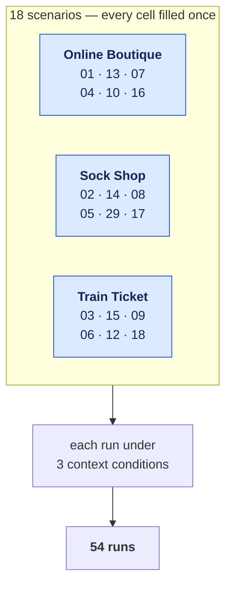

# Experiment 1 — RCAEval evaluation

Eighteen RCAEval RE2 scenarios × three context conditions = **54 runs, 1,950
claims, zero fallbacks**. Run against a local OrbStack Kubernetes deployment.

A complete **3 × 6 factorial**: three systems × six fault families, one scenario
per cell, every cell filled. Each fault family appears three times and each
system six times, so neither is confounded with the other.

> **One sample per cell, and run-to-run variance is large.** Three runs of
> `rcaeval-03`/`hybrid` on an identical configuration produced verifier
> concordance of **68.6%, 42.9% and 68.4%** — a **25.7-point spread** with no
> code, model or data change between them. Claim counts were 35, 28 and 38.
>
> Treat any single scenario-condition cell as **uninformative on its own**. Only
> pooled figures across all 54 runs are quoted here, and even those carry this
> variance. **No inferential statistics are computed** and none should be quoted
> from here. See the limitations in
> [`results/EXPERIMENT_FINAL_RESULTS.md`](results/EXPERIMENT_FINAL_RESULTS.md).
>
> **No infrastructure data is involved.** Every scenario's telemetry is seeded
> from the RCAEval RE2 file and torn down after the run; retrieval is scoped by
> `scenario_id` on both Neo4j and Qdrant, and each log prints the store census
> before and after seeding. **No host-cluster data reaches any prompt.**
>
> **No manual labelling.** Correctness verdicts come from the deterministic
> Python labeller run during each scenario, and `claims.csv` is rebuilt from the
> logs by a committed script. No step is hand-scored.

## Scenarios



Reading order in each cell: cpu · mem · disk · delay · loss · socket.

| Scenario | System | Target | Injected fault |
|---|---|---|---|
| `rcaeval-03` | Train Ticket | `ts-order-service` | `cpu_exhaustion` |
| `rcaeval-14` | Sock Shop | `carts` | `memory_exhaustion` |
| `rcaeval-07` | Online Boutique | `checkoutservice` | `disk_saturation` ⚠ |
| `rcaeval-04` | Online Boutique | `checkoutservice` | `network_delay` |
| `rcaeval-29` | Sock Shop | `catalogue` | `packet_loss` |
| `rcaeval-18` | Train Ticket | `ts-auth-service` | `socket_exhaustion` |
| `rcaeval-01` | Online Boutique | `checkoutservice` | `cpu_exhaustion` |
| `rcaeval-13` | Online Boutique | `checkoutservice` | `memory_exhaustion` |
| `rcaeval-10` | Online Boutique | `checkoutservice` | `packet_loss` |
| `rcaeval-16` | Online Boutique | `checkoutservice` | `socket_exhaustion` |
| `rcaeval-02` | Sock Shop | `carts` | `cpu_exhaustion` |
| `rcaeval-08` | Sock Shop | `carts` | `disk_saturation` |
| `rcaeval-05` | Sock Shop | `carts` | `network_delay` |
| `rcaeval-17` | Sock Shop | `carts` | `socket_exhaustion` |
| `rcaeval-15` | Train Ticket | `ts-auth-service` | `memory_exhaustion` |
| `rcaeval-09` | Train Ticket | `ts-auth-service` | `disk_saturation` |
| `rcaeval-06` | Train Ticket | `ts-auth-service` | `network_delay` |
| `rcaeval-12` | Train Ticket | `ts-auth-service` | `packet_loss` |

⚠ **`rcaeval-07` cannot be solved by any arm.** Its fault metric
(`checkoutservice_diskio`) has no readings before the injection, so
`build_rcaeval_dataset.py` drops it on a NaN baseline and the ground truth never
reaches the model. It is retained because the failure is itself a finding about
benchmark construction, not because it measures pipeline quality.

## Archived dataset

The full contents of this directory — 54 run logs, `results/`, `traces/`, the 18
scenario definitions and the analysis scripts — are archived on Zenodo at
[10.5281/zenodo.22142635](https://doi.org/10.5281/zenodo.22142635).
The archived `claims.csv` is byte-identical to the one here.

## Layout

```text
logs/       54 gzipped run logs — the raw evidence. Every number in
            results/ and traces/ is derived from these.
traces/      9 narrative walkthroughs: three scenarios × three conditions.
            Derived, illustrative. Traces exist for rcaeval-03, -07 and -14
            only; the other scenarios were run but not narrated.
results/    claims.csv (the analysis substrate) plus the two analysis
            documents and the manifest.
```

### What is raw and what is derived

| Path | Kind | Regenerable by a script in this repo? |
|---|---|---|
| `logs/*.log.gz` | **raw evidence** | **No.** Re-running produces different samples at T=0.8 |
| `results/claims.csv` | derived from logs | **Yes** — `services/api/scripts/build_claims_csv.py` |
| `results/*.md` | derived analysis | **No script ships.** Written against `claims.csv` |
| `traces/*.md` | derived narrative | **No script ships.** Written against the logs |

**The logs are produced by a committed tool** (`scripts/trace_scenario.py`), and
**`claims.csv` is now regenerated from them by another** — so the analysis
substrate is reproducible by command, not by hand:

```bash
cd services/api
.venv/bin/python scripts/build_claims_csv.py \
    ../../experiment-1-benchmark/logs \
    app/demo/rcaeval_dataset_generated.json \
    ../../experiment-1-benchmark/results/claims.csv
```

**No step is manual.** The parser does no labelling of its own. The correctness
verdicts it reads were decided during each run by the deterministic labeller in
`label_claim_correctness.py`. Running the parser twice on the same logs gives
the same CSV, every time.

Treat the logs as the authority. Where a figure in `results/` or `traces/`
disagrees with them, the logs win — and a reader checking a number should grep
the log rather than trusting the derived file.

### `results/claims.csv` — column dictionary

1,950 rows, one per extracted claim. 16 columns.

| Column | Type | Values |
|---|---|---|
| `scenario_id` | text | 18 ids, `rcaeval-01` … `rcaeval-29` |
| `system` | text | Train Ticket · Sock Shop · Online Boutique |
| `target_entity` | text | the faulted service (given to the system) |
| `injected_fault` | text | held-out fault type |
| `context_condition` | text | `none` · `raw` · `hybrid` |
| `claim_id` | text | `claim-N`, unique **within** a run only |
| `claim_text` | text | **truncated to 52 characters** — full text is in `logs/` |
| `gpcs_trust_score` | float | 0.000–0.720; only **8 distinct values** occur: 0.000, 0.700, 0.703, 0.705, 0.708, 0.710, 0.713, 0.720 |
| `gpcs_unsupported` | **bool** | `TRUE` / `FALSE` — GPCS flagged it (trust < 0.50) |
| `sc_recurrence_rate` | float | 0.0 · 0.5 · 1.0 — only three values are reachable from 3 samples |
| `sc_unsupported` | **bool** | `TRUE` / `FALSE` — self-consistency flagged it (recurrence < 0.5) |
| `verifiers_agree` | **bool** | `TRUE` / `FALSE` — both verifiers reached the same verdict |
| `joint_verdict` | text | `both_supported` · `gpcs_only_flagged` · `sc_only_flagged` · `both_unsupported` |
| `correctness_label` | text | `consistent` · `contradicted` · `unverifiable` |
| `label_reason` | text | why the labeller decided that |
| `evaluable` | **bool** | `TRUE` / `FALSE` — `correctness_label != unverifiable`. **93 TRUE** |

The four boolean columns use `TRUE`/`FALSE` rather than `1`/`0`, so the file
reads correctly in Excel, R (`read.csv` → logical) and pandas
(`read_csv` → `bool`) without a converter.

**`correctness_label` and the `*_unsupported` columns are different axes.**
The label comes from held-out ground truth; `unsupported` is what a verifier
*said*. The experiment asks whether the second predicts the first — so never
read `gpcs_unsupported = TRUE` as "the claim is wrong".

## Reproducing

The logs cannot be reproduced byte-for-byte: generation runs at temperature 0.8,
and identical configurations were measured to vary by up to **25.7 pp** on
verifier rates (see the note at the top). What *is* reproducible is the
analysis.

```bash
gunzip -k logs/*.gz                       # restore the raw logs
```

To re-run a scenario end to end (requires the cluster and port-forwards):

```bash
cd services/api
AUTH=$(kubectl get secret cloudgraph-neo4j-auth -n cloudgraph-system \
        -o jsonpath='{.data.NEO4J_AUTH}' | base64 -d)
NEO4J_URI=bolt://127.0.0.1:7687 NEO4J_AUTH="$AUTH" \
QDRANT_HOST=127.0.0.1 QDRANT_PORT=6333 \
AGENT_ORCHESTRATOR_URL=http://localhost:8082 \
.venv/bin/python ../../scripts/trace_scenario.py rcaeval-03 hybrid out.log
```

**Scenarios must run sequentially.** `teardown_benchmark_data()` deletes every
`is_benchmark` node without scenario scoping, and `assert_semantic_store_isolated()`
fails if the vector store holds any foreign scenario. Parallel runs break both.

## Pipeline properties

Two properties of the pipeline that produced these logs, both of which affect how
the results should be read:

- **GPCS's semantic term is a constant.** Evidence reaches GPCS through graph
  traversal, which assigns a fixed score (`0.75` within two hops, `0.6` beyond)
  rather than a measured similarity. Trust is therefore determined by graph
  reachability, and takes eight distinct values across the 1,950 claims, 79.3% of
  them exactly `0.000`.
- **Retrieval isolation is enforced at query time.** A `scenario_id` filter on
  both the Neo4j query and the Qdrant search restricts each run to its own
  seeded scenario. Every log prints the store census before and after seeding so
  this is checkable.

`claim_text` in `results/claims.csv` is truncated to 52 characters; full text is
in the logs and traces.

Labelling follows the pre-registered policy in
[`research/LABELLING_POLICY.md`](../research/LABELLING_POLICY.md), including its
recorded deviations.

## Headline results

| | `NONE` | `RAW` | `HYBRID` |
|---|---:|---:|---:|
| Claims | 628 | 703 | 619 |
| GPCS unsupported | 78.3% | 80.1% | 79.3% |
| Self-consistency unsupported | 57.0% | 49.2% | 53.3% |
| Accepted by both | 16.4% | 16.1% | 14.9% |
| Evaluable coverage | 4.8% | 3.6% | **6.1%** |
| Consistent : contradicted | 14 : 16 | 10 : 15 | 12 : 26 |
| Mean request payload | 1,651 ch | 27,406 ch | **13,196 ch** |

**No condition wins outright.** `HYBRID` cuts the request payload **51.9%**
versus `RAW` and yields the best evaluable coverage, but has the **worst**
correctness ratio (12 : 26). `NONE` is not beaten on correctness.

**The binding constraint is coverage — 93 of 1,950 claims (4.8%) are
adjudicable.** 76.2% of claims are excluded as "not a causal claim" and 19.0%
as "no mechanism or service identifiable". Both are labeller decisions, not
gaps in the data.

**Neither verifier tracks correctness.** On those 93 claims GPCS's flag-rate
gap is **+5.1 pp** at precision 0.627 and self-consistency's is **−0.7 pp** at
0.610, against a base rate of 0.613 — the score for flagging everything. GPCS
is *stricter*, not *sharper*.
