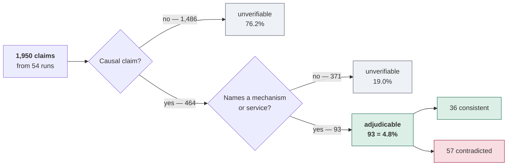
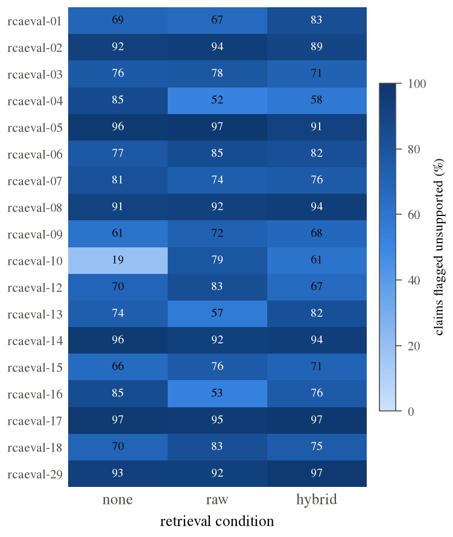
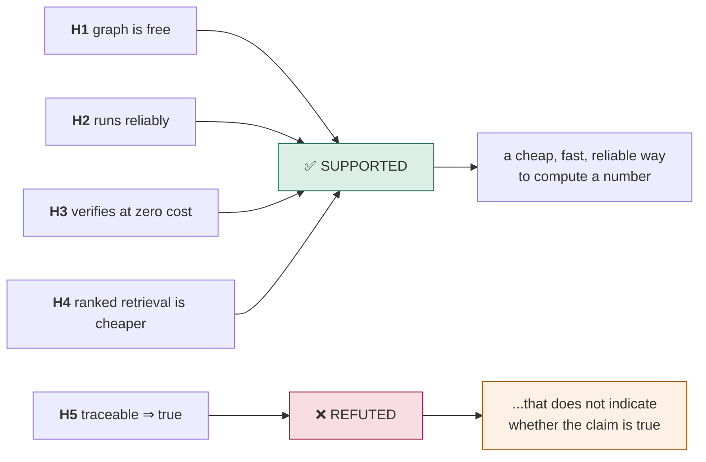

# Experiment 1 — RCAEval Evaluation

Eighteen RCAEval RE2 scenarios × three context conditions = **54 runs, 1,950
claims, zero fallbacks**. A complete 3×6 factorial: three systems × six fault
families, one scenario per cell, every cell filled.

> **One sample per cell.** **No inferential statistics are computed** and none
> should be quoted from here. Running the same scenario twice with nothing
> changed moves verifier concordance by up to **25.7 points**, so a single
> scenario-condition cell is uninformative on its own. Only pooled figures are
> reported.
>
> **No infrastructure data is involved.** Every scenario's telemetry is seeded
> from the RCAEval RE2 file and torn down after the run. Retrieval is scoped by
> `scenario_id` on both stores, and each log prints the store census before and
> after seeding. No host-cluster data reaches any prompt.
>
> **No manual labelling.** Correctness verdicts come from the deterministic
> Python labeller run during each scenario, and `claims.csv` is rebuilt from the
> logs by `services/api/scripts/build_claims_csv.py`. Nothing is hand-scored.

## Scope

| | |
|---|---|
| Scenarios | 18 (3 systems × 6 fault families, one per cell) |
| Conditions | `none` · `raw` · `hybrid` |
| Runs | 54 |
| Claims scored | 1,950 |
| LLM calls | 1,057 |
| Wall clock | 18,734 s (5.20 h) |
| Fallbacks / timeouts | 0 |

## Where the claims go

Most generated claims cannot be judged. This is the central result, so it is
worth seeing as a shape rather than a percentage:

**95.2% of what the model writes cannot be checked** against the benchmark. Every
correctness number in this document rests on the 93 that can.

## Per-run data

*Flag rates run from 19% to 97%, and no retrieval condition is systematically
darker than another — most variation is between scenarios, not between
conditions. Individual cells should not be read on their own: see the variance
note below.*

| Scenario | System | Fault | Cond | Claims | GPCS unsup | SC unsup | Agree | Eval |
|---|---|---|---|---:|---:|---:|---:|---:|
| `rcaeval-03` | Train Ticket | cpu | NONE | 38 | 29 (76.3%) | 27 (71.1%) | 30 (78.9%) | 2 |
| `rcaeval-03` | Train Ticket | cpu | RAW | 41 | 32 (78.0%) | 24 (58.5%) | 29 (70.7%) | 3 |
| `rcaeval-03` | Train Ticket | cpu | HYBRID | 35 | 25 (71.4%) | 20 (57.1%) | 24 (68.6%) | 2 |
| `rcaeval-14` | Sock Shop | memory | NONE | 27 | 26 (96.3%) | 12 (44.4%) | 13 (48.1%) | 3 |
| `rcaeval-14` | Sock Shop | memory | RAW | 52 | 48 (92.3%) | 30 (57.7%) | 34 (65.4%) | 0 |
| `rcaeval-14` | Sock Shop | memory | HYBRID | 36 | 34 (94.4%) | 23 (63.9%) | 23 (63.9%) | 3 |
| `rcaeval-07` | Online Boutique | disk | NONE | 48 | 39 (81.2%) | 32 (66.7%) | 31 (64.6%) | 1 |
| `rcaeval-07` | Online Boutique | disk | RAW | 42 | 31 (73.8%) | 22 (52.4%) | 27 (64.3%) | 0 |
| `rcaeval-07` | Online Boutique | disk | HYBRID | 33 | 25 (75.8%) | 14 (42.4%) | 18 (54.5%) | 2 |
| `rcaeval-04` | Online Boutique | network | NONE | 34 | 29 (85.3%) | 12 (35.3%) | 17 (50.0%) | 1 |
| `rcaeval-04` | Online Boutique | network | RAW | 31 | 16 (51.6%) | 10 (32.3%) | 17 (54.8%) | 0 |
| `rcaeval-04` | Online Boutique | network | HYBRID | 33 | 19 (57.6%) | 14 (42.4%) | 22 (66.7%) | 1 |
| `rcaeval-29` | Sock Shop | packet | NONE | 41 | 38 (92.7%) | 30 (73.2%) | 29 (70.7%) | 0 |
| `rcaeval-29` | Sock Shop | packet | RAW | 40 | 37 (92.5%) | 14 (35.0%) | 17 (42.5%) | 0 |
| `rcaeval-29` | Sock Shop | packet | HYBRID | 33 | 32 (97.0%) | 17 (51.5%) | 18 (54.5%) | 0 |
| `rcaeval-18` | Train Ticket | socket | NONE | 30 | 21 (70.0%) | 17 (56.7%) | 22 (73.3%) | 0 |
| `rcaeval-18` | Train Ticket | socket | RAW | 35 | 29 (82.9%) | 14 (40.0%) | 20 (57.1%) | 1 |
| `rcaeval-18` | Train Ticket | socket | HYBRID | 32 | 24 (75.0%) | 14 (43.8%) | 18 (56.2%) | 3 |
| `rcaeval-01` | Online Boutique | cpu | NONE | 32 | 22 (68.8%) | 21 (65.6%) | 25 (78.1%) | 2 |
| `rcaeval-01` | Online Boutique | cpu | RAW | 42 | 28 (66.7%) | 23 (54.8%) | 29 (69.0%) | 1 |
| `rcaeval-01` | Online Boutique | cpu | HYBRID | 36 | 30 (83.3%) | 19 (52.8%) | 21 (58.3%) | 4 |
| `rcaeval-13` | Online Boutique | memory | NONE | 34 | 25 (73.5%) | 18 (52.9%) | 23 (67.6%) | 0 |
| `rcaeval-13` | Online Boutique | memory | RAW | 30 | 17 (56.7%) | 12 (40.0%) | 21 (70.0%) | 2 |
| `rcaeval-13` | Online Boutique | memory | HYBRID | 39 | 32 (82.1%) | 24 (61.5%) | 29 (74.4%) | 3 |
| `rcaeval-10` | Online Boutique | packet | NONE | 27 | 5 (18.5%) | 8 (29.6%) | 18 (66.7%) | 0 |
| `rcaeval-10` | Online Boutique | packet | RAW | 42 | 33 (78.6%) | 20 (47.6%) | 21 (50.0%) | 0 |
| `rcaeval-10` | Online Boutique | packet | HYBRID | 36 | 22 (61.1%) | 17 (47.2%) | 19 (52.8%) | 0 |
| `rcaeval-16` | Online Boutique | socket | NONE | 46 | 39 (84.8%) | 25 (54.3%) | 30 (65.2%) | 0 |
| `rcaeval-16` | Online Boutique | socket | RAW | 32 | 17 (53.1%) | 18 (56.2%) | 27 (84.4%) | 1 |
| `rcaeval-16` | Online Boutique | socket | HYBRID | 41 | 31 (75.6%) | 24 (58.5%) | 28 (68.3%) | 2 |
| `rcaeval-02` | Sock Shop | cpu | NONE | 37 | 34 (91.9%) | 20 (54.1%) | 23 (62.2%) | 5 |
| `rcaeval-02` | Sock Shop | cpu | RAW | 34 | 32 (94.1%) | 18 (52.9%) | 20 (58.8%) | 2 |
| `rcaeval-02` | Sock Shop | cpu | HYBRID | 9 | 8 (88.9%) | 7 (77.8%) | 8 (88.9%) | 1 |
| `rcaeval-08` | Sock Shop | disk | NONE | 33 | 30 (90.9%) | 22 (66.7%) | 23 (69.7%) | 5 |
| `rcaeval-08` | Sock Shop | disk | RAW | 38 | 35 (92.1%) | 21 (55.3%) | 24 (63.2%) | 2 |
| `rcaeval-08` | Sock Shop | disk | HYBRID | 35 | 33 (94.3%) | 16 (45.7%) | 16 (45.7%) | 0 |
| `rcaeval-05` | Sock Shop | network | NONE | 27 | 26 (96.3%) | 14 (51.9%) | 15 (55.6%) | 1 |
| `rcaeval-05` | Sock Shop | network | RAW | 38 | 37 (97.4%) | 17 (44.7%) | 18 (47.4%) | 0 |
| `rcaeval-05` | Sock Shop | network | HYBRID | 35 | 32 (91.4%) | 17 (48.6%) | 16 (45.7%) | 5 |
| `rcaeval-17` | Sock Shop | socket | NONE | 36 | 35 (97.2%) | 21 (58.3%) | 22 (61.1%) | 4 |
| `rcaeval-17` | Sock Shop | socket | RAW | 44 | 42 (95.5%) | 20 (45.5%) | 22 (50.0%) | 6 |
| `rcaeval-17` | Sock Shop | socket | HYBRID | 38 | 37 (97.4%) | 20 (52.6%) | 21 (55.3%) | 2 |
| `rcaeval-15` | Train Ticket | memory | NONE | 38 | 25 (65.8%) | 23 (60.5%) | 30 (78.9%) | 2 |
| `rcaeval-15` | Train Ticket | memory | RAW | 41 | 31 (75.6%) | 22 (53.7%) | 26 (63.4%) | 1 |
| `rcaeval-15` | Train Ticket | memory | HYBRID | 41 | 29 (70.7%) | 31 (75.6%) | 33 (80.5%) | 4 |
| `rcaeval-09` | Train Ticket | disk | NONE | 36 | 22 (61.1%) | 20 (55.6%) | 32 (88.9%) | 2 |
| `rcaeval-09` | Train Ticket | disk | RAW | 32 | 23 (71.9%) | 17 (53.1%) | 22 (68.8%) | 1 |
| `rcaeval-09` | Train Ticket | disk | HYBRID | 40 | 27 (67.5%) | 15 (37.5%) | 26 (65.0%) | 2 |
| `rcaeval-06` | Train Ticket | network | NONE | 31 | 24 (77.4%) | 15 (48.4%) | 20 (64.5%) | 0 |
| `rcaeval-06` | Train Ticket | network | RAW | 53 | 45 (84.9%) | 29 (54.7%) | 37 (69.8%) | 0 |
| `rcaeval-06` | Train Ticket | network | HYBRID | 40 | 33 (82.5%) | 27 (67.5%) | 28 (70.0%) | 1 |
| `rcaeval-12` | Train Ticket | packet | NONE | 33 | 23 (69.7%) | 21 (63.6%) | 25 (75.8%) | 2 |
| `rcaeval-12` | Train Ticket | packet | RAW | 36 | 30 (83.3%) | 15 (41.7%) | 21 (58.3%) | 5 |
| `rcaeval-12` | Train Ticket | packet | HYBRID | 27 | 18 (66.7%) | 11 (40.7%) | 18 (66.7%) | 3 |

## NONE vs RAW vs HYBRID

| Measure | NONE | RAW | HYBRID | Best |
|---|---:|---:|---:|---|
| Claims extracted | 628 | 703 | **619** | HYBRID (fewest) |
| Mean request size | 1,651 ch | 27,406 ch | **13,196 ch** | HYBRID: **51.9% smaller than RAW** |
| GPCS unsupported | 78.3% | 80.1% | 79.3% | |
| Self-consistency unsupported | 57.0% | 49.2% | 53.3% | |
| Verifier concordance | 68.2% | 61.5% | 62.4% | |
| Evaluable coverage | 30 (4.8%) | 25 (3.6%) | **38 (6.1%)** | HYBRID |
| Consistent : contradicted | 14 : 16 | 10 : 15 | 12 : 26 | NONE |

**HYBRID buys context cost, not accuracy.** It more than halves the request
payload against RAW and yields the most adjudicable claims, but its
consistent-to-contradicted ratio (12:26) is the **worst** of the three. With 38
labelled claims in that cell it is a weak signal, but it points away from the
idea that ranked retrieval helps the model reason better.

## GPCS vs self-consistency

| | GPCS | Self-consistency |
|---|---|---|
| Unsupported, pooled | **1546/1950 = 79.3%** | 1034/1950 = 53.0% |
| Extra LLM calls | **0** | 2 generations per claim |
| Mechanism | graph + vector evidence | model repetition |
| Concordance (both) | — | 1246/1950 = 63.9% |

| Joint verdict | Claims |
|---|---:|
| `both_supported` | 308 |
| `gpcs_only_flagged` | 608 |
| `sc_only_flagged` | 96 |
| `both_unsupported` | 938 |

## Correctness result

The labeller marked **93 of 1950 claims (4.8%)** adjudicable:
**36 consistent, 57 contradicted** — a base rate of 61.3% incorrect.
The remaining 1857 were unverifiable, overwhelmingly because they were
descriptive rather than causal, or named no mechanism.

| Verifier | Flags incorrect | Flags correct | Gap | Precision |
|---|---|---|---|---|
| GPCS | 91.2% (52/57) | 86.1% (31/36) | **+5.1 pp** | 0.627 |
| Self-consistency | 63.2% (36/57) | 63.9% (23/36) | **-0.7 pp** | 0.610 |

A verifier flagging *everything* scores **0.613** precision on this set.
GPCS's 0.627 and self-consistency's 0.610 both sit at that floor.

**Neither verifier tracks correctness.** Self-consistency's gap is −0.7 pp —
it flags correct and incorrect claims at the same rate, so its verdict carries
no information about truth. GPCS leans the right way by 5.1 pp, but on 93
claims that is roughly three claims, and its precision is within noise of the
base rate. **GPCS is stricter, not sharper.**

*A verifier that worked would show a tall orange bar beside a short blue one.
Neither does. Counts appear beneath each percentage; the 93 adjudicable claims
split 36 correct / 57 incorrect.*

### Why the trust score cannot discriminate

Across 1,950 claims the GPCS trust score takes only **eight distinct values**,
and 79.3% of claims sit at exactly `0.000` — an early return taken when no
retrieved evidence clears the 0.30 relevance floor, before any term of the
formula is computed.

*Nothing at all falls between 0.000 and 0.700, and the 404 non-zero scores
occupy a band 0.020 wide. GPCS is a gate, not a graded confidence: a threshold
cannot be tuned on a distribution with this shape.*

## The five hypotheses

The project rests on five claims. **Four are supported by this evaluation; one
is refuted** — and the refuted one is the claim the design was built on.

| # | Hypothesis | Verdict | Evidence |
|---|---|---|---|
| **H1** | An operational system already carries a real dependency graph, obtainable as a by-product rather than at extra cost. | ✅ **Supported** | All 54 runs built a typed property graph from RCAEval telemetry with no annotation step. True by construction, and it held at scale. |
| **H2** | The pipeline runs reliably end to end at scale. | ✅ **Supported** | 54/54 runs completed. **Zero** fallbacks or timeouts across 1,057 LLM calls and 5.20 h of wall clock, producing paired verdicts for all 1,950 claims. |
| **H3** | A graph can verify generated claims at no additional model cost. | ✅ **Supported** | GPCS scores every claim by Neo4j and Qdrant query in milliseconds, at **0 extra LLM calls**, against self-consistency's 2 extra generations per claim. It also behaves distinctly: 79.3% unsupported vs 53.0%. |
| **H4** | Ranked graph retrieval reduces context cost against dumping all evidence. | ✅ **Supported** | HYBRID cuts the mean request payload **51.9%** against RAW (13,196 vs 27,406 chars), produces the fewest claims (619 vs 703), and yields the highest evaluable coverage (6.1% vs 3.6%). |
| **H5** | A claim traceable to nearby graph evidence is more likely to be **true**. | ❌ **Refuted** | On the 93 adjudicable claims, GPCS's flag-rate gap is **+5.1 pp** at precision **0.627**, against a **0.613** base rate — the score for flagging everything. Self-consistency is **−0.7 pp**. Provenance predicts reachability, not truth. |

**H5 is the load-bearing one.** H1–H4 establish that the graph is free, the
system is reliable, verification is cheap, and ranked retrieval is cheaper. None
of that is worth much if traceable evidence does not indicate a true claim — and
it does not. That is the finding, and it is negative.

## Research questions

Verdicts against the project's single register, RQ1–RQ7, defined in
`docs/PROJECT_EXPLAINED.md`. All figures are descriptive.

| RQ | Question | Verdict | Evidence |
|---|---|---|---|
| **RQ1** | Does GPCS behave differently from self-consistency, and does either flag track correctness? | **Partly against** | Distinct: 79.3% vs 53.0% unsupported. But on 93 adjudicable claims neither tracks correctness (GPCS +5.1 pp at 0.627 precision, SC −0.7 pp at 0.610, base rate 0.613). |
| **RQ2** | Is the measured result real end-to-end? | **Yes** | 54/54 runs, 0 fallbacks, deterministic labeller, `claims.csv` regenerable by committed script. |
| **RQ3** | Does graph retrieval beat dumping all evidence into context? | **Cost win only** | 51.9% smaller payloads and the best evaluable coverage; but the worst consistent:contradicted ratio (12:26). No accuracy advantage. |
| **RQ4** | Is any retrieval benefit symbolic or neural? | **Not measured** | No retrieval ablation was run. |
| **RQ5** | Does the five-agent ensemble beat one model at matched compute? | Deferred |  |
| **RQ6** | Are the confidence scores calibrated? | Deferred |  |
| **RQ7** | Which claim types are each verifier's blind spot? | Deferred | 4.8% coverage is still too thin to stratify. |

## Operational results

Engineering findings, stated separately because they are not research claims:

- **Zero-cost verification gate.** GPCS adds no LLM calls; self-consistency costs 2 extra generations per claim.
- **Reliability.** 54 runs, 1,057 LLM calls, 5.20 h, 0 fallbacks or timeouts.
- **Regenerable analysis.** `build_claims_csv.py` rebuilds `claims.csv` from the logs deterministically. The same logs always produce the same file.

## Interpretation

1. **The binding constraint is adjudicability, not verifier choice.** 95.2% of
   generated claims cannot be judged against RCAEval metadata at all. Until that
   changes, no claim-level verifier evaluated this way can be shown to separate
   true claims from false ones. This is the result most worth reporting.
2. **HYBRID is the cost winner and only that.** Recommend it on payload size;
   do not claim it is more accurate.
3. **Read pooled figures only.** Running the same scenario twice with nothing
   changed moves verifier concordance by up to 25.7 points, so a single
   scenario-condition cell carries no weight.
4. **GPCS and self-consistency are complementary in mechanism, not proven
   complementary in effect.** Requiring both is sharply selective, but this run
   cannot show the survivors are more often correct.

*Source: 54 run logs under `../logs/`, parsed by
`services/api/scripts/build_claims_csv.py` into `claims.csv`. Correctness labels
were produced by the deterministic labeller during each run. No step is manual.*
