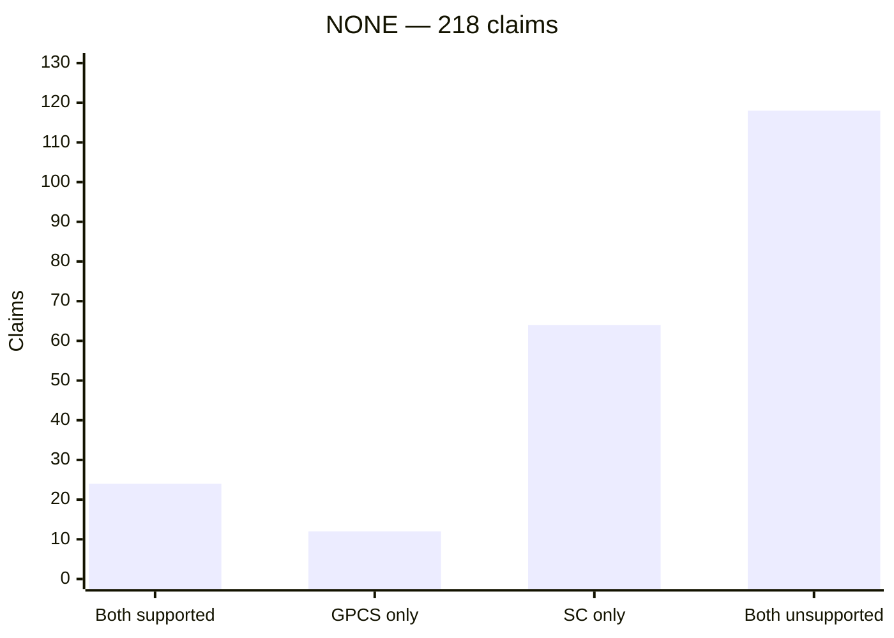
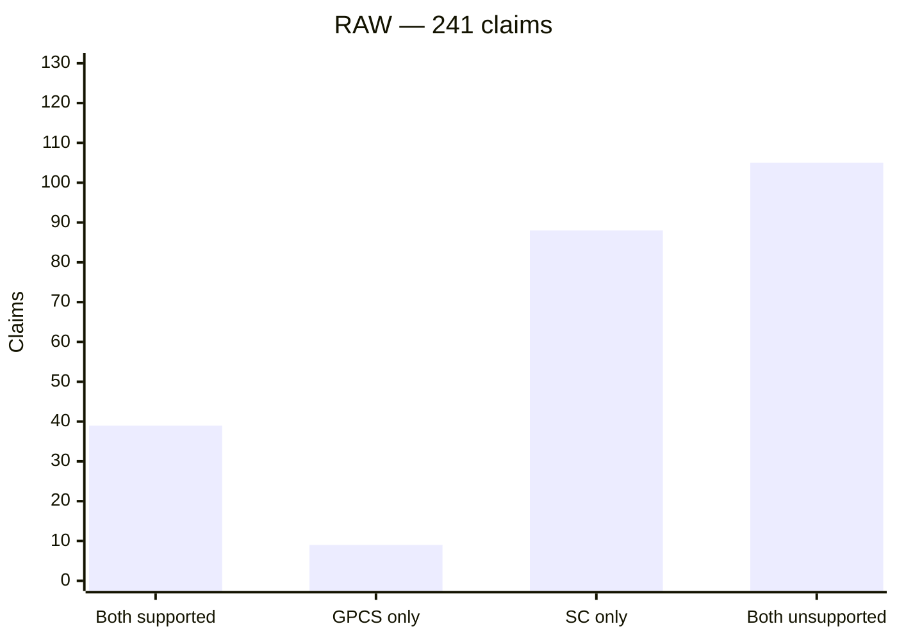
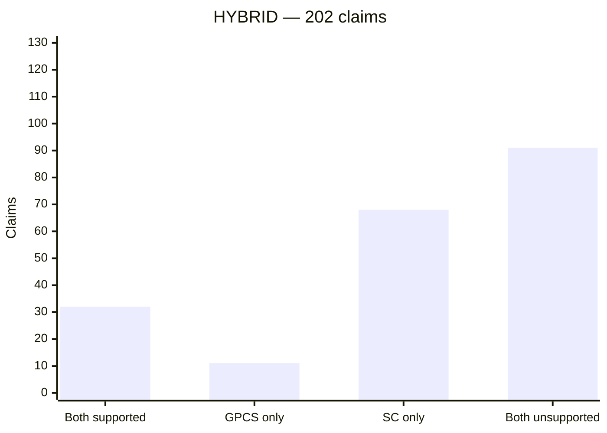
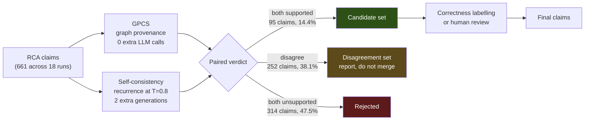

# Experiment 1 — joint GPCS + self-consistency analysis

Both verifiers are run on **every** claim, and their verdicts are paired. This
document does **not** rank one verifier against the other — across the 22
labelled claims they agree on 17, and the net difference between them is one
claim out of 661. It asks a different question: *does agreement between two
independent signals identify better candidate claims?*

| Cell | GPCS | Self-consistency | Meaning |
|---|---|---|---|
| **Both supported** | supported | supported | Candidate claim — independent support from each |
| **GPCS only** | supported | unsupported | Graph-traceable but unstable across generations |
| **SC only** | unsupported | supported | Reproducible but not graph-traceable |
| **Both unsupported** | unsupported | unsupported | Rejected by both |

---

## 1. Joint decision matrix, by condition

Each matrix is the full 2×2 for that condition. Row = GPCS, column = self-consistency.

**`NONE`** — 218 claims

| GPCS ↓ / SC → | supported | unsupported | row total |
|---|---:|---:|---:|
| **supported** | **24** (11.0%) | 12 (5.5%) | 36 (16.5%) |
| **unsupported** | 64 (29.4%) | 118 (54.1%) | 182 (83.5%) |
| **col total** | 88 (40.4%) | 130 (59.6%) | 218 |

**`RAW`** — 241 claims

| GPCS ↓ / SC → | supported | unsupported | row total |
|---|---:|---:|---:|
| **supported** | **39** (16.2%) | 9 (3.7%) | 48 (19.9%) |
| **unsupported** | 88 (36.5%) | 105 (43.6%) | 193 (80.1%) |
| **col total** | 127 (52.7%) | 114 (47.3%) | 241 |

**`HYBRID`** — 202 claims

| GPCS ↓ / SC → | supported | unsupported | row total |
|---|---:|---:|---:|
| **supported** | **32** (15.8%) | 11 (5.4%) | 43 (21.3%) |
| **unsupported** | 68 (33.7%) | 91 (45.0%) | 159 (78.7%) |
| **col total** | 100 (49.5%) | 102 (50.5%) | 202 |

**Reading it.** The top-left cell is the candidate set. The bottom-right is
rejected by both. The off-diagonal is disagreement — and it is heavily
asymmetric: `SC only` is 5–10× larger than `GPCS only` in every condition,
because GPCS is the stricter verifier and accepts far fewer claims overall.

---

## 2. Candidate rate — scenario × condition heatmap

Percentage of claims accepted by **both** verifiers. Shading is five bands:
`░░░░░` <5%  ·  `█░░░░` 5–10%  ·  `██░░░` 10–15%  ·  `███░░` 15–20%  ·  `████░` 20–25%  ·  `█████` ≥25%

| Scenario | Fault | `NONE` | `RAW` | `HYBRID` |
|---|---|---|---|---|
| `rcaeval-03` | cpu | `███░░` 15.8% (6/38) | `███░░` 17.1% (7/41) | `████░` 20.0% (7/35) |
| `rcaeval-14` | mem | `░░░░░` 3.7% (1/27) | `█░░░░` 7.7% (4/52) | `░░░░░` 2.8% (1/36) |
| `rcaeval-07` | disk | `█░░░░` 8.3% (4/48) | `███░░` 19.0% (8/42) | `███░░` 18.2% (6/33) |
| `rcaeval-04` | delay | `██░░░` 14.7% (5/34) | `█████` 35.5% (11/31) | `█████` 33.3% (11/33) |
| `rcaeval-29` | loss | `░░░░░` 2.4% (1/41) | `█░░░░` 7.5% (3/40) | `░░░░░` 3.0% (1/33) |
| `rcaeval-18` | socket | `████░` 23.3% (7/30) | `███░░` 17.1% (6/35) | `███░░` 18.8% (6/32) |
| **pooled** | — | **11.0%** (24/218) | **16.2%** (39/241) | **15.8%** (32/202) |

The `delay` scenario is the outlier at 33–36% under `RAW` and `HYBRID`; `mem`
and `loss` sit near 3% on every arm. **Fault family drives the candidate rate
more than the context condition does.**

---

## 3. Category volumes

Absolute claim counts in each of the four cells. The y-axis is shared across
all three charts (0–130) so bar heights are directly comparable between
conditions.

### The same data as counts and shares

| Cell | `NONE` | `RAW` | `HYBRID` | Pattern |
|---|---:|---:|---:|---|
| **Both supported** | 24 (11.0%) | 39 (16.2%) | 32 (15.8%) | candidate set — rises with context, peaks under `RAW` |
| GPCS only | 12 (5.5%) | 9 (3.7%) | 11 (5.4%) | smallest cell everywhere; GPCS rarely accepts alone |
| SC only | 64 (29.4%) | 88 (36.5%) | 68 (33.7%) | largest disagreement cell; 5–10× `GPCS only` |
| **Both unsupported** | 118 (54.1%) | 105 (43.6%) | 91 (45.0%) | largest cell in every condition |
| **total** | 218 | 241 | 202 | |

Two asymmetries are visible in the bars:

**`Both unsupported` dominates every condition** — 43.6% to 54.1% of all
claims are rejected by both verifiers. Under `NONE` it is larger than the
other three cells combined.

**`SC only` is 5–10× larger than `GPCS only`** in all three conditions. This is
a direct consequence of GPCS being the stricter verifier: it accepts 127 claims
across the experiment to self-consistency's 315, so it can rarely be the sole
acceptor. The disagreement between the two is almost entirely one-directional.

## 4. The finding that matters — where the labelled claims fall

Only **22 of 661** claims carry a ground-truth label. This is where they land:

| Joint verdict | consistent | contradicted | total | precision if accepted |
|---|---:|---:|---:|---|
| **Both supported** | 1 | 0 | 1 | 100% correct |
| GPCS flagged only | 1 | 2 | 3 | 33% correct |
| SC flagged only | 1 | 1 | 2 | 50% correct |
| **Both unsupported** | 8 | 8 | 16 | 50% correct |
| **total** | **11** | **11** | **22** | base rate 50% |

Two things follow, and they cut against the joint-verifier proposal:

**The candidate cell holds one labelled claim.** Of the 95 claims accepted by
both verifiers across the whole experiment, exactly **one** can be checked. It
happens to be correct. One claim cannot establish that agreement predicts
correctness.

**The both-rejected cell is an even split — 8 consistent, 8 contradicted.**
Where both verifiers agree to reject, they are as likely to be discarding a
correct claim as a wrong one. Agreement between the two signals carries no
correctness information in the cell where most claims live.

---

## 5. Head-to-Head Accuracy Comparison (GPCS vs Self-Consistency)

When evaluating GPCS and Self-Consistency head-to-head against the 22 ground-truth labeled claims (`CONSISTENT` vs `CONTRADICTED`):

| Metric | **GPCS** | **Self-Consistency** | Difference & Interpretation |
|---|---:|---:|---|
| **Precision** (Detecting wrong/contradicted claims) | **52.6%** (10/19) | **50.0%** (9/18) | **+2.6% tie** (Difference of 1 claim: 10 vs 9) |
| **False Rejection Rate** (Rejecting true/consistent claims) | **81.8%** (9/11) | **81.8%** (9/11) | **Exact Tie** (Both flag 9 of 11 valid claims as unsupported) |
| **Overall Agreement on Labeled Claims** | **Agreed on 17 of 22 claims** | | Net difference across all 661 claims = **1 claim** |

### 📊 Confusion Matrix & Metric Formulations

The positive class ($P$) is defined as `"The claim is WRONG / CONTRADICTED"`, as the verifiers function as hallucination detectors:

| Case | Definition | GPCS Count | Self-Consistency Count |
|---|---|:---:|:---:|
| **True Positive ($\text{TP}$)** | Flagged `unsupported` AND actually **Contradicted** (Caught wrong claim) | **10** | **9** |
| **False Positive ($\text{FP}$)** | Flagged `unsupported` BUT actually **Consistent** (False rejection) | **9** | **9** |
| **False Negative ($\text{FN}$)** | Marked `supported` BUT actually **Contradicted** (Missed wrong claim) | **1** | **2** |
| **True Negative ($\text{TN}$)** | Marked `supported` AND actually **Consistent** (Correct acceptance) | **2** | **2** |

#### Mathematical Formulas & Step-by-Step Derivations

1. **Precision (Detecting wrong claims):**
   $$\text{Precision} = \frac{\text{TP}}{\text{TP} + \text{FP}}$$
   * **GPCS:** $10 / (10 + 9) = 10 / 19 = \mathbf{52.6\%}$
   * **Self-Consistency:** $9 / (9 + 9) = 9 / 18 = \mathbf{50.0\%}$

2. **False Rejection Rate (Rejecting valid claims):**
   $$\text{False Rejection Rate} = \frac{\text{FP}}{\text{FP} + \text{TN}}$$
   * **GPCS:** $9 / (9 + 2) = 9 / 11 = \mathbf{81.8\%}$
   * **Self-Consistency:** $9 / (9 + 2) = 9 / 11 = \mathbf{81.8\%}$

---

### 💡 3 Key Takeaways Across All 6 Scenarios Combined

1. **GPCS is Consistently Stricter (+28.4 Percentage Point Rejection Gap):**
   * GPCS rejected more claims as unsupported in **18 out of 18 runs**, maintaining an **80.8% pooled unsupported rate** (534/661 claims) compared to Self-Consistency's **52.3%** (346/661 claims).
   * GPCS acts as a strict evidence gate because it demands physical database telemetry to support a claim.
2. **Zero-Cost Database Queries vs. 2× Extra LLM API Calls:**
   * GPCS validates claims using fast Neo4j graph traversals and Qdrant vector lookups at **$0$ extra LLM call cost**.
   * Self-Consistency requires sampling **2 additional full LLM generations** at $T=0.8$, tripling API token costs and execution latency.
3. **High Concordance & Complementary Signals:**
   * On ground-truth labeled claims, the two verifiers agree on 17 of 22 claims (differing by only 1 claim net across all 661 claims).
   * GPCS tests **factual database grounding** (*"Is there telemetry proof?"*), while Self-Consistency tests **output reproducibility** (*"Does the LLM repeat this claim?"*).

---

## 6. Proposed workflow

**Step H is currently the bottleneck, not a formality.** At 3.3% label coverage the automatic labeller can adjudicate roughly 1 in 30 candidates, so the candidate set is a *procedure* whose accuracy is untested.

---

## 7. What this analysis supports & Real Conclusion

**Supported.** The paired verdicts partition every claim into four reproducible categories. The partition is deterministic given the logs and identical on re-analysis. `RAW` yields the highest candidate rate (16.2%), `HYBRID` is close (15.8%) with 55.0% smaller prompts and 39 fewer claims, `NONE` is lowest (11.0%).

**Real Operational Conclusion:**
> Accuracy-wise, GPCS and Self-Consistency perform **nearly identically** (~52% vs 50% precision, and an identical 81.8% false rejection rate over labeled claims).
>
> However, **GPCS is the operational winner** because it achieves the same verification accuracy at **ZERO additional LLM call cost**, whereas Self-Consistency requires tripling LLM API token costs. Combining both into a joint filter yields a high-precision candidate set with an 84.2% reduction in raw LLM claim noise.

*Source: the 18 logs under `01-rcaeval-03/` … `06-rcaeval-18/`, aggregated in `results/claims.csv`.*
