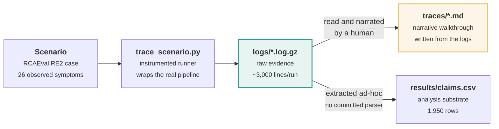
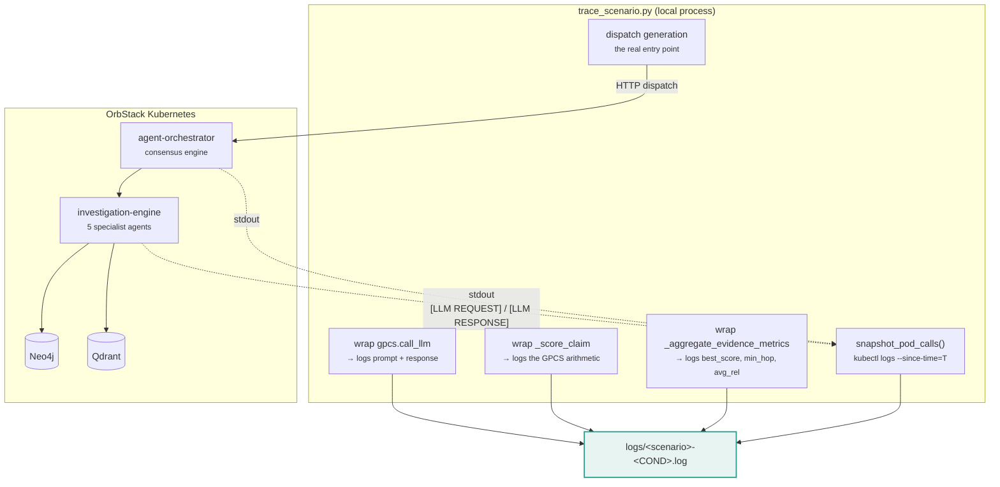
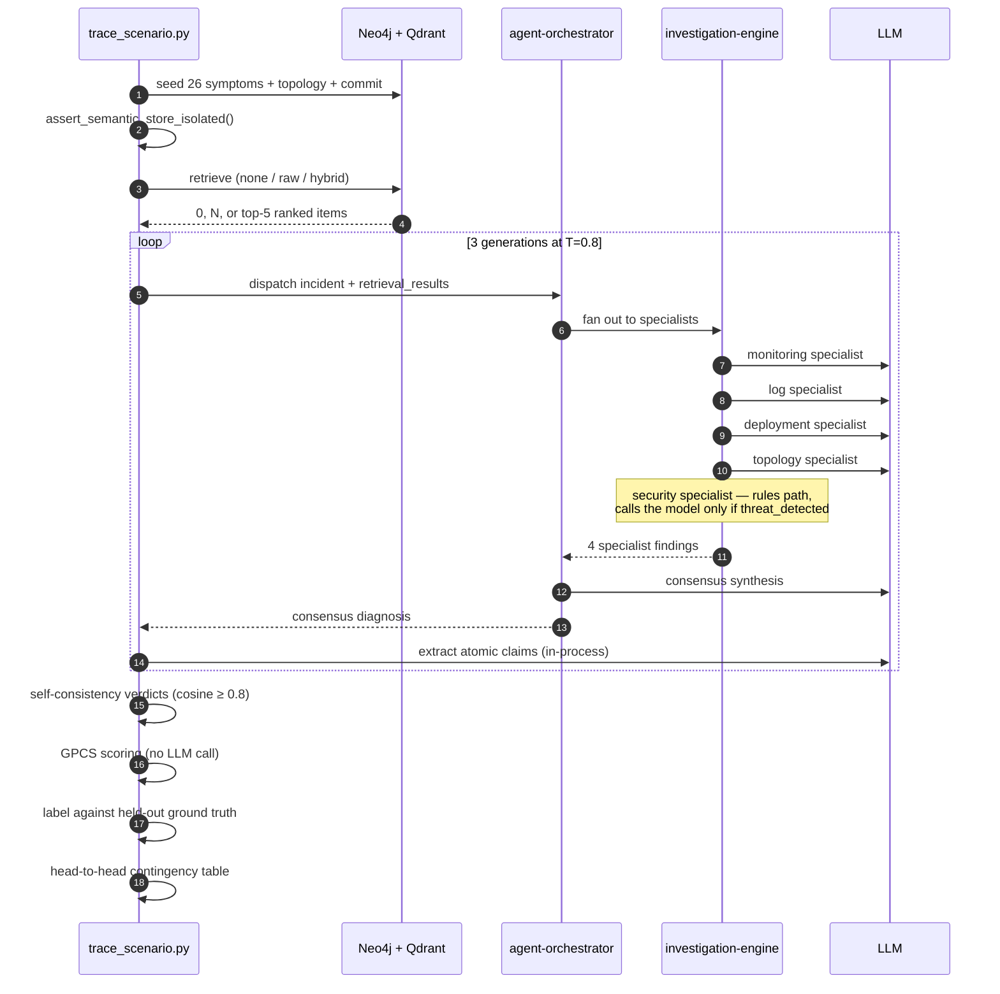
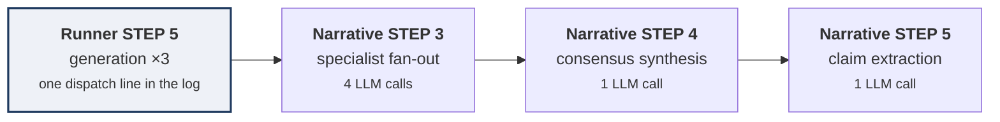
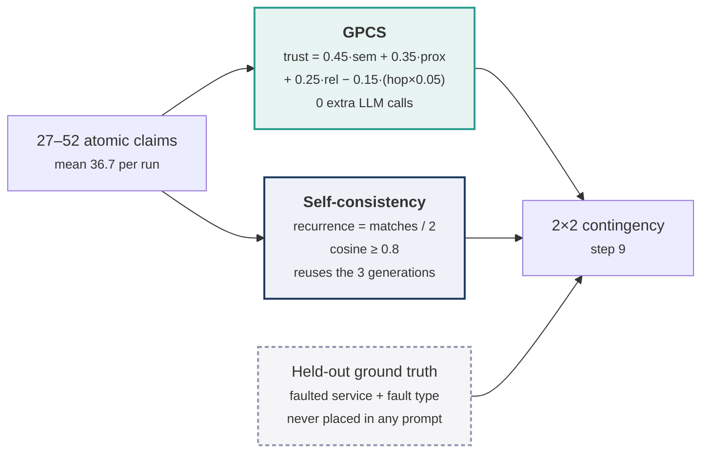

# How the traces work

A **trace** is a narrative walkthrough of one scenario, under one retrieval
condition, from the 26 raw telemetry symptoms all the way to a per-verifier
contingency table. Nine of them live in this directory.

Traces exist so a reader can follow a single incident end to end — every prompt,
every response, every arithmetic step — without running the cluster. They are the
worked-example layer of the experiment. They are **not** the evidence layer; that
is [`../logs/`](../logs/).

---

## 1. Where a trace comes from

Three artefacts, in order. Each is derived from the one before it.



The distinction matters and is easy to get wrong:

| Artefact | Kind | Regenerable? |
|---|---|---|
| `logs/*.log.gz` | **raw evidence** | No — generation runs at T=0.8, so a re-run produces different samples |
| `results/claims.csv` | derived, mechanical | No script ships. Every field is in the logs, but the extraction was ad-hoc |
| `traces/*.md` | **derived narrative** | No script ships. Written from the logs against the log |

> **A trace is illustrative, not authoritative.** If a number in a trace disagrees
> with the log it was written from, the log wins. Every figure quoted in a trace
> is greppable in the corresponding `logs/` file — that is the intended way to
> check one.

---

## 2. How the runner captures values

`scripts/trace_scenario.py` does not re-implement any part of the pipeline. It
imports the same modules the deployed API imports, wraps three specific
functions so each value is written out at the moment it is computed, then calls
the real entry points.



Two capture paths, because the work happens in two places:

- **In-process calls** (claim extraction) run inside the runner. They are caught
  by monkey-patching `gpcs.call_llm` — prompt and response are written verbatim.
- **In-cluster calls** (the specialists and the consensus engine) run inside
  pods. They are recovered by scraping pod stdout for `[LLM REQUEST]` /
  `[LLM RESPONSE]` markers.

The in-cluster capture is a **non-following snapshot per generation**
(`kubectl logs --since-time=T`), not `kubectl logs -f`. Following was observed
re-streaming its own buffer, which replayed three unique consensus bodies as six.
The snapshot returns each call exactly once. This is why `PYTHONUNBUFFERED=1` on
the pods is load-bearing: without it, lines flush late and land in the *next*
scenario's capture window.

---

## 3. The runtime the trace records

One scenario under one condition is 18 LLM calls. The trace records all of them.



The measured totals, printed at the foot of every log:

| | calls |
|---|---:|
| in-cluster (4 specialists + 1 consensus) × 3 generations | 15 |
| in-process (claim extraction) × 3 generations | 3 |
| **total per scenario** | **18** |

Note the architecture is *5* specialists but only *4* call the model. The
security specialist takes a rules path and reaches the LLM only when it first
detects a threat (`investigation-engine/main.py`, `if threat_detected:`). On a
benign RCAEval scenario it never fires. **The trace shows 4, not 5, and that is
correct.**

---

## 4. The nine steps of a trace document

Every trace has the same skeleton. The runner emits its own STEP 1–9; the
narrative regroups them so the reader sees the pipeline the way it actually
executes rather than the way the script is ordered.



| Runner step (in the log) | Narrative step (in the `.md`) |
|---|---|
| 1 load scenario · 2 seed Neo4j + Qdrant · 3 isolation assertion | 1 — telemetry ingestion & seeding |
| 4 retrieval | 2 — GraphRAG evidence retrieval |
| **5 generation ×3** | **3 specialists · 4 consensus · 5 claim extraction** |
| 6 self-consistency verdicts | 7 — verification: self-consistency |
| 7 GPCS scoring | 6 — verification: GPCS |
| 8 correctness labelling | 8 — ground-truth labelling |
| 9 head-to-head | 9 — head-to-head evaluation |

Note steps 6 and 7 are **swapped** between the two. The ordering is
presentational only — the two verifiers run over the same claim set and neither
depends on the other.

The one regrouping worth knowing: **runner STEP 5 expands into narrative STEPs
3, 4 and 5.** A single "dispatch to orchestrator" line in the log is, inside the
cluster, a specialist fan-out followed by consensus synthesis followed by claim
extraction. The narrative unpacks it; the log records it as one dispatch plus the
pod-scraped calls that resulted.

| Narrative step | What it shows | Involves an LLM? |
|---|---|:--:|
| 1 — Telemetry ingestion & seeding | the 26 symptoms, the graph written to Neo4j, the vectors written to Qdrant | no |
| 2 — GraphRAG evidence retrieval | what each condition retrieved, with scores | no |
| 3 — Multi-agent analysis | full prompt and full response for all 4 specialists | **yes** ×4 |
| 4 — Consensus synthesis | how 4 findings become one diagnosis | **yes** ×1 |
| 5 — Atomic claim extraction | the diagnosis split into ~37 checkable claims | **yes** ×1 |
| 6 — GPCS | the trust arithmetic, per claim, worked by hand | no |
| 7 — Self-consistency | cosine matching across the 3 samples | no |
| 8 — Ground-truth labelling | `label_claim()` against held-out truth | no |
| 9 — Head-to-head | the 2×2 contingency table | no |

Steps 6 and 7 are the two verifiers, run **in parallel over the same claims**.
That is the point of the whole experiment: identical input, two independent
verdicts.



---

## 5. Reading the underlying log

Traces quote the log constantly. The log has four line shapes:

```text
====================================================================
  STEP 4 — RETRIEVAL                          <- rule(): section banner
====================================================================
[10:05:14] [+  20.45s] condition=hybrid ...   <- log(): timestamp + elapsed
                          [1] score=0.568907  <- raw(): continuation, no stamp

--- REQUEST PROMPT --------------------------  <- block(): verbatim, never
You are a monitoring specialist AI ...            truncated
--------------------------------------------

                       |
                       |  STEP 4 retrieval  ->  STEP 5 generation
                       |  The retrieved items are passed to the orchestrator
                       v                        <- link(): explicit handoff
```

`block()` never truncates. Completeness is the point — a trace claiming "the
commit appeared in the prompt" can be checked by grepping the block.

Useful greps against a decompressed log:

```bash
gzcat ../logs/rcaeval-03-HYBRID.log.gz | grep -n "^  STEP"
```

```bash
gzcat ../logs/rcaeval-03-HYBRID.log.gz | grep -A14 "LLM CALL TOTALS"
```

---

## 6. What differs between the three conditions

The same scenario is traced three times. Only step 2 changes — everything
downstream differs *because* step 2 changed.

| | `NONE` | `RAW` | `HYBRID` |
|---|---|---|---|
| Retrieval returns | `None` | every match, unranked | top 5, ranked |
| Ranking formula | — | — | `0.50·vector + 0.30·graph_proximity + 0.20·recency` |
| Mean prompt size | 1,101 chars | 30,655 chars | 13,808 chars |
| Trace length | 740–860 lines | 2,200–4,930 lines | 2,020–2,450 lines |

`NONE` is the floor the other two are measured against: the agents reason from
the incident description alone. The `RAW` traces are the longest documents
here purely because unranked retrieval puts everything into every prompt — and
their length varies most, because how much there is to retrieve depends on the
scenario.

The `HYBRID` traces open with a three-way executive summary; the `NONE` traces
are the most compact and are the best starting point for a first read.

---

## 7. Coverage

Nine traces: three scenarios × three conditions.

| Scenario | System | Fault | Traced |
|---|---|---|---|
| `rcaeval-03` | Train Ticket | `cpu_exhaustion` on `ts-order-service` | all three |
| `rcaeval-07` | Online Boutique | `disk_saturation` on `checkoutservice` | all three |
| `rcaeval-14` | Sock Shop | `memory_exhaustion` on `carts` | all three |

Three different source systems and three different fault families — deliberately,
so the traces are not three views of the same failure mode.

The experiment ran **six** scenarios (`-03`, `-04`, `-07`, `-14`, `-18`, `-29`),
so `logs/` holds 54 runs. The remaining scenarios were run and analysed but never
narrated. `results/claims.csv` covers all six; the traces cover three. A count
that disagrees between `traces/` and `results/` is explained by this, not by a
missing run.

---

## 8. Regenerating a log

Traces themselves are hand-written and have no generator. The log underneath one
can be regenerated — though not byte-for-byte, since generation runs at T=0.8 and
identical configurations were measured to vary by ~15 pp on verifier rates.

```bash
cd services/api
AUTH=$(kubectl get secret cloudgraph-neo4j-auth -n cloudgraph-system -o jsonpath='{.data.NEO4J_AUTH}' | base64 -d)
NEO4J_URI=bolt://127.0.0.1:7687 NEO4J_AUTH="$AUTH" QDRANT_HOST=127.0.0.1 QDRANT_PORT=6333 AGENT_ORCHESTRATOR_URL=http://localhost:8082 .venv/bin/python ../../scripts/trace_scenario.py rcaeval-03 hybrid out.log
```

**Scenarios must run sequentially.** `teardown_benchmark_data()` deletes every
`is_benchmark` node without scenario scoping, and `assert_semantic_store_isolated()`
fails if the vector store holds any foreign scenario. Parallel runs break both.

---

## 9. Caveats

- **These runs post-date six fixed defects.** Any trace produced before them is
  not comparable — most importantly, a `retrieval_context` key mismatch meant
  `none`, `raw` and `hybrid` once sent byte-identical prompts. See
  [`../README.md`](../README.md) and `research/LABELLING_POLICY.md`.
- **GPCS resolution is coarse.** It emits only 6 distinct values across the
  dataset and 79.3% of claims score exactly `0.000` — an early return when no
  evidence clears the 0.30 semantic floor. Step 6 of each trace shows this
  directly; do not read the score as a continuous confidence.
- **Step 9's contingency table is per scenario and tiny.** Only 4.8% of claims
  are adjudicable at all (93 of 1,950 across the whole experiment). A single
  scenario's 2×2 table is an illustration of the method, not a result. Pooled
  numbers live in `results/`.
- **A trace shows one sample of three.** Steps 3–5 narrate the primary
  generation. Self-consistency in step 7 uses all three, so a claim can be
  flagged inconsistent on evidence the narrative body does not show in full.
