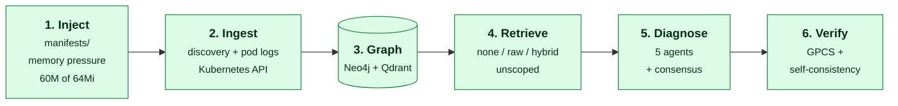

# Experiment 2 — live-cluster demonstration

**This directory demonstrates that the pipeline runs end to end on a real
Kubernetes cluster. It produces no results and measures nothing.**

Every number in the project comes from
[`experiment-1-benchmark/`](../experiment-1-benchmark/). That experiment seeds
RCAEval telemetry into Neo4j and Qdrant and therefore never exercises the
ingestion pipeline. This one does the opposite: one fault, injected by hand into
a running cluster, discovered by the ingestion pipeline, and traced through the
whole system.

| | `experiment-1-benchmark/` | **this directory** |
|---|---|---|
| Purpose | measure verification | demonstrate the pipeline |
| Evidence comes from | an RCAEval file, seeded in | the real cluster |
| Exercises ingestion? | **no** | **yes** |
| Scale | 18 faults × 3 conditions, 1,950 claims | 1 fault |
| Produces results? | **yes** | **no** |

---

## What is demonstrated



Nothing is seeded. The graph is built by the system from the cluster, and
retrieval runs unscoped (`scenario_id=None`) against the whole graph.

## The fault

`manifests/01-inject-memory-pressure.yaml` — a container that allocates 60M of a
64Mi limit and holds it, emitting its own error lines:

```text
WARN  checkout: allocating request buffer pool
ERROR checkout: buffer pool at capacity, allocation stalled
ERROR checkout: request rejected, insufficient memory for buffer
```

The pod stays `Running` under sustained pressure. `manifests/01-inject-oom.yaml.rejected` is an alternative that OOM-kills the
container outright. It is not used: the metrics collector samples only pods with
`status == "Running"`, so a CrashLoopBackOff pod yields no metrics at all.

## Evidence that ingestion found it

`evidence/` holds a census at four points. The delta is the demonstration:

| File | Shows |
|---|---|
| `01-census-clean.txt` | stores wiped — Neo4j holds only `Settings`, Qdrant 0 points |
| `02-census-baseline.txt` | two healthy services discovered, 271 nodes, 0 contamination |
| `03-census-injected.txt` | after the fault: **19 ERROR lines** from the container, 8 linked to the faulted pod |
| `07-census-after-backfill.txt` | vector store corrected (522 → 1093) so retrieval can see the fault |
| `05-pod-state.txt` | `kubectl` output for the faulted pod |
| `04-discovery-output.json` | what `/api/v1/graph/discover` returned |

## The traces

`traces/TRACE_NONE.md`, `TRACE_RAW.md`, `TRACE_HYBRID.md` — the complete
input-to-output chain for each retrieval condition, generated from the logs by
`scripts/make_trace_md.py`. **Nothing in them is truncated:** every LLM request
and response body is reproduced in full.

## Reproducing

```bash
kubectl apply -f manifests/00-baseline.yaml
kubectl apply -f manifests/01-inject-memory-pressure.yaml
```

Then run discovery, **then `backfill_from_neo4j()`** — in that order — and:

```bash
bash scripts/run_all.sh
```

> ⚠️ **Order matters: backfill after injection.** Discovery writes the faulted
> container's logs into Neo4j, but they only become searchable once
> `backfill_from_neo4j()` copies them into Qdrant. Run it before injecting and
> vector retrieval cannot see the fault.

---

## What this does NOT show

**No accuracy claim.** Claim correctness is not labelled here. The verifier
figures inside the traces are inter-method concordance — both verifiers can be
wrong about the same claim and it still counts as agreement.

**No statistical result.** n=1. One fault, one cluster, one model, one sample per
condition. Repeated runs of this identical setup produced materially different
verifier outcomes, which is why no comparison table is published from it.

**Nothing about metric-based diagnosis.** Every `Metric` node in this experiment
comes from `_simulate_pod_metrics()` ([`k8s_discovery.py:236`](../services/api/app/adapters/k8s_discovery.py)),
which generates every value with `random.uniform()`. A Prometheus ingestion
endpoint does exist (`POST /api/v1/telemetry/metrics`, backed by
[`adapters/prometheus.py`](../services/api/app/adapters/prometheus.py)), but
nothing here calls it and no metrics-server is deployed, so no real metric ever
reaches the graph. Metric evidence is therefore filtered out of retrieval and out
of GPCS scoring throughout this experiment, because it is not telemetry.

## What it does show

The ingestion pipeline discovers real topology and reads real container logs; the
graph reflects a fault the system found itself; and the diagnosis names the
injected mechanism. That is the claim, and it is the only one made here.
