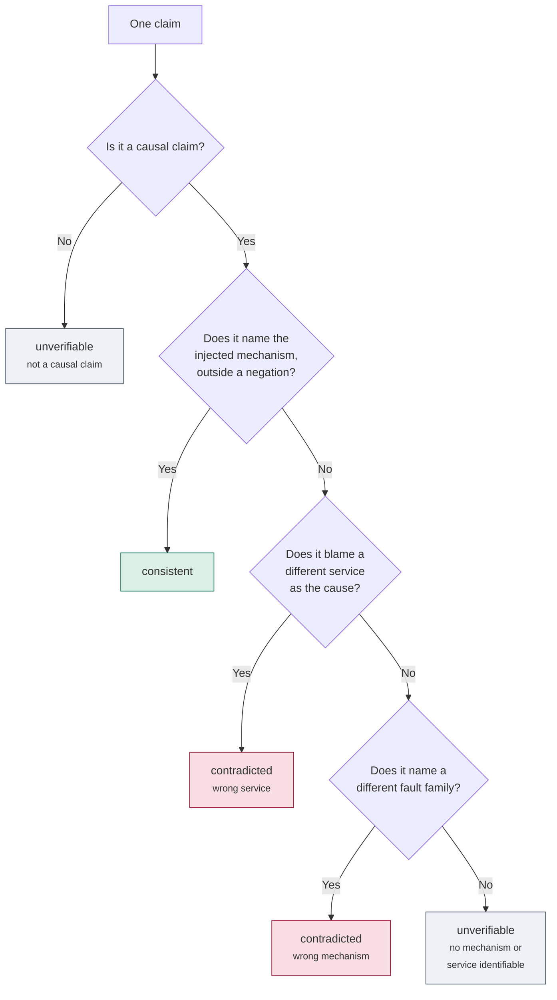

# How claim correctness is decided

Every claim the system generates is labelled **consistent**, **contradicted**, or
**unverifiable**. A Python function does this — `label_claim()` in
[`services/api/scripts/label_claim_correctness.py`](../services/api/scripts/label_claim_correctness.py).
No human scores any claim.

Ground truth is the RCAEval case metadata: which fault was injected, into which
service. That metadata is held out and never reaches a prompt.

---

## The decision, step by step

Order matters. A claim naming the correct mechanism is **consistent** even if it
mentions other things too. A claim naming no mechanism at all is
**unverifiable**, not wrong — the benchmark simply cannot settle it.

---

## The rules

**Only causal claims are judged.** A claim qualifies if the extractor typed it
`causal`, or if it contains a causal marker such as *"caused"*, *"due to"* or
*"because"*. Statements about what happened — *"CPU rose to 37.5"* — are
descriptive. They may be perfectly true, but they say nothing about the cause,
so the benchmark cannot check them.

**Negated mechanisms do not count.** *"Stable memory rules out memory
exhaustion"* mentions memory twice but asserts nothing about it. The labeller
scans the whole claim for negation and, if it finds any, treats the mechanism as
not named. Ruling something out is good reasoning, not a wrong answer.

**Bare effect words are ignored.** *"Latency increased"* follows from every fault
type. Matching on it would label most CPU faults as delay faults.

**Naming another service counts only when it is blamed as the cause.** Saying a
neighbour was *affected* is usually true and is not an error. Saying a neighbour
*caused* the failure, when the fault was injected elsewhere, is.

**Anything unclear is `unverifiable`.** Claims are never assumed correct. They
are excluded from the correctness figures entirely.

---

## The six fault families

| Family | Injected as |
|---|---|
| `cpu` | cpu_exhaustion |
| `mem` | memory_exhaustion |
| `disk` | disk_saturation |
| `delay` | network_delay |
| `loss` | packet_loss |
| `socket` | socket_exhaustion |

Naming a family other than the injected one makes a claim **contradicted**.

**Deployment and configuration claims are always contradicted.** RCAEval faults
are injected by a chaos tool. No deployment, rollout, config change or commit
happens inside any incident window, so a claim blaming one is false about the
ground truth — in the same way that naming `mem` on a `cpu` fault is false.

---

## What this costs

Only **93 of 1,950 claims (4.8%)** can be judged at all:

| Outcome | Claims | Share |
|---|---:|---:|
| Not a causal claim | 1,486 | 76.2% |
| No mechanism or service identifiable | 371 | 19.0% |
| **Consistent** | **36** | **1.8%** |
| **Contradicted** | **57** | **2.9%** |

Both exclusions are labeller decisions, not gaps in the data. This rule set
prefers a narrow, defensible label over a broad, noisy one.

The consequence: every correctness figure in this project rests on 93 claims, and
**61.3% of them are incorrect**. A verifier that flagged *everything* would score
0.613 precision. That is the number to compare against, not zero.

---

## What is deliberately not measured

**No inferential statistics.** One sample per cell does not support them, and
running the same scenario twice with nothing changed moves verifier concordance
by up to 25.7 points. All figures are descriptive.

**No claim-type breakdown.** Splitting 93 claims by type leaves cells too small
to read.

**Correctness labels and verifier verdicts are different axes.** The label comes
from held-out ground truth; `gpcs_unsupported` is what a verifier *said*. The
experiment asks whether the second predicts the first — so `gpcs_unsupported =
TRUE` never means "this claim is wrong".
