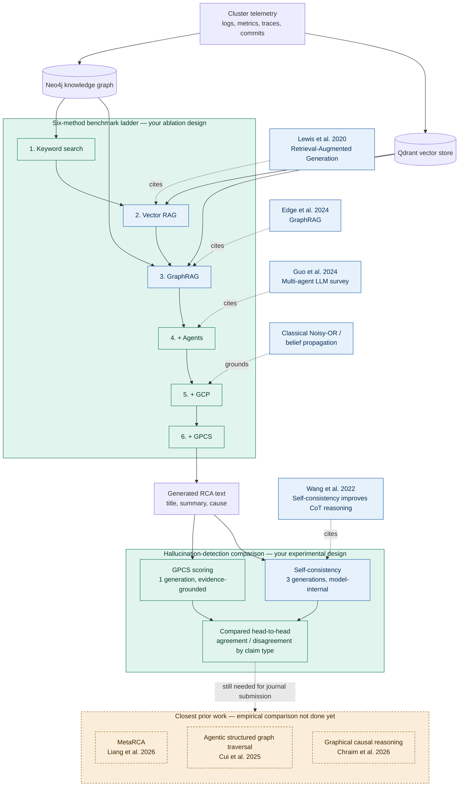

# CloudGraph — full pipeline, methods, citations, and contributions

Green = your contribution. Blue = borrowed/cited technique. Amber dashed =
not done yet. See `internal/planning/PROJECT_CONTRIBUTION_AND_ROADMAP.md` for the
full written explanation this diagram summarizes.

