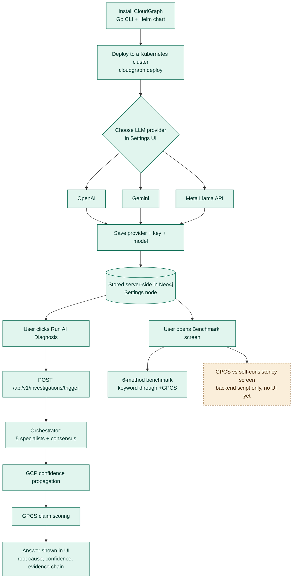

# CloudGraph — install, connect an LLM, run diagnosis, view benchmarks

Green = built and working today. Amber dashed = not built yet (script
exists, no UI page). The code supports **three** cloud LLM providers —
OpenAI, Gemini, and Meta's Llama API — all via the same `call_llm` pattern
in `agent-orchestrator/main.py`, `investigation-engine/main.py`, and
`gpcs.py`. An earlier local-only-via-Ollama iteration (and, before that, a
six-provider lineup including Claude/Groq/OpenRouter) was tried and
reverted; this is the current, settled architecture.

